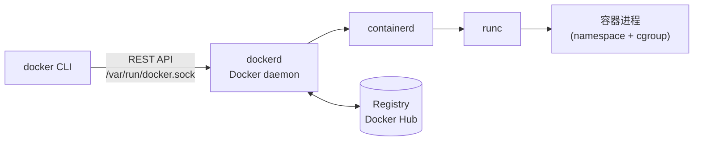

# Docker 整体架构

> 目标：搞清 `docker` 这个命令**背后是谁在干活**，以及 Docker 与 K8s 的关系。

---

## 一、三大角色（C/S 架构）

| 角色 | 是什么 | 在哪 |
|---|---|---|
| **Docker CLI（client）** | 你敲的 `docker ...` 命令 | 你的终端，轻量，只负责**发请求** |
| **Docker daemon（`dockerd`）** | 真正干活的守护进程：构建镜像、跑容器、管网络/存储 | 宿主机后台，监听 `/var/run/docker.sock` |
| **Registry** | 存镜像的仓库（Docker Hub / 私有 Harbor） | 远程（或本地 registry 容器） |

📖 书本把 Docker 作为"容器平台"介绍：镜像、镜像仓库、容器三个概念（2.1 节，`k8s-in-action.txt` 行 3024 前后 / 模块 `01-容器与K8s入门.md` §3）。

✍️ **补充：Docker 不是容器本身。** 现代链路是 `dockerd` → `containerd`（容器生命周期管理）→ `runc`（按 OCI 规范创建容器进程）。所以：
- 书里写"Kubelet 通知 Docker 拉镜像跑容器"（📖 p.57-59 / 模块 §4），**今天就该改口**：K8s 1.24+ 已移除 dockershim，默认直接用 **containerd**。
- 面试时被问"K8s 用 Docker 吗" → 答：**镜像还是 OCI 镜像，运行时已经不是 dockerd 了**。

---

## 二、三大概念

| 概念 | 一句话 | 类比 |
|---|---|---|
| **镜像 image** | 只读模板：应用 + 依赖 + 文件系统快照 | 类（class） |
| **容器 container** | 镜像的一次运行实例，顶层多一个可写层 | 对象（instance） |
| **仓库 registry** | 存/取镜像的地方（配 tag 定位版本） | 应用商店 |

引用格式：`registry/namespace/name:tag`，例如 `docker.io/library/nginx:1.27-alpine`
- 省略 registry → 默认 Docker Hub；省略 tag → 默认 `latest`（⚠️ 生产别用 `latest`，不可追溯）

---

## 三、`docker run` 一条命令的完整链路

| 步 | 谁做 | 做什么 |
|---|---|---|
| 1 | CLI | 把参数发给 dockerd |
| 2 | dockerd | 本地有镜像？没有 → 从 registry **逐层拉取**（已存在的层不重复下载） |
| 3 | containerd/runc | 用 namespace 造隔离视图、cgroup 设限额、挂载 rootfs |
| 4 | runc | `exec` 启动镜像里 `CMD`/`ENTRYPOINT` 指定的进程 |
| 5 | dockerd | 在顶层加**可写层**，配上网络（veth + 网桥）、端口映射（DNAT） |

📖 容器 = 被隔离/限制的进程这一结论，见 1.2 节（`k8s-in-action.txt` 行 2029-2326，PAGE 45-54）。

---

## 四、关键路径与端口（排障常用）

| 位置 | 用途 |
|---|---|
| `/var/run/docker.sock` | daemon 的 UNIX socket；**挂进容器 = 交出宿主 root**（Day 6 安全） |
| `/var/lib/docker` | 镜像层、容器可写层、volume 的默认存放地（磁盘满常在这） |
| `docker info` | 看 Storage Driver（overlay2）、Cgroup 版本、根目录 |

---

## 五、Docker 与 Kubernetes 的分工

| | Docker | Kubernetes |
|---|---|---|
| 管什么 | **单机**上的镜像与容器 | **集群**里的容器编排（调度、自愈、扩缩） |
| 关系 | 提供"打包+运行"的能力 | 调用容器运行时去跑，并保证期望状态 |

📖 运行 K8s 应用三步：打包镜像 → 推仓库 → 提交描述给 API server（p.59 / 模块 §2）。
👉 第 1 周练 Docker，第 2 周就是把同一个镜像交给 K8s。

---

## 自测

1. `docker images` 显示的是本地镜像还是仓库里的镜像？
2. 为什么"docker CLI 停止运行"不会影响已经在跑的容器？
3. K8s 1.24 之后容器运行时换成了什么？为什么书里还写 Docker？
4. 拉取 `nginx:1.27` 和 `nginx:latest`，哪个可复现？为什么？
