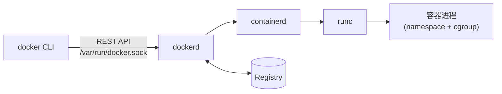

# Docker 架构与底层原理

> 结构：**§一~§四 = 架构**（谁在干活 / 三个核心概念 / 启动链路 / 与 K8s 的分工）；**§五~§十一 = 内核机制**（namespace / cgroup / 分层 / 缓存 / capability）。
> 🧭 查具体知识点：`docs/00-知识点索引.md`
> 一句话总纲：**容器 = 一组 namespace（限制进程能看到什么）+ cgroup（限制进程能用多少资源）+ 一个 rootfs 的普通 Linux 进程，与宿主机共用同一个内核。**

---

## 一、三大角色与启动链路

| 角色 | 是什么 | 在哪 |
|---|---|---|
| **Docker CLI（client）** | 你敲的 `docker ...` 命令 | 你的终端；只负责发 REST 请求 |
| **Docker daemon（`dockerd`）** | 构建镜像、运行容器、管理网络与存储的守护进程 | 宿主机后台，监听 `/var/run/docker.sock` |
| **Registry** | 存放镜像的仓库（Docker Hub / 私有 Harbor） | 远程，或本地 registry 容器 |



`docker run` 一条命令的完整链路：

| 步 | 谁做 | 做什么 |
|---|---|---|
| 1 | CLI | 把参数发给 dockerd |
| 2 | dockerd | 本地有镜像吗？没有 → 从 registry **逐层拉取**（已存在的层不重复下载） |
| 3 | containerd / runc | 创建 namespace（隔离视图）、设置 cgroup 限额、挂载 rootfs |
| 4 | runc | `exec` 启动镜像中 `CMD`/`ENTRYPOINT` 指定的进程 |
| 5 | dockerd | 在顶层加**可写层**，配置网络（veth + 网桥）与端口映射（DNAT） |

✍️ **Docker 不等于容器运行时**：现代链路是 `dockerd` → `containerd`（容器生命周期）→ `runc`（按 OCI 规范创建容器进程）。
- 📖 书里写"Kubelet 通知 Docker 拉镜像跑容器"（p.57-59）—— 该说法已过时：K8s 1.24+ 移除了 dockershim，默认直接使用 **containerd**。
- 面试题"K8s 还用 Docker 吗" → **镜像仍是 OCI 镜像，运行时已不是 dockerd**。

---

## 二、三大概念

| 概念 | 定义 |
|---|---|
| **镜像 image** | 只读模板：应用 + 依赖 + 文件系统快照 |
| **容器 container** | 镜像的一次运行实例，顶层多一个可写层 |
| **仓库 registry** | 存放和拉取镜像的地方（配 tag 定位版本） |

引用格式 `registry/namespace/name:tag`（例 `docker.io/library/nginx:1.27-alpine`）：省略 registry → 默认 Docker Hub；省略 tag → 默认 `latest`（⚠️ 不可追溯，生产环境不要用）。

---

## 三、关键路径与端口（排障常用）

| 位置 | 用途 |
|---|---|
| `/var/run/docker.sock` | daemon 的 UNIX socket；**挂进容器等于交出宿主 root**（原因见 §十） |
| `/var/lib/docker` | 镜像层、容器可写层、volume 的默认存放位置（磁盘满常出在这里） |
| `docker info` | 查看 Storage Driver（overlay2）、Cgroup 版本、根目录 |

---

## 四、Docker 与 Kubernetes 的分工

| | Docker | Kubernetes |
|---|---|---|
| 管什么 | **单机**上的镜像与容器 | **集群**里的容器编排（调度、自愈、扩缩容） |
| 关系 | 提供打包与运行容器的能力 | 调用容器运行时执行，并维持期望状态 |

📖 运行 K8s 应用三步：打包镜像 → 推仓库 → 提交描述给 API server（p.59）。

---

## 五、namespace：隔离"看得见什么"

| namespace | 隔离什么 | 造成的现象 |
|---|---|---|
| `pid` | 进程号 | 容器内的 PID 1 在宿主机上是另一个 PID |
| `net` | 网卡、IP、端口、路由表 | 容器有独立 IP；`-p` 是宿主机上的端口转发 |
| `mnt` | 挂载点 | 容器看到自己的 rootfs，而不是宿主 `/` |
| `uts` | 主机名 / 域名 | 容器可有自己的 hostname |
| `ipc` | 信号量、共享内存 | 跨容器共享内存需 `--ipc` |
| `user` | 用户 / UID 映射 | 容器 root 可映射成宿主普通用户（`--userns-remap`） |

📖 namespace 与 cgroup 的机制：1.2 节（`k8s-in-action.txt` 行 2029-2326）。

**三个推论**：① 容器进程在宿主机 `ps` 里**看得见**（它本来就是宿主上的普通进程）② 启动快是因为不需要引导操作系统，只是启动一个进程 ③ **PID 1 退出 = 容器退出**，容器生命周期绑定在 1 号进程上。

---

## 六、cgroup：限制"能用多少资源"

| 控制器 | 限制 |
|---|---|
| `cpu` | CPU 配额 / 权重（`--cpus`、`--cpu-shares`） |
| `memory` | 内存上限，超过则 **OOMKill**（`-m 256m`） |
| `blkio` | 磁盘 IO 带宽 |
| `pids` | 进程数上限（防 fork 炸弹） |

⚠️ 被 OOMKill 时容器退出码是 **137**，`docker inspect` 里 `State.OOMKilled=true`（详见 `04-排障索引.md` §二）。
✍️ cgroup v1（多层级）与 v2（统一层级）行为不同，`docker info` 可看当前版本。K8s 的 `resources.limits` 最终就是翻译成 cgroup 参数。

---

## 七、镜像分层与写时复制

```
┌ 可写层（容器层）   ← docker rm 后消失；改文件经 copy-up 落到这里
├ 只读层 N～1        ← Dockerfile 每条指令一层（自上而下 = 指令倒序）
└ 基础镜像层         ← FROM 那一层
```

📖 "构建镜像时，Dockerfile 中每一条单独的指令都会创建一个新层。"（2.1.4 节，行 3104-3114）

### 写时复制（Copy-on-Write）

| 动作 | 发生什么 |
|---|---|
| 容器**读**只读层里的文件 | 直接读，不复制 |
| 容器**改 / 删**它 | 先从下层复制到可写层（copy-up）再操作；下层原文件不变 |
| 容器删除该文件 | 可写层加一条 whiteout 记录，下层文件仍然存在 |

**两个直接后果**：① 多个容器共享同一只读层，省磁盘、启动快 ② 数据写在可写层里，**`docker rm` 后即丢失**；需要持久化必须用 volume / bind mount。

---

## 八、构建缓存规则

**按层比对，命中则复用；某一层的输入变化（`COPY` 的文件内容 / `RUN` 的命令字符串 / `FROM` 的镜像），从它开始往后的所有层全部重建。**

| 问题 | 答案 |
|---|---|
| 为什么会"改一行代码就重装依赖" | `COPY . .` 排在 `RUN go mod download` **之前** → 依赖层跟着失效 |
| 怎么修 | 依赖清单单独一层并放在最前：`COPY go.mod` → `RUN go mod download` → `COPY . .` |

→ 完整写法与正/反例：`03-Dockerfile词典.md` §四。

---

## 九、容器进程 vs 宿主进程

| 视角 | 命令 | 看到什么 |
|---|---|---|
| 宿主机 | `ps -ef \| grep webapp` | 容器的服务进程，PID 是宿主机编号 |
| 容器内 | `docker exec <c> ps aux` | 同一个进程，PID 从 1 开始编号 |
| 宿主机 | `docker ps` | 只有容器视角（PID 1 是谁、启动命令是什么） |

---

## 十、capability：容器里的 root 为什么不是宿主 root

> 一句话：**容器的权限 = uid（只是一个数字）+ 一组 capability 位。决定"能做什么"的是 capability 位图，不是 uid。**

### 10.1 三层限制机制

| 机制 | 削弱什么 | 造成的现象 |
|---|---|---|
| namespace | **可见范围**：看不到宿主的进程 / 文件树 / 网络栈 | 想操作宿主资源时，**路径上根本不存在该对象** |
| **capability** | **能力**：把 root 的全能拆成约 40 个位，只保留一部分 | `mount`、加载内核模块、ptrace 宿主进程 → `Operation not permitted` |
| seccomp / AppArmor | **系统调用**：默认 profile 过滤一批 syscall | 部分 syscall 直接返回错误 |

⚠️ **关键结论**：这三层都是内核中的"减法"限制，进程本身**仍然是 uid=0**。一旦绕过（误配 `--privileged`、挂载 `docker.sock`、内核漏洞），进程立刻等价于宿主 root。
→ 所以规范做法是**不用 root 运行**：非 root 进程即使逃逸，也最多是普通用户。

### 10.2 `/proc/<pid>/status` 里的 5 个 Cap 字段

| 字段 | 含义 |
|---|---|
| `CapBnd` | **能力上限（bounding set）**：本进程一生能获得的能力上限。`exec` 一个 setuid-root 程序也只能涨到该上限以内 |
| `CapPrm` | 当前**可用**的能力（permitted） |
| `CapEff` | 当前**生效**的能力（effective），权限判定实际看这一项 |
| `CapInh` / `CapAmb` | 跨 `execve` 传递用（inheritable / ambient），容器内默认全 0 |

### 10.3 位图怎么读

`docker run --rm alpine:3.22 grep ^Cap /proc/self/status` 的默认输出：

```
CapPrm: 00000000a80425fb
CapEff: 00000000a80425fb
CapBnd: 00000000a80425fb
```

按**字节**拆 `0xa80425fb`，每一位对应一个 capability（cap 编号 = 位号）：

| 字节 | 二进制 | 置 1 的位 → 能力名 |
|---|---|---|
| `0xfb` | `1111 1011` | 0 `CHOWN` · 1 `DAC_OVERRIDE` · 3 `FOWNER` · 4 `FSETID` · 5 `KILL` · 6 `SETGID` · 7 `SETUID`（位 2 `DAC_READ_SEARCH` 为 0） |
| `0x25` | `0010 0101` | 8 `SETPCAP` · **10 `NET_BIND_SERVICE`** · **13 `NET_RAW`** |
| `0x04` | `0000 0100` | 18 `SYS_CHROOT` |
| `0xa8` | `1010 1000` | 27 `MKNOD` · 29 `AUDIT_WRITE` · 31 `SETFCAP` |

**数出来正好 14 个** = Docker 默认清单（与文档清单一致，可互相验证）。默认置 0 且最常被用于逃逸的 4 个：`NET_ADMIN`(12) 改路由/iptables、`SYS_MODULE`(16) 加载内核模块、`SYS_PTRACE`(19) ptrace 其他进程、`SYS_ADMIN`(21) 挂载文件系统等。

`--cap-drop=ALL` 之后 **Eff / Prm / Bnd 全部变成 `0000000000000000`** → 连"镜像里放 setuid-root 二进制再提权"这条路也被彻底切断。

### 10.4 逃逸路径

| 场景 | 为什么等价于宿主 root（多数不是漏洞，而是配置本身） |
|---|---|
| `-v /var/run/docker.sock:/var/run/docker.sock` | 通过该 socket 可以命令宿主 dockerd 启动一个 `--privileged` 容器并挂载宿主 `/` |
| `--privileged` | 关闭 capability 限制 + 授予几乎所有能力 + 放行设备 |
| `--pid=host` + `CAP_SYS_PTRACE` | 可以 ptrace / 杀死宿主进程 |
| `-v /:/host` | 直接读写宿主文件树（改写 `/etc/cron.d` 即可持久化） |
| 内核漏洞（DirtyCow 等） | 唯一**需要真实漏洞**的路径 |

→ 相关命令与配置：`02-命令词典.md` §七（选项表）+ §九（选项归属与易错点）。

### 10.5 案例：非 root 也能 `ping` —— ICMP 的两种实现路径

现象：`--cap-drop=ALL`（连 `NET_RAW` 都被去掉）之后 `ping 8.8.8.8` **仍然成功**，与"raw socket 需要 `CAP_NET_RAW`"矛盾。

**三步定位**：① 读 `net.ipv4.ping_group_range` = `0 2147483647`（**Docker 注入的默认值**，内核默认是 `1 0` 空区间）→ ② 用 `--sysctl net.ipv4.ping_group_range='1 0'` 把区间清空 → `permission denied (are you root?)`（退出码 1）→ ③ 只加回 `--cap-add=NET_RAW` → 又通。
**排除法**：① 成功时 `CAP_NET_RAW`=0，raw 路径不可能成立 ⇒ 走的**一定是 datagram 路径**；两条路径各自独立、各有开关。
**为什么会走到 datagram 路径**：busybox `ping` 先尝试 raw socket，被拒绝（EPERM）后回退到 datagram socket。

| 路径 | 系统调用 | 内核检查什么 | 开关 |
|---|---|---|---|
| raw | `socket(AF_INET, SOCK_RAW, IPPROTO_ICMP)` | `ns_capable(net->user_ns, CAP_NET_RAW)` | `--cap-add=NET_RAW` |
| datagram | `socket(AF_INET, SOCK_DGRAM, IPPROTO_ICMP)` | 进程 gid 是否落在 `net.ipv4.ping_group_range` 内 | `--sysctl net.ipv4.ping_group_range=...` |

⚠️ **两条结论**：① **"Docker 的默认值" ≠ "最小权限"** —— `--cap-drop=ALL` 只处理 capability，**Docker 放宽的 sysctl 仍然生效**；② **报错文案会误导** —— `(are you root?)` 是 busybox 的输出，真正缺的是 **capability 位 / sysctl 区间**，不是 root 身份。

### 10.6 案例：绑低端口的权限由什么决定

**先记录 sysctl 基线值**：`net.ipv4.ip_unprivileged_port_start` 内核默认 `1024`，**Docker 默认设为 `0`**。

**内核判定 bind 的实际条件**（两个条件同时成立才拒绝）：

```
拒绝 ⟺ (端口 < net.ipv4.ip_unprivileged_port_start) 且 (进程 CapEff 里没有 CAP_NET_BIND_SERVICE)
```

**实测矩阵（阈值 = 1024）**

| 组 | uid | `CapEff` 里有 `NET_BIND_SERVICE`？ | 绑 80 | 结论 |
|---|---|---|---|---|
| F2 | **0** | ✗（`--cap-drop=ALL`） | ❌ `bind: Permission denied` | **"是 root 就能绑低端口"被证伪** |
| K4 | **0** | ✓（drop ALL + add） | ✅ 绑上（退出码 143 = 被 `timeout` 杀掉） | 同一个 uid，**只有位图不同 → 结果相反** |
| E2 / G2 | 10001 | 名义有 / 实际只进了 `CapBnd` | ❌ 被拒 | **非 root 时 CapPrm/CapEff 被清空**（见下表） |
| K5 等（阈值 = 0） | 任意 | 任意 | ✅ 全部能绑 | 判定式第一个条件永不成立 → capability 不参与判定 |

**非 root 为什么拿不到位（`/proc/self/status` 的实测值）**

| 组 | 身份 | `CapPrm` / `CapEff` | `CapBnd` |
|---|---|---|---|
| K1 | root + 默认 | `a80425fb` | `a80425fb` |
| K2 | **非 root + 默认** | **`0000000000000000`** | `a80425fb` |
| K3 | **非 root + drop ALL + add `NET_BIND_SERVICE`** | **`0000000000000000`** | **`0x400`**（= 位 10 = `NET_BIND_SERVICE`） |

→ **结论**：**非 root 时 `CapPrm`/`CapEff` 被内核清空**（`setuid` 到非 0 uid 时发生），`--cap-add` **只写入 `CapBnd`（能力上限），进不了 Prm/Eff** —— 这正是 §10.2「Bnd = 一生能获得什么，Eff = 现在能不能用」的体现。要让非 root 真正获得能力，只能靠 **file capabilities**（`setcap`）或 **ambient capabilities**。

**实践结论（记这两条即可）**

| 场景 | 正确做法 |
|---|---|
| 服务要跑成非 root | **绑高位端口（> 1024，如 8080）**，不要绑 80 |
| 对外必须暴露 80/443 | **在宿主机侧映射**：`-p 80:8080`（宿主 dockerd 以 root 绑 80，容器内仍是高位端口 + 非 root） |

⚠️ **两条操作经验**：① 不把 sysctl 调回 `1024` 就测 `NET_BIND_SERVICE`，四组会**全部成功**（唯一区别只剩 `timeout` 的退出码 143）—— 变量没控制住，结论就是错的；每组前后都要读一次 sysctl 基线值。② **判定以退出码为准，不要看输出文案** —— `nc`/`ping` 这类工具的提示语（`punt!` / `(are you root?)`）只在特定路径出现，会误导判断。

✍️ **由此推出的加固动作**：K2 的 `CapBnd` 仍保留默认 14 位 → 镜像里若存在 **setuid-root** 二进制，非 root 进程执行它可能把位重新激活到 Prm/Eff。所以要做到：镜像内清理 setuid（`find / -perm -4000 -type f`）+ 运行时 `--security-opt no-new-privileges`。

### 10.7 Docker 主动放宽的 sysctl 默认值 ⚠️ 默认值 ≠ 最小权限

| 参数 | 内核默认 | **Docker 默认** | 影响 |
|---|---|---|---|
| `net.ipv4.ping_group_range` | `1 0`（空区间） | `0 2147483647` | 任何 gid 都能创建 ICMP datagram socket → 不用 root、不用 `NET_RAW` 也能 `ping` |
| `net.ipv4.ip_unprivileged_port_start` | `1024` | `0` | 任何 uid 都能绑低端口 → 不再需要 `NET_BIND_SERVICE` |

→ **推论**：`--cap-drop=ALL` 只处理 capability；**Docker 放宽的 sysctl 仍然生效**。要真正收紧，需要额外用 `--sysctl` 显式覆盖。

---

## 十一、常见误区

| 误区 | 事实 |
|---|---|
| "容器是轻量虚拟机" | 共用宿主内核，没有 guest 内核、没有硬件虚拟化 |
| "容器里 root = 宿主 root" | 差一层 namespace + capability 限制，但**逃逸后约等于宿主 root**（见 §十） |
| "镜像里删了文件，镜像就变小" | 下层文件仍在，只是加了 whiteout 记录；要变小得靠**多阶段构建** |
| "`docker restart` 会保住数据" | 数据在可写层，容器不删就还在；**删掉容器就没了** |

---

## 自测

1. 容器里的 PID 1 在宿主机上是 PID 几？用什么命令查？
2. 容器往一个只读层文件里写数据，下层会被修改吗？为什么？
3. 为什么"改一行代码也要重装依赖"？怎么调整指令顺序能避免？
4. 用 `-m 128m` 跑一个申请 256MB 的进程，容器会怎么退出？退出码是多少？
5. `CapBnd` 和 `CapEff` 有什么区别？为什么 `--cap-drop=ALL` 后 setuid 二进制也提不了权？
6. 容器里的 root 逃逸之后，为什么后果不是"普通用户"而是"宿主 root"？
