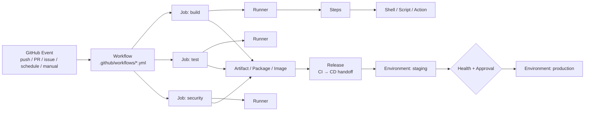

# GitHub Actions 实战薄书

> **从 YAML、Runner 到安全合规 CI/CD：把《GitHub Actions in Action》压成一条能真正走完的实践路线**  
> 原书：Michael Kaufmann、Rob Bos、Marcel de Vries，Manning，2025  
> 整理方式：以原书 3 个 Part、12 章为骨架，删去重复叙述和容易过时的数字，把重点重排成“概念 → 判断 → 配置 → 实验 → 故障排查 → 安全边界”。


[TOC]


---

## 先说明：这本“薄书”怎么用

原书不是一本“背 YAML 关键字”的书。它真正想建立的是一套完整的软件交付心智模型：**GitHub Actions 是 GitHub 生态中的自动化引擎；workflow 只是入口，runner 是执行面，CI 是质量反馈系统，release 是 CI/CD 的交接点，environment 是部署控制面，安全与合规要贯穿整条链路。**

这份薄书保留原书的主线，但做了三种压缩：

1. **机制留下，易变数字弱化。** 价格、runner 规格、Marketplace 数量、某些 action 的 major 版本会变化；你真正该记的是计费模型、选择 runner 的原则、依赖固定方式和权限边界。
2. **例子从“看懂”改成“亲手做”。** 原书 Part 3 主要用 GloboTicket、.NET、Azure 与 Kubernetes 串起 CI/CD；这里保留其设计思想，并额外提供一个不依赖云账号的 Python 小项目作为教学实践。**这部分 Python 项目是本薄书的教学改写，不是原书示例。**
3. **章节顺序从“知识目录”改成“工程决策链”。** 你会不断回答五个问题：什么时候跑？在哪里跑？跑什么？能访问什么？产物如何安全地进入下一阶段？

> **版本提示**：书中示例的 action 版本、GitHub UI、价格与 runner 镜像会随时间变化。本书中的“机制、威胁模型、决策原则”来自原书；实践代码若使用 major tag，是为了便于学习。正式生产环境应审计第三方 action，并在高安全要求场景固定到完整 commit SHA。

---

# 0. 全书地图：先把 257 页压成一张图

原书分三部分：

- **Part 1 — Action fundamentals**：GitHub Actions 是什么；第一次 workflow；完整 workflow 语法；如何自己写 Action。
- **Part 2 — Workflow runtime**：runner 到底是什么；GitHub-hosted 与 self-hosted 的取舍；如何安全、规模化地管理自托管 runner。
- **Part 3 — CI/CD with GitHub Actions**：CI、CD、安全、合规、性能与成本优化。

你可以把整本书记成下面这一条流水线：



这张图包含全书最重要的层次：

- **Event/Trigger** 决定“什么时候自动化”。
- **Workflow** 是版本化的自动化定义。
- **Job** 是可并行、可依赖的执行单元。
- **Runner** 是真正执行 job 的计算环境。
- **Step** 是 job 内按顺序执行的动作。
- **Action** 是可复用 step，不等于整个 workflow。
- **Artifact/Package/Image** 是 CI 的可交付产物。
- **Release** 是“这一批东西可交付”的明确边界。
- **Environment** 把 secrets、审批和部署保护规则绑定到目标环境。
- **Security/Compliance** 不是最后补上去，而是从 trigger、token、runner、artifact 一路贯穿到 deployment。

原书用一张生态图强调：Actions 位于 GitHub 的协作、规划、安全、开发效率和外部工具交汇处，所以它并不只是“自动跑测试”。


---

# 1. 最佳学习规划：14 个 Session，而不是从第 1 页硬啃

每个 Session 建议 60–90 分钟。**原则是每学一个抽象概念，当场把它变成一个可观察结果。**

| Session | 学什么 | 必须做出来的东西 | 学完你应能回答 |
|---|---|---|---|
| 1 | Actions 心智模型 + 第一个 workflow | 手动触发 Hello workflow | workflow/action/job/step 分别是什么？ |
| 2 | Trigger + jobs + steps | push/PR/manual 三种触发 | 什么事件该启动什么自动化？ |
| 3 | `needs` + matrix + contexts | 两个并行 job + 一个依赖 job | 并行与依赖怎样同时表达？ |
| 4 | outputs/env/secrets/variables/permissions | 跨 step/job 传值；最小权限 token | 数据应该放哪一层？ |
| 5 | Reusable Action | 一个 composite action | 什么时候抽成 Action，而不是复制 YAML？ |
| 6 | Runner | 比较 hosted/self-hosted | “我需要自托管吗？” |
| 7 | Self-hosted 安全 | 理解 ephemeral/JIT | 为什么持久 runner 会有跨 job 污染？ |
| 8 | CI 设计 | build/test/security 分层 | CI 的目标不是“一个大 yaml”而是什么？ |
| 9 | Artifact + version + SBOM + release | 产物可追溯到 commit | 为什么“重新 build 再部署”是坏主意？ |
| 10 | CD + Environment | staging → approval → production | 部署和 release 有什么区别？ |
| 11 | OIDC + deployment strategies | 设计无长期云密钥的身份链 | 为什么 OIDC 比长期 secret 更好？ |
| 12 | Actions 安全 | 攻击面 checklist | `pull_request_target` 为什么危险？ |
| 13 | Compliance | branch protection + CODEOWNERS 设计 | 如何证明“谁改、谁审、谁部署”？ |
| 14 | Performance + capstone | cache/concurrency + 完整流水线 | 如何又快、又省、又不牺牲正确性？ |

如果只想 2 天快速掌握：优先 Session **1–4、8–12、14**。  
如果要用于真正团队项目：**不要跳过 6、7、12、13**；这些恰恰是“能跑”和“能安全长期跑”的分界线。

---

# Part I — Actions Fundamentals：把 YAML 看成“可执行的工程结构”

# 2. GitHub Actions 到底是什么

## 2.1 不要把它理解成“GitHub 自带 Jenkins”

原书反复强调：Actions 的范围大于 CI/CD。它可以响应 GitHub 事件，从而把许多人工工程任务自动化，例如：

- PR 打开后跑测试、标记、生成报告；
- issue 创建或编辑后做 triage；
- 定时执行维护任务；
- 发布 package/container；
- 部署软件；
- 扫描安全问题；
- 自动化文档、ChatOps、IssueOps、GitOps 等流程。

**关键认知：GitHub event 是 Actions 的“神经末梢”。** 只要 GitHub 能发出事件，workflow 就可能成为它的自动响应器。

## 2.2 Workflow 与 Action 名字很像，但完全不是一层

一个 workflow 文件位于：

```text
.github/workflows/<name>.yml
```

它内部大致是：

```yaml
name: Example

on:
  push:

jobs:
  build:
    runs-on: ubuntu-latest
    steps:
      - name: One step
        run: echo "hello"
```

用一句话区分：

> **Workflow 是整条自动化；Action 是 step 中可复用的积木。**

原书给出的 workflow 基本构造非常值得记住：


## 2.3 “为什么 checkout 不是自动发生的？”

这是初学者非常容易误解的一点：**workflow 启动时，GitHub 不会天然把 repository 内容放到 runner 上。**

原因很合理：很多自动化根本不需要源码，例如 issue triage。只有当你的 job 需要代码时，才显式 checkout：

```yaml
steps:
  - uses: actions/checkout@v4
```

这体现了 Actions 的设计哲学：**每个 job 明确声明自己需要什么，不做隐式假设。**

---

# 3. 第一个实践：15 分钟建立反馈回路

## 3.1 目标

先别学完整语法。只做一件事：**创建一个能手动触发、能在日志里看到结果的 workflow。**

创建 `.github/workflows/hello.yml`：

```yaml
name: Hello Actions

on:
  workflow_dispatch:

permissions:
  contents: read

jobs:
  hello:
    runs-on: ubuntu-latest
    steps:
      - name: Say hello
        run: echo "Hello from GitHub Actions"

      - name: Show runner info
        run: |
          echo "OS=$RUNNER_OS"
          echo "Repo=$GITHUB_REPOSITORY"
          echo "SHA=$GITHUB_SHA"
```

提交后进入仓库的 **Actions** 页面，选中 workflow，点击 **Run workflow**。

你第一次运行的目的不是“成功一次”，而是观察 4 层：

1. Workflow run：一次完整运行记录。
2. Job：`hello`。
3. Step：两个 step。
4. Log：每条 shell 命令的 stdout/stderr。

## 3.2 第一个故障实验

故意加入：

```yaml
- name: Fail on purpose
  run: exit 1
```

再运行一次。观察：

- step 变红；
- job 失败；
- workflow 失败；
- 失败后的普通 step 默认不会继续执行。

然后加：

```yaml
- name: Always show diagnostics
  if: ${{ always() }}
  run: echo "I run even after failure"
```

你已经碰到了后面非常重要的概念：**status function**。

---

# 4. Workflow 语法：真正需要掌握的 20%

# 4.1 Trigger：先问“什么事件代表意图”

原书把触发大致分为三类：

| 类别 | 常见形式 | 适用思路 |
|---|---|---|
| Webhook/event | `push`、`pull_request`、issue 等 | GitHub 中发生了某件事 |
| Scheduled | `schedule` + cron | 固定时间维护/扫描 |
| Manual | `workflow_dispatch` | 人主动发起并可带输入 |

一个 workflow 可以监听多个事件：

```yaml
on:
  push:
    branches: [main]
  pull_request:
    branches: [main]
  workflow_dispatch:
```

**工程建议：不要把“所有可能事件”都塞进去。** 先定义业务意图：

- PR：给开发者快速反馈；
- push main：验证已合并主线；
- tag/release：产生可发布版本；
- manual：运维或特殊动作；
- schedule：定期安全/维护。

触发器不是语法装饰，而是**信任边界和成本边界**。来自 fork 的 PR 与 main 上的 push，权限和可信程度并不一样。

---

# 4.2 Jobs：默认并行；`needs` 把它们组成 DAG

假设有三个工作：测试前端、测试后端、最后打包：

```yaml
jobs:
  frontend:
    runs-on: ubuntu-latest
    steps:
      - run: echo "test frontend"

  backend:
    runs-on: ubuntu-latest
    steps:
      - run: echo "test backend"

  package:
    needs: [frontend, backend]
    runs-on: ubuntu-latest
    steps:
      - run: echo "package only after both succeed"
```

`frontend` 与 `backend` 并行；`package` 等二者都完成后再跑。

原书用图说明的就是这种 fan-out / fan-in：


### 设计原则

- **Job 是隔离边界。** 不要假设 A job 写到磁盘的文件，B job 自动看得到。
- 跨 job 传文件：使用 artifact；跨 job 传小数据：job output。
- 只有真的有依赖，才写 `needs`；否则让它并行。
- 把不同“目标”拆开，通常比把所有内容堆进一个 job 更可观察、更可重试。

---

# 4.3 Steps：同一个 job 内顺序执行

Step 主要有两种：

```yaml
steps:
  # 使用别人封装好的 Action
  - uses: actions/checkout@v4

  # 自己执行 shell
  - run: python -m pytest
```

区别不是“高级 vs 低级”，而是**复用边界**：

- 只用一次的简单命令：`run`。
- 多项目/多 workflow 重复逻辑：考虑 Action。
- 一长串 shell 被复制到 5 个仓库：已经是在向 reusable abstraction 求救了。

---

# 4.4 Matrix：把“同一测试 × 多个环境”声明出来

典型用途：多个 Python/Node/OS 组合。

```yaml
jobs:
  test:
    strategy:
      matrix:
        python: ["3.11", "3.12"]
        os: [ubuntu-latest, windows-latest]
    runs-on: ${{ matrix.os }}
    steps:
      - uses: actions/checkout@v4
      - uses: actions/setup-python@v5
        with:
          python-version: ${{ matrix.python }}
      - run: python --version
```

它会生成笛卡尔积。矩阵一旦大起来，必须考虑：

- 是否每个组合都有价值？
- 是否要限制 `max-parallel`？
- 是否要关闭/保留 `fail-fast`？
- 能否让 PR 只跑核心组合、主分支跑完整组合？

**矩阵不是“多跑一点更保险”，而是用预算购买兼容性证据。**

---

# 4.5 Expressions + Contexts：Actions 的“数据总线”

你会反复看到：

```yaml
${{ ... }}
```

它不是 shell 插值，而是 Actions 的表达式系统。

常用 context：

| Context | 你通常从中取什么 |
|---|---|
| `github` | 事件、repo、ref、SHA、actor 等 |
| `matrix` | 当前矩阵组合 |
| `env` | 环境变量 |
| `vars` | GitHub 配置变量 |
| `secrets` | Secret 值 |
| `needs` | 前置 job 的结果/output |
| `steps` | 当前 job 前面 step 的 output |
| `runner` | runner 环境信息 |
| `inputs` | 手动/reusable workflow 输入 |

例如：

```yaml
- name: Only on main
  if: ${{ github.ref == 'refs/heads/main' }}
  run: echo "main branch"
```

状态函数是排错和清理的关键：

- `success()`：此前成功；
- `failure()`：此前失败；
- `cancelled()`：被取消；
- `always()`：无论之前发生什么都执行。

**不要滥用 `always()`。** 适合上传诊断、清理、汇总；不适合让关键发布动作在前置失败后继续。

---

# 4.6 Workflow commands：跨 step 传数据的三条主线

## Step output

```yaml
- id: version
  run: echo "value=1.2.3" >> "$GITHUB_OUTPUT"

- run: echo "Version is ${{ steps.version.outputs.value }}"
```

## Environment variable

```yaml
- run: echo "APP_ENV=test" >> "$GITHUB_ENV"
- run: echo "$APP_ENV"
```

## Job summary

```yaml
- name: Summary
  run: |
    echo "## Test summary" >> "$GITHUB_STEP_SUMMARY"
    echo "- ✅ unit tests passed" >> "$GITHUB_STEP_SUMMARY"
```

把它们区分清楚：

- **output**：结构化地给后续 step/job 消费；
- **env**：给后续命令当环境变量；
- **summary**：给人看。

一个成熟 workflow 不应该逼人翻 3,000 行 log 才知道结果。

---

# 5. Secrets、Variables 与 Permission：自动化的“权限系统”

## 5.1 Secret 与 Variable 不是一回事

- **Variable**：普通配置，例如 region、feature flag、包名。
- **Secret**：敏感值，例如 token、password、private key。

它们都可以存在不同层级：organization、repository、environment。原书图清楚展示了这种层次：


把配置放在哪一层，取决于作用域：

- 整个组织统一：organization；
- 某一仓库专用：repository；
- 只允许 production 部署读取：environment。

## 5.2 `GITHUB_TOKEN`：默认就存在，但不代表你该给它大权限

每次 workflow run 都会得到 GitHub 提供的临时 repository token。原书最重要的实践之一是：**显式声明 workflow/job 需要的最小权限，其余置为 none。**

```yaml
permissions:
  contents: read
```

如果某 job 真要写 PR：

```yaml
permissions:
  contents: read
  pull-requests: write
```

把这一条刻进习惯：

> **“能运行”不是权限设计的验收标准；“只给完成工作所必需的权限”才是。**

---

# 6. 如何调试 Workflow：不要靠“改一点 → commit → 祈祷”

原书建议利用 GitHub editor、日志、debug message、错误 annotation 等能力。把排错固定成下面的顺序：

### 第 1 层：YAML/结构错了吗？

- 缩进；
- 键名；
- `on`、`jobs`、`steps` 层级；
- expression 括号；
- matrix/context 名称。

### 第 2 层：Workflow 有没有被触发？

如果根本没 run：

- event 选对了吗？
- branch/path filter 把它过滤了吗？
- `workflow_dispatch` 是否已在默认分支可用？

### 第 3 层：Job 有没有拿到 runner？

- `runs-on` label 是否存在？
- self-hosted runner 是否 online？
- runner group 是否允许该 repo？

### 第 4 层：Step 的运行环境对吗？

- 默认 shell；
- working directory；
- 工具版本；
- checkout 是否完成；
- 文件路径/权限。

### 第 5 层：权限与 secret 对吗？

- token 是否有必要 scope？
- fork PR 是否拿不到 secret？
- environment 是否需要 approval？

### 第 6 层：把“可观察性”做进 workflow

```yaml
- name: Dump safe context
  run: |
    echo "ref=${GITHUB_REF}"
    echo "sha=${GITHUB_SHA}"
    echo "runner=${RUNNER_OS}"
```

不要把整个 `secrets` context 打出来。**日志是永久证据，也是泄密面。**

---

# 7. Actions：什么时候值得自己封装

原书区分三种主要 Action：

| 类型 | 特点 | 适合 |
|---|---|---|
| JavaScript Action | 启动快、与 GitHub toolkit 结合好 | API/逻辑型自动化 |
| Docker container Action | 环境最可控，依赖封装完整 | Linux 环境、复杂工具链 |
| Composite Action | 把多个 step/命令组合起来 | 团队内复用已有 shell/action |

## 7.1 最小 Composite Action 实验

创建：

```text
.github/actions/python-test/action.yml
```

```yaml
name: Python test

description: Install dependencies and run tests

inputs:
  python-version:
    description: Python version already configured by caller
    required: false
    default: "default"

runs:
  using: composite
  steps:
    - shell: bash
      run: pip install -r requirements.txt

    - shell: bash
      run: python -m pytest -q
```

Workflow 中：

```yaml
- uses: ./.github/actions/python-test
```

## 7.2 Action 的设计底线

原书的最佳实践可以压缩成：

- **单一职责**：一个 Action 做一件清楚的事；
- **清楚的 input/output contract**；
- **测试自己的 Action**；
- **版本化发布**；
- **README 讲清权限、输入、输出与示例**；
- 公共 Action 要考虑不同 runner/环境的兼容性；
- 不要因为“能封装”就封装，复用确实存在再抽象。

## 7.3 Action 的发布与复用边界

原书不仅讲“写一个 Action”，还强调**如何保存、版本化和分享**。工程上可以分三层：

```text
仓库内部复用
  -> 本仓库 composite action / reusable workflow

组织内部复用
  -> 组织中专门的 action 仓库 + 权限控制

公共复用
  -> 独立公开仓库 + README + release/tag + Marketplace
```

发布公共 Action 时，真正的 API 是 `action.yml` 中的 inputs、outputs、运行环境和行为。修改这些内容，就像修改一个库的公开 API；要考虑兼容性和版本策略。

对调用方而言也要区分两类复用：

- **Action**：复用一个/一组 step；调用方仍掌控 job、runner 和周边 steps。
- **Reusable workflow**：复用更大粒度的 workflow/job 结构。原书重点在 Action，但你在实际工程中应始终选择“最小够用的复用边界”。

### 可选实验：Docker Action 的最小骨架

原书第 4 章用 Docker container Action 做 hands-on。你不必在主线项目里强行使用，但应看懂它的三件套：

```text
action.yml       -> 声明 Action 接口/运行方式
Dockerfile       -> 构建可执行环境
entrypoint.sh    -> 真正执行逻辑
```

它的优势是环境封装更强；代价是启动、构建与跨平台限制更明显。**只有当“环境本身就是 Action 的一部分”时，Docker Action 才特别自然。**

---

# Part II — Workflow Runtime：YAML 只是控制面，Runner 才是真正的机器

# 8. Runner：理解 Actions 的执行模型

GitHub Actions 的 job 最终必须落到一台 runner 上。runner service 会：

- 接收 job definition；
- 下载 Action；
- 执行 steps；
- 把 logs 传回 GitHub；
- 上传/下载 artifacts；
- 使用 cache service。

原书对 runner runtime 的展示：


## 8.1 GitHub-hosted vs Self-hosted

| 维度 | GitHub-hosted | Self-hosted |
|---|---|---|
| 运维 | GitHub 管 | 你管 |
| 环境清洁 | 每次 job 基本是新环境 | 取决于你的实现 |
| 自定义硬件 | 有限/按提供规格 | 高，可 GPU/专用硬件 |
| 私网访问 | 需额外网络方案 | 可直接放内网 |
| 软件/许可证 | 镜像预装 + 临时安装 | 可预装专用/授权软件 |
| 安全责任 | 较多由平台承担 | 你承担更多 |
| Action minutes | 按 GitHub 计费模型 | GitHub 不收 runner 分钟，但你承担基础设施成本 |

### 一个很实用的决策树

```text
默认：先用 GitHub-hosted
  |
  +-- 必须访问私网服务？ ---- 是 --> 考虑 self-hosted / 私网 hosted 方案
  |
  +-- 必须特殊硬件/GPU？ --- 是 --> 考虑 self-hosted / larger runner
  |
  +-- 必须预装授权软件？ ---- 是 --> 考虑 self-hosted
  |
  +-- 性能/成本测量证明 hosted 不合算？ --> 再比较 self-hosted
```

**不要因为“我有一台服务器”就上 self-hosted。** 你获得环境控制权的同时，也获得补丁、隔离、凭据、清理、网络、扩缩容和审计责任。

---

# 9. Self-hosted Runner：真正危险的不是“机器归你”，而是“状态会留下”

## 9.1 持久 runner 的跨 job 污染

想象 job A 能修改：

- PATH；
- tool cache；
- workspace；
- 配置文件；
- 系统服务；
- 注册凭据；
- 某个二进制。

随后 job B 以为自己进入的是“正常机器”，实际继承了 A 留下的状态。

这就是为什么原书强烈推荐一次性 runner 思路：**每个 job 尽量从干净、可重建的环境开始。**

## 9.2 Ephemeral runner 与 JIT runner

### Ephemeral

- 注册为一次性；
- 完成一个 job 后 runner 自己注销/停止接 job；
- **但底层 VM/container 不一定自动消失**，你仍要负责销毁环境。

### Just-in-time (JIT)

- runner 注册配置只能用一次；
- 降低长期/可重用注册凭据被窃取的风险；
- 同样只执行一个 job；
- 完成后仍应清理底层计算环境。

最简记忆：

> **Ephemeral 解决“一个 runner 不服务第二个 job”；JIT 再加强“注册凭据也尽量一次性”。**

## 9.3 公共 PR + 私网 self-hosted = 高风险组合

如果外部贡献者能让未受信任代码在你的 self-hosted runner 上执行，而 runner 又能访问企业内网，那么攻击者得到的就不仅是一个 CI 容器，而可能是进入内部系统的跳板。

所以原则是：

- 未受信任 PR 代码不要进入高权限 self-hosted runner；
- runner 网络访问按最小权限限制；
- 每 job 新环境；
- 权限/token 最小化；
- 不要让 secret 暴露给 fork PR。

## 9.4 ARC：规模化时再上 Kubernetes

Actions Runner Controller (ARC) 是原书重点介绍的 GitHub 推荐 Kubernetes runner 扩缩容方案。它的核心价值不是“用了 K8s 很酷”，而是：

- 根据 job 需求创建 runner；
- 一次性执行；
- 完成后回收；
- 把 runner fleet 当作弹性基础设施管理。

如果你只有一个学习仓库，**不要为了学 Actions 先学一套 K8s 运维**；理解模型即可。

## 9.5 如果你真的要上 Self-hosted：用生命周期而不是“装一台机器”的方式思考

原书第 6 章花了大量篇幅讲安装、通信、升级、proxy、service account、pre/post-job hooks、容器定制等细节。把它们压缩成一个生命周期检查表：

```text
Provision
  -> 创建 VM/container/node

Register
  -> 用最短生命周期的注册方式加入 GitHub

Constrain
  -> runner group / labels / service account / network policy

Execute one job
  -> 下载 Action / source / 执行 / 上传日志与 artifact

Observe
  -> status / logs / queue / network / telemetry

Cleanup
  -> 删除 workspace / credential / cache contamination

Destroy
  -> 最理想：整个计算环境销毁
```

这里有两个很容易被漏掉的运维点：

1. **自动升级也是可用性的一部分。** Runner service 与 GitHub 协议/功能会演进，不能把 runner 镜像几年不更新。
2. **Service account 也是权限边界。** 不要因为 runner 在“自己的服务器”上就让它以过大的系统权限运行。

如果你发现自己需要大量脚本来“每次 job 后把机器恢复干净”，通常说明应该认真考虑 immutable/ephemeral 基础设施，而不是继续给持久机器打补丁。

---

# 10. Runner 管理：规模化之后，问题变成“谁能用、够不够用、能访问哪儿”

## 10.1 Runner groups 是访问控制，不只是分类

Runner group 可以限制哪些 repository 有权使用某组 runner。原书的管理图：


一个合理组织可能分：

```text
runner group: public-ci
  -> 只处理低权限构建

runner group: internal-build
  -> 可访问内部 package registry

runner group: production-deploy
  -> 极少数 repo 可用
  -> 受 environment / approval / network controls 保护
```

## 10.2 监控什么

原书列出 runner 的状态：idle、active、offline、ready 等。真正要盯的是：

- queue time；
- runner utilization；
- active/idle 比；
- offline/更新失败；
- job duration；
- 哪些仓库/团队消耗最多；
- 网络访问；
- 失败率。

容量规划不要只问“CPU 高不高”，还要问：**高峰期 job 在队列里等多久？**

## 10.3 网络白名单要声明式

原书讨论限制/监控 runner 的网络访问。思路是让 outbound access 也成为可审计配置，而不是“这台机器理论上能访问全网”。

安全成熟度越高，runner 越像短命、最小权限、网络受限的计算单元，而不是一台大家共用的“万能 CI 服务器”。

---

# Part III — CI/CD：把代码变成“可追溯、可验证、可安全部署”的产物

# 11. Continuous Integration：CI 的核心不是“自动 build”，而是快速合并 + 快速证伪

原书把 CI 拆成几类目的：


可以把它们理解成四条反馈线：

1. **Integration CI**：这次变更能不能与主线集成？
2. **Quality CI**：单测、质量阈值、代码规范是否满足？
3. **Security CI**：是否引入漏洞、危险配置？
4. **Packaging CI**：能否形成可交付包/镜像？

为什么要按目的分？因为反馈速度不同：

- PR 最怕等 40 分钟才能知道“lint 失败”；
- 很重的 security scan 不一定每个 step 都阻塞最早反馈；
- package/release 只需要在有意义的分支/版本边界发生。

## 11.1 GitHub Flow：让自动化与协作模型一致

原书用 GitHub Flow 作为主要 branching/collaboration 策略：


核心循环：

```text
main
  ↓
短生命周期 feature branch
  ↓
提交 / push
  ↓
Pull Request
  ↓
自动 CI + review
  ↓
merge main
  ↓
继续交付
```

CI 的价值是让“频繁、小批量合并”变得安全，而不是让团队积累 3 周再做一次大爆炸集成。

---

# 12. 一个好的 CI Workflow 应该怎么拆

原书给出的 generic CI steps 可以整理成：

```text
Get source
  ↓
Restore/setup dependencies
  ↓
Build
  ↓
Unit/integration tests
  ↓
Test reporting
  ↓
Security/quality checks
  ↓
Package
  ↓
Artifact / container image
  ↓
Traceability + SBOM + version
  ↓
Release candidate / Release
```

## 12.1 Multiple jobs 还是 multiple workflows？

一个非常好用的判断：

### 同一个“目标”的不同并行阶段 → 多个 jobs

例如同一个 PR 验证里：

```text
lint ─┐
unit ─┼──> aggregate
scan ─┘
```

### 不同“生命周期目标” → 多个 workflows

例如：

- `pr-ci.yml`：PR 快速反馈；
- `security.yml`：更深安全扫描；
- `release.yml`：建立发布边界；
- `cd.yml`：部署。

**不要把所有自动化塞进一个巨大 workflow，然后用 30 个 `if` 控制。** 那会让权限、触发、观察、重跑都变差。

---

# 13. Artifact、Package、Image：产物必须“build once, promote many”

一个危险但常见的做法：

```text
CI: 从 commit A build 一个包并测试通过
CD: 又从 commit A 重新 build 一次，然后部署第二个包
```

这两个二进制即使来自同一 commit，也不再是你刚测试过的**同一个 artifact**。

更稳的设计：

```text
commit A
  ↓
build
  ↓
artifact X
  ↓
test X / scan X / SBOM X
  ↓
release X
  ↓
staging 部署 X
  ↓
production 仍部署 X
```

这就是“**build once, promote many**”的工程含义。

## 13.1 Traceability：从运行中的软件一路追到 commit

原书对 traceability 的图示非常关键：


你至少应该能回答：

- 生产上的版本是什么？
- 它来自哪个 release？
- release 中的 artifact 是哪次 workflow 产出的？
- 对应哪个 commit？
- commit 谁写的？谁 review 的？
- 当时跑了哪些 tests/scans？

如果这些问题只能靠聊天记录和记忆回答，交付系统还不够成熟。

---

# 14. SBOM 与 Versioning：把“软件是什么”说清楚

## 14.1 SBOM

SBOM（Software Bill of Materials）是软件物料清单。原书把它放在 deployment preparation 中，因为你不仅需要“这个 artifact 是谁 build 的”，还需要知道“里面包含了什么”。

书中提到 SPDX 与 CycloneDX 两类标准，并以 SPDX 方案举例。

实战原则：

- 生成 artifact 的时候生成 SBOM；
- 把 SBOM 与 release/artifact 一起保存；
- 不要把 SBOM 当成一次性审计文件。

## 14.2 Semantic Versioning

最常用的语义版本：

```text
MAJOR.MINOR.PATCH
```

- MAJOR：不兼容 API 变化；
- MINOR：向后兼容的新功能；
- PATCH：向后兼容的 bug fix。

版本号的价值不是“看起来专业”，而是给人和自动化一个稳定的**身份与兼容性信号**。

---

# 15. Release：CI 与 CD 的清晰交接点

这是整本书里非常值得保留的架构判断：**把 CI 与 CD 分开，并用 release 作为交接。**

```text
CI workflow
  build/test/scan/package
        ↓
     Release
        ↓
CD workflow
  download exact artifacts
        ↓
     Deploy
```

这样做的好处：

- CD 不需要重新 build；
- 可以重跑 deployment 而不重跑 compilation；
- release 本身形成审计边界；
- “开发完成”与“部署行为”可以使用不同权限；
- 容易对 environment 施加审批和 secrets 控制。

---

# 16. Continuous Delivery：部署流程的本质是“逐步扩大暴露面”

原书给出的 generic CD 思路可以压成三步：

1. 把已验证的 artifact 部署到一个可检查环境；
2. 用自动或人工证据判断是否可以继续；
3. 逐步暴露给真实用户。


## 16.1 Environment：部署控制面

Environment 可以绑定：

- environment secrets；
- environment variables；
- required reviewers / manual approval；
- wait timer / protection rules（取决于计划与配置）。

原书展示了 environment protection：


以及人工批准部署：


**核心价值：生产凭据不需要在普通 build job 中可见。** 只有真正进入 production environment 的 job 才应该获得对应权限。

---

# 17. OIDC：部署到云时，尽量不要保存长期云密钥

传统模式：

```text
GitHub secret
  = AWS/Azure/GCP long-lived credential
```

风险：secret 一旦泄漏，可在 workflow 之外继续使用，直到被撤销/过期。

OIDC 模式的思路：

```text
GitHub workflow identity
   ↓  short-lived OIDC token
Cloud identity provider validates claims
   ↓
short-lived cloud credential
```

关键点：

- 云端信任的是特定 repo/ref/environment/workflow 条件；
- 凭据短期有效；
- 不需要长期云 secret 躺在 repository settings 中；
- 仍然必须最小权限。

**OIDC 不是“没有身份认证”，而是把长期静态 secret 换成基于工作负载身份的短期凭据。**

---

# 18. Health check 与 Deployment Strategy

部署成功不等于“服务真的健康”。原书强调部署后验证，例如 health endpoint 与端到端验证。

一个合理顺序：

```text
Deploy
  ↓
Process started?
  ↓
Health endpoint OK?
  ↓
Critical user journey OK?
  ↓
Promote / increase traffic
```

## 18.1 Zero-downtime

目标不是某个具体工具，而是**新旧版本切换时保持服务可用**。

## 18.2 Red–Green（Blue–Green）

```text
Red: current production
Green: new version

先把 Green 部署并验证
      ↓
切流量到 Green
      ↓
必要时可切回 Red
```

优点：回滚快；缺点：需要两套容量/环境，数据库变化尤其要谨慎。

## 18.3 Ring-based deployment

不是一下把 100% 用户都暴露给新版本，而是逐圈扩大：

```text
Ring 0: 内部/极小用户
  ↓ 观察
Ring 1: 少量真实用户
  ↓ 观察
Ring 2: 更多用户
  ↓
100%
```

原书图：


这种策略最重要的不是“圈怎么命名”，而是：**每扩大一圈，都有监控和停止条件。**

---

# Part IV — Security：Actions 最大的安全误区是“YAML 看起来只是配置”

# 19. Threat Model：Workflow 实际上是远程代码执行系统

每当你写：

```yaml
- uses: someone/action@...
```

或：

```yaml
- run: some-command
```

你都在让 runner 执行代码。这个代码可能接触：

- workspace；
- network；
- 当前 job 使用的 secrets；
- `GITHUB_TOKEN`；
- self-hosted runner 的持久状态；
- package cache / tool cache。

所以安全问题不只是“secret 有没有打印到 log”。

---

# 20. `pull_request_target`：为什么它是著名陷阱

它的用途有合理之处：在目标仓库上下文执行，可以获得更高权限去 label/comment 等。但这正是危险来源。

最糟糕组合：

```text
外部 fork 提交恶意 PR
  ↓
pull_request_target workflow
  ↓
checkout PR 中攻击者控制的代码
  ↓
以目标仓库高权限 token / secrets 执行
```

这类攻击常被称为 **pwn request** 风险。

## 20.1 更安全的拆法：低权限 workflow + 高权限 follow-up

### Workflow A：处理不可信 PR

- `pull_request`；
- read-only；
- 不拿敏感 secret；
- build/test；
- 把结果以 artifact/metadata 交出去。

### Workflow B：处理可信结果

- 由完成事件（例如 `workflow_run`）触发；
- 不去执行 PR 提供的代码；
- 只读取经过设计的结果；
- 必要时写 comment/label。

这个模式的本质是：

> **把“执行不可信代码”和“持有写权限/secret”分到不同信任域。**

---

# 21. Untrusted Input：不要直接把 GitHub context 插进 shell

危险示意：

```yaml
- run: echo "${{ github.event.issue.title }}"
```

Issue title 是外部输入。把它直接插入 shell 命令文本，会把数据变成“可能改变命令结构的代码”。

更稳的模式：先进入环境变量，再让 shell 把它当数据：

```yaml
env:
  TITLE: ${{ github.event.issue.title }}
run: echo "$TITLE"
```

这里最重要的是理解**两个解析阶段**：

```text
GitHub expression evaluation
  ↓
生成 shell command / environment
  ↓
Shell 再解析
```

如果外部字符串在第一阶段直接进入 command source，就可能影响第二阶段的语法。

## 21.1 用工具发现问题

原书展示 actionlint 能检测 Actions workflow 问题：


以及 CodeQL 对 workflow/script injection 的检测：


**自动扫描不能替代威胁模型，但能把很多容易犯的错前移到 PR。**

---

# 22. Third-party Actions：你依赖的不是“YAML 名字”，而是一段别人控制的代码

## 22.1 引用方式的风险强弱

从可变到更固定：

```text
@main / @master      高可变
@v1                  tag 可能可变
@v1.2.3              更明确，但 tag 仍是引用
@<full commit SHA>   精确固定到一个 changeset
```

原书安全章节建议在高安全要求下固定到完整 SHA。再进一步，如果你需要完全控制更新节奏，可以 fork 并自行审计。

## 22.2 一条容易被忽视的事实

即使你没有显式把 `GITHUB_TOKEN` 作为 input 传给某个 Action，执行中的 Action 仍处于当前 job 的权限上下文里。因此：

- 第三方 action 必须当作代码依赖审查；
- job `permissions` 必须最小；
- secret 只在需要它的 job 中暴露；
- Dependabot 可帮助维护 GitHub Actions 版本更新。

Dependabot 的基本配置：

```yaml
version: 2
updates:
  - package-ecosystem: "github-actions"
    directory: "/"
    schedule:
      interval: "weekly"
```

---

# 23. Security Checklist：任何生产 Workflow 都先过这 12 项

- [ ] `permissions` 是否显式最小化？
- [ ] fork PR 是否完全拿不到敏感 secrets？
- [ ] 是否错误地用 `pull_request_target` checkout/执行 PR 代码？
- [ ] 外部输入是否直接插进 shell command？
- [ ] 第三方 Action 是否可信、审计过、固定版本/SHA？
- [ ] Action 更新是否有 Dependabot/人工审查机制？
- [ ] 高权限 job 是否与不可信代码执行分离？
- [ ] self-hosted runner 是否运行不可信代码？
- [ ] self-hosted runner 是否一次性/可清理？
- [ ] runner 网络权限是否过大？
- [ ] 云认证能否用 OIDC 代替长期 credential？
- [ ] log / summary / artifact 是否可能泄漏 secret 或敏感数据？

只要其中一项答案让你说“应该没事吧”，就值得继续检查。

---

# Part V — Compliance：不是加一份 PDF，而是让交付链本身能证明发生过什么

# 24. 原书把合规压到两个非常实用的控制：Traceability + Four-eyes

## 24.1 Traceability

你需要建立：

```text
人
 ↓
commit
 ↓
PR / review
 ↓
workflow run
 ↓
artifact / SBOM
 ↓
release
 ↓
deployment
 ↓
production version
```

身份本身要可信。原书讨论 SSO、企业身份与 commit 签名等手段。

GitHub 的 verified/signed commit 是一块证据：


## 24.2 Four-eyes Principle

“四眼原则”简单说就是：**关键变更不能由同一个人不经独立检查直接完成。**

在 GitHub 中常由这些机制组合实现：

- Pull Request；
- required review；
- branch protection；
- 禁止直接 push 到 main；
- 限制 bypass；
- CODEOWNERS；
- protected environments / deployment approval。

原书示意 branch protection：


## 24.3 CODEOWNERS：把“谁应该审”写成代码

例如：

```text
# .github/CODEOWNERS

.github/workflows/  @platform-team
infra/              @platform-team
src/payments/       @payments-team
```

配合 required CODEOWNER review，可以把“敏感路径必须由对应团队审查”自动化。

## 24.4 End-to-end Deployment Traceability

GitHub deployments/environment 页面能形成部署视图：


成熟交付的目标不是“我们有流水线”，而是：

> **从 production 版本反向追到代码、审查、测试、artifact、批准人；从任意 commit 正向追到它是否已经进入 production。**

## 24.5 Mandatory workflows：把组织级规则从“文档要求”变成“自动执行”

原书第 11 章最后讨论 mandatory/required workflows：在大组织里，与其要求每个仓库手工复制同一套安全与质量 YAML，不如让组织层统一施加必要检查。它适合三类目标：

- **Compliance**：所有仓库都必须经过共同的质量/合规检查；
- **Security**：统一插入漏洞扫描、策略检查；
- **Deployment governance**：所有部署都遵循共同门槛。

这解决的是“规模化治理”的问题：

```text
坏做法：100 个 repo 各复制一份 security.yml
        -> 漂移、有人删、版本不一致

更成熟：组织层规则 / required workflow
        -> 统一更新、统一 required check、统一证据
```

但要注意治理的另一面：强制 workflow 自身就成为高影响基础设施，修改它时更需要严格 review、CODEOWNERS 和最小权限。

---

# Part VI — Performance & Cost：先优化等待，再优化分钟数

# 25. Concurrency：新 commit 来了，旧 PR 构建还值得跑吗？

对同一个 PR/branch，如果旧 commit 的 workflow 还在跑，新 commit 已经到达，很多时候旧结果已失去意义。

```yaml
concurrency:
  group: ci-${{ github.workflow }}-${{ github.ref }}
  cancel-in-progress: true
```

原书展示被 concurrency 自动取消的旧 run：


这同时优化：

- 开发者等待；
- runner capacity；
- Actions minutes；
- 队列长度。

## 25.1 Merge Queue

当很多 PR 都在同时改主分支时，“PR 各自在旧 main 上通过 CI”不保证它们按顺序合并后仍然通过。Merge queue 的思想是让即将合并的组合再经过验证，减少 main 被并发合并破坏。

高吞吐仓库中，这是比“大家抢着点 merge”更可靠的机制。

---

# 26. Cache：缓存是优化，不是正确性的依赖

适合缓存：

- package manager 下载；
- dependency cache；
- Docker layer cache；
- 可重新生成、但生成昂贵的中间结果。

不该依赖：

- 唯一副本；
- 必须永久保存的发布 artifact；
- 关键审计证据。

缓存的核心逻辑：

```text
key 命中 → 复用
key 未命中 → 正常构建 → 写入新 cache
```

key 通常应包含能代表依赖集合的 hash，例如 lockfile：

```yaml
key: deps-${{ runner.os }}-${{ hashFiles('**/requirements.txt') }}
```

原书展示 cache 对运行时间的改善：


**最重要的缓存测试：删光 cache 后，workflow 仍然必须正确。**

---

# 27. Sparse checkout、Artifact retention 与 Runner 选择

## Sparse checkout

如果 monorepo 很大，而 job 只需要一小部分，可以只 checkout 必要路径，减少网络与 IO。

## Artifact retention

Artifact 长期保存会产生成本。区分：

- 短期调试 artifact；
- 正式 release artifact；
- 合规必须长期留存的证据。

不要所有东西统一保留 90 天，也不要统一只保留 1 天。

## 27.1 一个反直觉的计费点：过度并行可能更贵

原书最后特别提醒：hosted runner 的 job 使用时间按计费粒度计算时，很多极短 job 如果被拆得过细，可能因为每个 job 分别计时/取整而浪费分钟数。

例如从工程思想上看：

```text
10 个彼此独立、每个只跑几十秒的 job
```

虽然“并行度”很漂亮，但未必比一个几分钟的顺序 job 更经济。是否拆 job 应一起考虑：

- 是否真需要独立失败/重试；
- 是否能显著缩短 critical path；
- 是否能提供更好的权限隔离；
- 是否只是为了看起来并行。

所以性能优化不是“并行越多越快”，而是优化**关键路径 + 有效工作量 + 计费模型**。


## Larger runner 不一定更贵

假设普通 runner 10 分钟，大 runner 2 分钟。即使单位时间更贵，也可能因总时长下降而经济，且更快反馈本身有开发者价值。

**优化需要测量总成本：计算成本 + 等待成本 + 运维成本。**

---

# Part VII — 实践项目：从 0 做出一条安全的“迷你生产流水线”

> **说明**：下面项目不是原书 GloboTicket 的照搬，而是依据原书原则改成一个可以零云成本完成的 Python 教学项目。目标是把书里的抽象全部摸一遍。

# 28. 项目最终形态

```text
actions-lab/
├─ .github/
│  ├─ workflows/
│  │  ├─ ci.yml
│  │  ├─ security.yml
│  │  ├─ release.yml
│  │  └─ cd.yml
│  ├─ actions/
│  │  └─ python-test/
│  │     └─ action.yml
│  ├─ dependabot.yml
│  └─ CODEOWNERS
├─ src/
│  ├─ __init__.py
│  └─ calc.py
├─ tests/
│  └─ test_calc.py
├─ requirements.txt
└─ README.md
```

`src/calc.py`：

```python
def add(a, b):
    return a + b


def divide(a, b):
    if b == 0:
        raise ValueError("division by zero")
    return a / b
```

`tests/test_calc.py`：

```python
import pytest
from src.calc import add, divide


def test_add():
    assert add(2, 3) == 5


def test_divide():
    assert divide(8, 2) == 4


def test_divide_by_zero():
    with pytest.raises(ValueError):
        divide(1, 0)
```

`requirements.txt`：

```text
pytest
```

---

# 29. Lab 1 — CI：先建立“每次 PR 都能快速证伪”的流水线

`.github/workflows/ci.yml`：

```yaml
name: CI

on:
  pull_request:
    branches: [main]
  push:
    branches: [main]
  workflow_dispatch:

permissions:
  contents: read

concurrency:
  group: ci-${{ github.workflow }}-${{ github.ref }}
  cancel-in-progress: true

jobs:
  test:
    strategy:
      matrix:
        python-version: ["3.11", "3.12"]

    runs-on: ubuntu-latest

    steps:
      - name: Checkout
        uses: actions/checkout@v4

      - name: Set up Python
        uses: actions/setup-python@v5
        with:
          python-version: ${{ matrix.python-version }}
          cache: pip

      - name: Install dependencies
        run: pip install -r requirements.txt

      - name: Run tests
        run: pytest -q

      - name: Job summary
        if: ${{ always() }}
        run: |
          echo "## CI result" >> "$GITHUB_STEP_SUMMARY"
          echo "Python: ${{ matrix.python-version }}" >> "$GITHUB_STEP_SUMMARY"
          echo "Commit: $GITHUB_SHA" >> "$GITHUB_STEP_SUMMARY"
```

### 这一个文件里你已经练到：

- event trigger；
- `workflow_dispatch`；
- least-privilege `permissions`；
- concurrency；
- matrix；
- checkout；
- setup action；
- cache；
- shell step；
- job summary；
- `always()`。

### 故障练习

把 `test_add` 临时改成错误断言，推到新 branch 并开 PR。确认：

- PR check 失败；
- main 不应允许在 required check 失败时 merge（需要 branch protection 配置）；
- 修复后新的 run 取代旧 run。

---

# 30. Lab 2 — 把重复逻辑抽成 Composite Action

`.github/actions/python-test/action.yml`：

```yaml
name: Run Python tests
description: Install project dependencies and run pytest

runs:
  using: composite
  steps:
    - name: Install
      shell: bash
      run: pip install -r requirements.txt

    - name: Test
      shell: bash
      run: pytest -q
```

把 CI 中两步替换为：

```yaml
- name: Test project
  uses: ./.github/actions/python-test
```

思考题：为什么 setup-python 仍放在 caller，而不是 Action 内？

一种合理答案：caller 负责“运行矩阵/环境策略”，Action 只负责“项目测试动作”，职责更清晰。**复用不应吞掉调用方需要控制的关键策略。**

---

# 31. Lab 3 — Build Artifact，并让下游 Job 使用“同一个产物”

在 CI 增加一个 package job。最简单可以把源码打包成 tar/zip 作为教学 artifact：

```yaml
  package:
    needs: [test]
    runs-on: ubuntu-latest
    permissions:
      contents: read

    steps:
      - uses: actions/checkout@v4

      - name: Create artifact
        run: |
          mkdir -p dist
          tar -czf dist/app-${GITHUB_SHA}.tar.gz src

      - name: Upload artifact
        uses: actions/upload-artifact@v4
        with:
          name: app-${{ github.sha }}
          path: dist/*.tar.gz
```

验收：

- test 不通过时 package 不运行；
- package artifact 名包含 commit SHA；
- workflow 页面可看到 artifact；
- 你能明确回答“这个文件来自哪个 commit”。

---

# 32. Lab 4 — Security Workflow

`.github/workflows/security.yml` 可以先做到两件事：

1. workflow 静态检查；
2. dependency/action 更新自动化。

Dependabot：

```yaml
# .github/dependabot.yml
version: 2
updates:
  - package-ecosystem: "github-actions"
    directory: "/"
    schedule:
      interval: "weekly"
```

再检查你所有 workflow：

- 是否显式 `permissions`；
- 是否引用不可信第三方 action；
- 是否把 event 文本直接插入 `run`；
- 是否存在 `pull_request_target`；
- 是否把 secret 打日志。

如果未来引入 actionlint/CodeQL，把它们当作“安全反馈自动化”，不要只在出事故后手工跑。

---

# 33. Lab 5 — Release：建立 CI → CD 的交接边界

最简单的学习版：手动创建 GitHub Release 或 tag，然后让一个 release workflow 负责把**已构建/可确认的版本产物**组织起来。

重要思想不是某段 YAML，而是这三个不变量：

```text
1. Release 必须有唯一版本身份
2. Release 必须能追溯到 commit
3. CD 应部署 release 对应的 artifact，而不是临时重新 build
```

如果你的真实项目是 container：更自然的 artifact identity 是不可变 image digest，而不仅是可移动 tag。

---

# 34. Lab 6 — CD：不用云，也能练 Environment 与 Approval

先在 GitHub 仓库 Settings 中建立两个 environments：

```text
staging
production
```

给 `production` 配 required reviewer（你的账号/团队是否可用取决于仓库与 GitHub 计划设置）。

创建 `.github/workflows/cd.yml`：

```yaml
name: CD demo

on:
  workflow_dispatch:
    inputs:
      version:
        description: Version or release identifier
        required: true

permissions:
  contents: read

jobs:
  staging:
    runs-on: ubuntu-latest
    environment: staging
    steps:
      - name: Deploy to staging (simulation)
        run: echo "Deploy ${{ inputs.version }} to staging"

      - name: Health check (simulation)
        run: |
          echo "Checking health..."
          sleep 2
          echo "healthy"

  production:
    needs: [staging]
    runs-on: ubuntu-latest
    environment: production
    steps:
      - name: Deploy to production (simulation)
        run: echo "Deploy ${{ inputs.version }} to production"
```

运行时你应该看到：

```text
manual trigger
  ↓
staging
  ↓
health check
  ↓
production environment gate
  ↓
approval
  ↓
production job
```

你虽然没有真部署云服务，但已经理解了 CD 最关键的**控制结构**。

---

# 35. Lab 7 — Compliance：让 main 不能“偷偷变”

配置目标：

- [ ] 禁止直接 push main；
- [ ] PR 才能 merge；
- [ ] CI required check；
- [ ] 至少一个 review；
- [ ] 敏感路径用 CODEOWNERS；
- [ ] 生产 environment 有审批；
- [ ] 重要 workflow 的修改也需要平台 owner review。

`.github/CODEOWNERS`：

```text
.github/workflows/  @YOUR_GITHUB_USERNAME
.github/actions/    @YOUR_GITHUB_USERNAME
src/                @YOUR_GITHUB_USERNAME
```

单人学习仓库无法真正实现独立 four-eyes，但结构先建立起来；团队项目中把 owner 换成真实团队。

---

# 36. Lab 8 — 性能实验：用数据证明 Cache 与 Concurrency 有价值

做三次实验：

### 实验 A：无 cache

记录 5 次平均 job 时长。

### 实验 B：有 dependency cache

记录：首次 miss 与后续 hit 的差异。

### 实验 C：快速连续 push 3 次

观察 `cancel-in-progress: true` 是否取消前两个已过时 run。

最后写到 README：

```text
Before cache:  xx s
Cache miss:    xx s
Cache hit:     xx s
Concurrency:   stale runs cancelled = x
```

你会从“听说缓存更快”变成“我知道它在这个 repo 里节省多少”。

---

# 37. Capstone 验收：你真正学会了吗？

只要下面任一题答不清，就回对应章节再做一次实验。

1. workflow 与 Action 有什么区别？
2. job 和 step 的隔离边界是什么？
3. 为什么两个 job 默认能并行？如何等待另一个 job？
4. matrix 的成本风险是什么？
5. `GITHUB_OUTPUT`、`GITHUB_ENV`、job summary 分别解决什么问题？
6. repository variable 与 environment secret 应该如何选？
7. 为什么 `GITHUB_TOKEN` 即使“临时”也必须最小权限？
8. GitHub-hosted 与 self-hosted runner 最大的 trade-off 是什么？
9. ephemeral runner 解决什么，JIT 再多解决什么？
10. 为什么不应该让公共 fork PR 在内网 self-hosted runner 上跑？
11. 为什么 CI 最好按 integration/quality/security/package 的目标拆？
12. 为什么 artifact 应 build once, promote many？
13. SBOM 的工程价值是什么？
14. Release 为什么适合做 CI → CD handoff？
15. Environment 为什么不仅是“变量分组”？
16. OIDC 为什么比长期 cloud secret 更安全？
17. red–green 与 ring deployment 分别降低什么风险？
18. `pull_request_target` 的核心风险是什么？
19. 为什么 `${{ github.event.issue.title }}` 直接进 shell 可能出问题？
20. 为什么第三方 action 本质上是供应链依赖？
21. traceability 要能串起哪些对象？
22. four-eyes 如何用 GitHub 控制组合实现？
23. concurrency 为什么同时是性能与成本优化？
24. cache 为什么绝不能成为正确性的唯一依赖？

如果你能不看笔记讲明白其中 20+ 个，并完成 Lab 1–8，你已经抓住了原书绝大部分真正可迁移的工程能力。

---

# Part VIII — 一页式速查

# 38. Workflow 骨架

```yaml
name: Example

on:
  pull_request:
  workflow_dispatch:

permissions:
  contents: read

concurrency:
  group: ${{ github.workflow }}-${{ github.ref }}
  cancel-in-progress: true

jobs:
  test:
    runs-on: ubuntu-latest
    steps:
      - uses: actions/checkout@v4
      - run: echo "test"

  package:
    needs: [test]
    runs-on: ubuntu-latest
    steps:
      - run: echo "package"
```

---

# 39. 触发器怎么选

| 目的 | 首选思路 |
|---|---|
| PR 反馈 | `pull_request` |
| main 合并后动作 | `push` + branch filter |
| 人手动操作 | `workflow_dispatch` |
| 周期维护 | `schedule` |
| Release 后部署 | release 相关事件/明确的 CD 触发 |
| 高权限 PR 元数据操作 | 谨慎设计；不要把不可信 PR 代码与高权限上下文混在一起 |

---

# 40. 数据应该放哪

```text
敏感？
  ├─ 是 → secret
  │       └─ 只属于 production? → environment secret
  └─ 否 → variable / env

step 产生的小结果给后续用？ → output
job 间传文件？             → artifact
人要快速看到结果？         → job summary
```

---

# 41. Runner 怎么选

```text
先 GitHub-hosted
  ↓
需要特殊硬件 / 私网 / 授权软件 / 明确成本优势？
  ↓ 是
Self-hosted
  ↓
尽量 ephemeral + JIT
  ↓
限制 repo / runner group / network
  ↓
监控 queue + utilization + failures
```

---

# 42. CI / CD 的黄金路径

```text
Feature branch
  ↓
PR
  ↓
Fast CI
  ├─ unit/integration
  ├─ quality
  └─ security
  ↓
Review + branch protection
  ↓
Merge main
  ↓
Build immutable artifact
  ↓
SBOM + scan + version
  ↓
Release
  ↓
CD retrieves exact artifact
  ↓
Staging
  ↓
Health / E2E
  ↓
Approval / automated policy
  ↓
Production
  ↓
Observe / ring expansion
```

---

# 43. 安全的“六不”

1. **不**给 workflow 默认大写权限。
2. **不**让 fork PR 代码碰高权限 secrets/token。
3. **不**把不可信 GitHub context 直接拼进 shell。
4. **不**把第三方 Action 当“纯配置”。
5. **不**让持久 self-hosted runner 混跑不同信任等级工作负载。
6. **不**长期保存能用 OIDC 替代的云访问密钥。

---

# 44. Debug Playbook

```text
Workflow 没出现
  -> trigger / branch/path filter / default branch

Workflow 出现但 job 等待
  -> runs-on label / runner group / runner online / capacity

Job 启动但命令失败
  -> shell / path / checkout / tool version / working-directory

只在 PR/fork 失败
  -> token permission / secret availability / trust boundary

部署卡住
  -> environment gate / approval / credential / health check

偶发性 self-hosted 失败
  -> persistent state / cache contamination / runner drift

越来越慢/贵
  -> queue / matrix explosion / cache / artifact retention / stale runs
```

---

# Part IX — 12 章原书到本薄书的映射

| 原书章节 | 原书核心 | 本薄书位置 |
|---|---|---|
| Ch1 Introduction | GitHub universe、Actions 不止 CI/CD、hosting/pricing | §2、全书地图 |
| Ch2 First workflow | editor、Marketplace、运行 workflow | §3 |
| Ch3 Workflows | YAML、triggers、jobs/steps、matrix、contexts、commands、secrets、permissions、debug | §4–6 |
| Ch4 GitHub Actions | Action 类型、编写、分享、最佳实践 | §7、Lab 2 |
| Ch5 Runners | hosted runner、OS/software/shell、billing、self-hosted intro | §8 |
| Ch6 Self-hosted runners | setup、安全、ephemeral/JIT、autoscaling、ARC | §9 |
| Ch7 Managing runners | groups、monitoring、capacity、network、internal billing | §10 |
| Ch8 Continuous integration | GitHub Flow、CI 类型、build/test/artifact、traceability、SBOM、version、registry/release | §11–15、Lab 1–5 |
| Ch9 Continuous delivery | artifacts、environment、approval、OIDC、health、red–green、rings | §16–18、Lab 6 |
| Ch10 Security | pwn requests、untrusted input、least privilege、action refs、Dependabot、CodeQL | §19–23、Lab 4 |
| Ch11 Compliance | traceability、signed commits、four-eyes、CODEOWNERS、mandatory workflows | §24、Lab 7 |
| Ch12 Performance/cost | concurrency、merge queue、artifact cost、sparse checkout、cache、runner optimization | §25–27、Lab 8 |

---

# 45. 最后把全书压成 15 句话

1. **GitHub Actions 是自动化引擎，不只是 CI 工具。**
2. **Event 触发 workflow；workflow 由 jobs 构成；job 在 runner 上执行；job 内 steps 顺序执行。**
3. **Jobs 默认并行，`needs` 把它们连成依赖图。**
4. **Matrix 用声明式方式覆盖多个运行组合，但每个组合都有成本。**
5. **配置、secret、output、artifact 与 summary 是不同的数据通道，不要混用。**
6. **`GITHUB_TOKEN` 永远按最小权限设计。**
7. **Action 是代码依赖；第三方 Action 必须按供应链依赖对待。**
8. **GitHub-hosted 是默认选择；self-hosted 只有在控制、网络、硬件或经济性真正需要时才值得。**
9. **Self-hosted 最怕持久状态与信任边界混淆；优先 ephemeral/JIT。**
10. **CI 的核心是快速、安全地集成，而不是写一个巨大 YAML。**
11. **可部署产物应该 build once、test once、promote many，并且可追溯。**
12. **Release 是 CI 与 CD 很好的交接点；Environment 是部署的权限与审批边界。**
13. **OIDC 用短期工作负载身份替代长期云密钥；部署后必须做 health/行为验证。**
14. **安全与合规要从 trigger、token、runner、artifact、review 一路设计到 deployment。**
15. **性能优化先取消无意义工作，再缓存重复工作，最后才考虑更大的机器。**

---

# 46. 你接下来最值得做的事

不要继续读下一本书。直接新建一个 GitHub 仓库，把 **Lab 1 → Lab 8** 做完。每一次只增加一个能力，并在 README 里记录：

```text
我增加了什么？
它解决什么风险/等待/重复劳动？
如果删掉它，系统会失去什么？
它引入了什么新的权限或复杂度？
```

当你能用这四个问题解释自己的 pipeline 时，你掌握的就不再是 GitHub Actions 语法，而是**可迁移的软件交付工程能力**。

---


# 47. 五张决策卡：遇到真实项目时直接套

## 卡 1：这段逻辑应该放 step、Action 还是 workflow？

```text
只出现一次、几条命令？
  -> run step

多个 job/repo 都重复一组步骤？
  -> Composite/JS/Docker Action

连 jobs、permissions、runner 策略都要一起复用？
  -> 更大粒度 reusable workflow / 平台模板
```

## 卡 2：该用 Artifact、Cache 还是 Package Registry？

| 需求 | 选择 | 原因 |
|---|---|---|
| 同一/后续 workflow 传 build 结果 | Artifact | 明确产物，适合短中期保存 |
| 加速可重建依赖 | Cache | miss 时仍可重建 |
| 长期、版本化分发 | Package/container registry | 有版本/权限/消费模型 |
| 正式发布证据 | Release + artifact/package + SBOM | 建立发布边界与追溯 |

## 卡 3：什么时候拆 Job？

拆 job 的充分理由：

- 可以并行缩短 critical path；
- 需要不同 runner；
- 需要不同 permissions/secrets；
- 需要独立重试/可观察性；
- 是清楚的逻辑阶段。

不要仅因为“每 5 行 YAML 一个 job”而拆。

## 卡 4：什么时候拆 Workflow？

当它们的**触发、权限、目标、生命周期**明显不同：

```text
PR feedback      -> pr-ci.yml
Deep security    -> security.yml
Create release   -> release.yml
Deployment       -> cd.yml
Scheduled upkeep -> maintenance.yml
```

## 卡 5：一个 Deployment 是否值得信任？

部署前连续问：

```text
它是哪一个 artifact？
  -> 哪个 release？
    -> 哪次 CI？
      -> 哪个 commit？
        -> 谁写的/谁审的？
          -> tests/security checks 都过了吗？
            -> 部署身份是不是短期、最小权限？
              -> 部署后 health/关键业务路径过了吗？
```

只要中间有一环答成“应该是……”，traceability 就还不完整。

---

## 附：原图索引

为了让这份 Markdown 能离线作为“小书”阅读，保留了原书中最能承载结构信息的图，而不是把所有 UI 截图都塞进来：

- `assets/01_ecosystem.png`：GitHub ecosystem
- `assets/02_workflow_anatomy.png`：workflow 基本结构
- `assets/03_job_dag.png`：job 依赖关系
- `assets/04_secret_hierarchy.png`：配置/secret 层次
- `assets/05_runner_runtime.png`：runner runtime
- `assets/06_environment_protection.png`：environment protection
- `assets/07_runner_groups.png`：runner groups
- `assets/08_ci_types.png`：CI 类型
- `assets/09_github_flow.png`：GitHub Flow
- `assets/10_traceability.png`：artifact traceability
- `assets/11_cd_stages.png`：CD stages
- `assets/12_manual_approval.png`：人工审批
- `assets/13_ring_deploy.png`：ring deployment
- `assets/14_actionlint.png`：actionlint
- `assets/15_codeql_scan.png`：CodeQL workflow security
- `assets/16_signed_commits.png`：signed commits
- `assets/17_branch_protection.png`：branch protection
- `assets/18_deployments_view.png`：deployment traceability
- `assets/19_concurrency.png`：concurrency 取消旧 run
- `assets/20_cache_effect.png`：cache performance

> 版权说明：图片来自用户提供的原书文件，仅作为这份个人学习摘要中的必要引用与教学说明；本薄书没有复刻原书全文，而是对概念、结构和实践方法进行压缩与重组。
