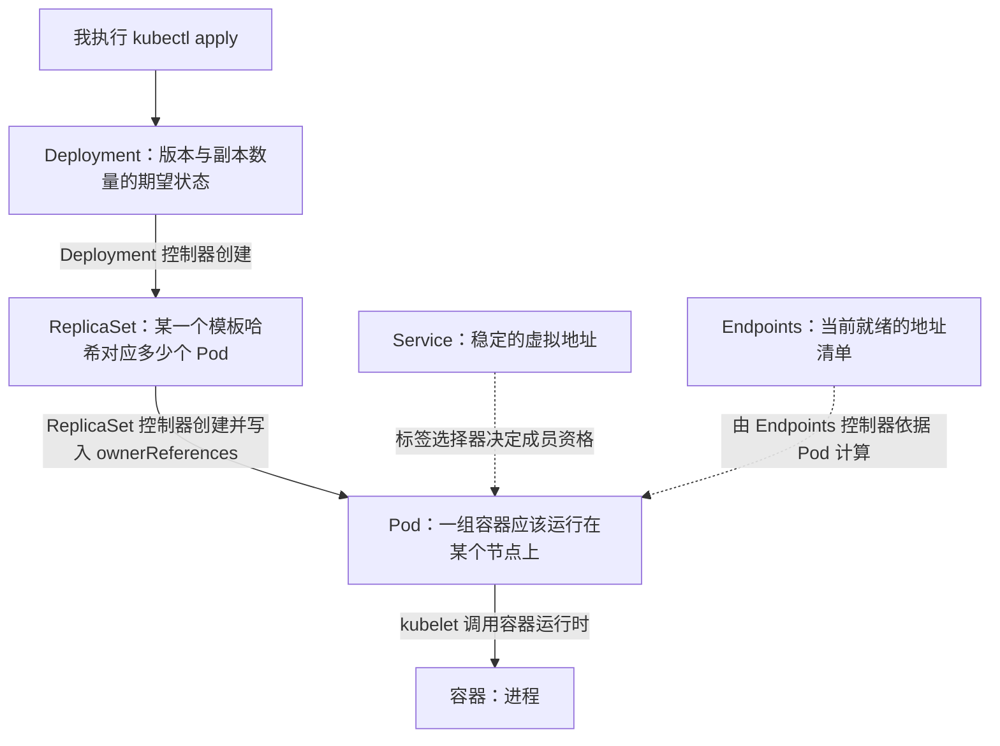

# 模块 09 · 如何理解 Kubernetes 工作负载（多视角分析）

> **这篇文档回答的问题**：Pod、Deployment、Service、Endpoints 这四个对象，除了「各自的字段是什么意思」之外，还能从哪些角度理解它们？本文把同一个对象放在八个不同的视角下观察，最后给出「四个对象 × 八个视角」的综合矩阵。
>
> **前置知识**：模块 `02-Pod与副本机制.md`、模块 `03-Service与存储.md`，以及 `notes/week2/day1.md`、`notes/week2/day2.md` 中记录的实测输出。
>
> **标注约定**（沿用 `docs/00-知识点索引.md`）：📖 表示书本原文或书本观点，并且标注页码与正文行号；✍️ 表示这是我的补充，书本中没有直接写出，你可以质疑并且自行验证；⚠️ 表示易错点。
>
> **回查方法**：本文给出的正文行号对应 `assets/text/k8s-in-action.txt`，页码对应 `assets/text/k8s-in-action.index.md` 中的页码列。
>
> ⚠️ 注意页码陷阱：`assets/text/k8s-in-action.index.md` 的页码列与正文中的 `=== PAGE n ===` 编号不是同一个体系，回查时请使用本文给出的「节号 + 正文行号」。

---

## 0. 一页速览

| 编号 | 视角 | 一句话结论 | 主要依据 |
|---|---|---|---|
| 1 | 契约与动作 | Kubernetes 的对象只声明「应该是什么样」，对象内部没有任何一行行为代码；真正执行动作的是控制器 | 📖 p.99、p.498-499、p.509-512 |
| 2 | 控制论与声明式 | 我提交的是期望状态，控制器在一轮又一轮的对账中把实际状态向期望状态收敛 | 📖 p.99、p.163-164、p.179 |
| 3 | 对象图与所有权 | 一个工作负载是一张由 `ownerReferences` 串起来的对象图：Deployment 拥有 ReplicaSet，ReplicaSet 拥有 Pod | 📖 p.173、p.511-512 |
| 4 | 稳定层与易变层 | 把「不随时间变化的部分」与「频繁变化的部分」拆成不同对象，是 Pod 与 Service、Deployment 与 ReplicaSet 被分开的根本原因 | 📖 p.445、p.207 |
| 5 | 集合成员资格 | 对象之间靠标签选择器判断「你是否属于我」，而不是靠硬引用；同一个 Pod 可以通过改标签换一个管理者 | 📖 p.172-173、p.223 |
| 6 | 控制平面与数据平面 | 控制器只写对象，不改数据包；转发由节点内核依据 kube-proxy 写入的规则完成 | 📖 p.220、p.523 |
| 7 | 一切皆 API 对象 | 连「事件」也是一条 API 对象；工作负载只是「资源类型 + 控制器」这一机制的实例，因此这套机制可以用自定义资源扩展 | 📖 p.512-513、p.630、p.775 |
| 8 | 清单即唯一真相 | 集群状态可以只依靠清单重建，因此清单可以进版本库；代价是服务端写入的字段无法声明 | ✍️ 由视角 2 推出，📖 p.260 |

---

## 1. 视角一：契约与动作（对你提出的视角做确认与修正）

### 1.1 你提出的判断，成立的部分

你提出的判断是：**Pod 在实现层面最核心的是接口定义，也就是以动作和契约为核心，而不是以类对象和属性为核心**。这个判断成立的部分有三点。

| 编号 | 成立的部分 | 机制依据 |
|---|---|---|
| 1 | Pod 的定义中没有任何行为代码。`pod.webapp.yaml` 里只有字段，没有任何一处描述「如何启动容器」「失败之后如何重启」。 | Pod 是一份数据，不是一段程序；它被序列化成 JSON 保存在 etcd 中，由别的组件解释这份数据。 |
| 2 | 各单位之间不使用「调用」这种通信方式。Deployment 控制器、ReplicaSet 控制器、kube-scheduler、kubelet 相互之间没有直接调用，它们各自通过 API Server 监听自己关心的资源类型的变化。 | 📖 p.509-511（第 11 章 11.2 开头）原文说明：控制器、调度器、Kubelet 早就通过 API 服务器监听它们各自资源类型的变化；p.512 原文说明：参与这个全过程的控制器除了通过 API 服务器更新资源之外，没有做其他具体的事情。 |
| 3 | 决定「做什么动作」的主体在对象之外。数量不足时创建 Pod、数量过多时删除 Pod，这些动作属于 ReplicaSet 控制器，而不属于 Pod 对象自身。 | 📖 p.498-499（第 11 章 11.1.6）原文说明：API 服务器只做了存储资源到 etcd 和通知客户端有变更的工作，调度器只给 Pod 分配节点，因此需要有活跃的组件确保系统真实状态朝 API 服务器定义的期望的状态收敛；原文同时说明：资源描述了集群中应该运行什么，而控制器就是活跃的 Kubernetes 组件，去完成具体工作。 |

### 1.2 需要修正的部分

你的判断里有一处需要精确化：**准确的说法应当是「对象是契约，控制器是动作」，而不是「Pod 既是契约又是动作」**。

| 判据 | 说明 |
|---|---|
| 动作的归属 | 删除 Pod 之后补齐副本数量，这个动作由 ReplicaSet 控制器执行；容器退出之后重启容器，这个动作由 kubelet 执行；把一个新 Pod 绑定到某个节点，这个动作由 kube-scheduler 执行。这三个动作没有一个是 Pod 对象自己完成的。 |
| 契约的归属 | Pod 对象提供的只有两样东西：一份期望状态（`spec`）与一份实际状态（`status`）。前者是我写的，后者是别人写的。 |
| 因此正确的表述 | 「Kubernetes 的工作负载以契约为接口，以控制器的动作为实现」。这样表述之后，「接口」对应 `spec` 与 `status` 这一对字段，「实现」对应运行在控制平面与节点上的各个组件。 |

此外，「不是以属性为核心」这一句也需要限定：Pod 的 `spec` 里确实有大量属性（`containers[]`、`volumes[]`、`restartPolicy` 等），只是**这些属性的解释者不是 Pod 自己，而是外部组件**。因此「属性」在 Kubernetes 中没有被取消，而是从「对象自己的状态」变成了「控制器的输入」。

### 1.3 与面向对象语言的逐项对照

| 维度 | 面向对象的语言（例如 Java、Python） | Kubernetes 的 API |
|---|---|---|
| 定义单位 | 类，声明字段名与类型，并且声明方法，也就是行为 | 资源类型，例如 `Pod`、`Deployment`、`Service`，只声明字段与约束，不声明任何行为 |
| 运行实例 | 对象，保存在进程的内存中，进程结束之后对象消失 | API 对象，保存在 etcd 中，通过 HTTP 接口读写，API Server 重启之后对象仍然存在 |
| 行为的载体 | 类的方法，调用发生在同一个进程内部 | 控制器，运行在 `kube-controller-manager` 中或者作为独立进程运行，它读写对象的行为发生在进程外部 |
| 属性的可写性 | 由类的封装决定，通常提供 setter 方法 | `spec` 由我写入；`status` 由控制器与 kubelet 写入；`metadata.name`、`spec.selector` 等字段在创建之后不可修改 |
| 复用方式 | 继承与接口实现 | 组合与所有权，也就是 Deployment 拥有 ReplicaSet、ReplicaSet 拥有 Pod，以及由标签选择器构成的集合关系 |
| 调用方式 | 直接调用方法，调用方必须知道被调用方存在 | 向 API Server 提交期望状态，各组件通过 watch 机制接收变更通知，因此提交清单的人不知道有哪些组件会响应，组件之间也互不知道对方存在 |
| 失败处理 | 抛出异常，由调用方捕获并且决定如何处理 | 不抛出异常；控制器在下一轮对账中重新比较期望状态与实际状态 |
| 生命周期管理 | 由引用计数或者垃圾回收器回收内存 | 由 `ownerReferences` 与垃圾回收控制器删除对象（📖 p.173 提示了这一字段的用途；级联删除的实测过程见 `notes/week2/day1.md` 阶段六） |

✍️ 补充说明：这张对照表是我把两种模型放在同一组维度上整理的，书本没有给出这张表；表中每一行的「Kubernetes 一侧」都能在书本中找到依据，对应位置见 1.5 节。

### 1.4 契约的三个组成部分

把 API 对象理解为一份契约之后，它的三个顶层字段就各自有了明确的角色。

| 顶层字段 | 谁写入 | 语义 | 在契约模型中的角色 |
|---|---|---|---|
| `metadata` | 名称与标签由我在提交时写入；`uid`、`creationTimestamp`、`resourceVersion`、`generation`、`ownerReferences` 由服务端写入 | 身份与元信息 | 说明「这份契约是谁的」，其中 `uid` 是对象的唯一标识，`resourceVersion` 用于并发控制 |
| `spec` | 我声明 | 期望状态 | 契约的正文，说明「它应该是什么样」 |
| `status` | 控制器与 kubelet 写入 | 实际状态 | 对契约的应答，说明「它现在是什么样」 |

✍️ 补充说明：把三个字段整理成「身份—期望—应答」的关系，是我的整理方式；书本在第 4 章与第 11 章中分别描述了这些字段的产生过程，但没有集中给出这张表。

由这个模型可以直接解释一个常见现象：`kubectl get po -o yaml` 的输出里，我没有写过的字段很多，因为它们分别由两个不同的写入者补全。`restartPolicy`、`dnsPolicy`、`terminationGracePeriodSeconds`、`serviceAccountName` 由 API Server 在准入阶段补全默认值；`nodeName` 由调度器写入；`status` 整段由 kubelet 上报、由 API Server 落库（实测过程见 `notes/week2/day1.md` 阶段二）。

### 1.5 本视角的书本依据

| 页码 | 原文要点 |
|---|---|
| p.99（正文行 4030-4050） | 「你已经告诉 Kubernetes 需要确保 pod 始终有三个实例在运行。注意，你没有告诉 Kubernetes 需要采取什么行动，也没有告诉 Kubernetes 增加两个 pod，只设置新的期望的实例数量并让 Kubernetes 决定需要采取哪些操作来实现期望的状态。这是 Kubernetes 最基本的原则之一。不是告诉 Kubernetes 应该执行什么操作，而是声明性地改变系统的期望状态，并让 Kubernetes 检查当前的状态是否与期望的状态一致。在整个 Kubernetes 世界中都是这样的。」 |
| p.179（正文行 6478-6490） | 「在 Kubernetes 中水平伸缩 pod 是陈述式的：『我想要运行 x 个实例。』你不是告诉 Kubernetes 做什么或如何去做，只是指定了期望的状态。这种声明式的方法使得与 Kubernetes 集群的交互变得容易。」 |
| p.498-499（正文行 15955-15995） | 「API 服务器只做了存储资源到 etcd 和通知客户端有变更的工作。调度器则只是给 pod 分配节点，所以需要有活跃的组件确保系统真实状态朝 API 服务器定义的期望的状态收敛。这个工作由控制器管理器里的控制器来实现。」 |
| p.509-512（正文行 16437-16515） | 「在你启动整个流程之前，控制器、调度器、Kubelet 就已经通过 API 服务器监听它们各自资源类型的变化了。」「Deployment 控制器完全不会去处理单个 pod。」「参与这个全过程的控制器没有做其他具体的事情，除了通过 API 服务器更新资源。」 |

---

## 2. 视角二：控制论 —— 声明期望状态，由控制器持续收敛

### 2.1 声明式与命令式的差别

| 维度 | 命令式做法 | 声明式做法 |
|---|---|---|
| 我提供的信息 | 一串动作，例如「再启动两个容器」 | 一个目标，例如「副本数量为 3」 |
| 执行动作的决定权 | 在我手里 | 在控制器手里 |
| 命令执行时的判断依据 | 我提交命令那一刻的集群状态 | 控制器每一轮对账时读到的集群状态 |
| 重复提交的结果 | 可能重复执行，例如重复启动容器 | 结果不变，因为控制器比较的是数量，不是命令次数 |
| 中途有人手工改动 | 我无法察觉，也无法纠正 | 控制器在下一轮对账中发现偏差并且纠正 |
| 观察方式 | 命令的返回码 | 对象自身的 `spec` 与 `status` 对比 |

### 2.2 调谐循环：控制器响应的是状态，而不是事件

控制器的工作方式可以拆成四步，这四步循环执行，因此称为调谐循环。

| 步骤 | 执行者 | 动作 | 依据 |
|---|---|---|---|
| 1 | 控制器 | 读取期望状态，也就是我写入的 `spec` | 📖 p.183 说明 ReplicaSet 的目标是让「匹配选择器的 Pod 数量」等于 `spec.replicas` |
| 2 | 控制器 | 列出并统计实际状态，也就是当前匹配选择器的对象 | 同上 |
| 3 | 控制器 | 计算两者的差值，并且执行补齐或者删除 | 📖 p.163-164 以 ReplicationController 为例说明它对账的方式 |
| 4 | 控制器 | 把结果写回自己的 `status`，然后继续监听下一批变更 | 📖 p.509-512 |

✍️ 补充说明：这个循环在分布式系统里称为电平触发（level-triggered），与边沿触发（edge-triggered）相对。书本没有使用这两个术语，但是给出了等价的描述：控制器响应的不是删除事件，而是删除之后产生的状态，也就是「匹配选择器的 Pod 数量少于期望值」这一事实（📖 p.163-164）。这条区别有一个直接后果：即使控制器在某个事件发生时恰好重启，导致事件丢失，它在下一轮对账中依然能够发现偏差，因此不需要为事件投递提供可靠性保证。

### 2.3 由这一机制推出的四个性质

| 性质 | 内容 | 机制依据 |
|---|---|---|
| 幂等 | 同一份清单重复提交，结果不发生变化 | 控制器的动作是「把实际状态调整到期望状态」，当两者相等时它不创建也不删除任何对象 |
| 最终一致 | 出现偏差之后系统会在一段时间内恢复，但不会在提交的那一刻立即恢复 | 控制器按自己的节奏对账，`kubectl apply` 返回成功只说明对象已经写入 etcd |
| 自愈 | 删除一个由 Deployment 管理的 Pod 之后，控制器会创建一个新的 Pod 补齐数量 | 实测过程见 `notes/week2/day1.md` 阶段四，删除 `webapp-7dbcc8ff4b-cz4vc` 之后出现了 `webapp-7dbcc8ff4b-qpndp` |
| 客户端的角色很轻 | kubectl 只是一个 HTTP 客户端，它提交完成之后就退出，不持有任何状态 | 📖 p.511 原文说明 kubectl 通过 HTTP POST 请求把清单发送到 API 服务器 |

### 2.4 这个视角解释不了的边界

⚠️ 声明式模型不负责的部分必须说清楚，否则容易把它当成万能机制。

| 边界 | 说明 |
|---|---|
| 应用自身的可伸缩性 | 副本数量可以写成 3，但是如果应用不能在多个实例之间共享状态，那么新增的 Pod 无法分担请求。📖 p.100 原文明确说明：Kubernetes 并不会让你的应用变得可扩展，它只是让应用的扩容或缩容变得简单。 |
| 中间状态 | 调谐循环只保证最终结果，不保证过程形态；滚动升级期间同时存在新旧两组 Pod 属于正常现象（📖 p.413-438 描述的 RollingUpdate 策略）。 |
| 无法收敛的情形 | 清单本身引用了一个不存在的镜像或者一个不存在的存储类时，控制器会反复重试并且把失败原因写入事件，此时它不会放弃，也不会自动修改我的期望状态。 |

---

## 3. 视角三：对象图与所有权 —— 工作负载是一张对象图

### 3.1 四层对象图

### 3.2 每一层只回答一个问题

| 层 | 对象 | 由谁创建 | 它回答的问题 | 它不负责的事情 |
|---|---|---|---|---|
| 1 | Deployment | 我执行 `kubectl apply` 创建 | 应该运行哪一个版本的模板，期望多少个副本 | 不直接创建 Pod，也不处理单个 Pod（📖 p.511-512 原文说明 Deployment 控制器完全不会去处理单个 pod） |
| 2 | ReplicaSet | Deployment 控制器 | 与当前模板哈希对应的 Pod 应该有多少个 | 不决定升级的顺序，也不保留版本历史，版本历史由 Deployment 保留（📖 p.422 描述了回滚时重新调大旧 ReplicaSet 副本数量的做法） |
| 3 | Pod | ReplicaSet 控制器 | 哪一个容器组应该被调度到某个节点上，并且一直被监控 | 不维持自身数量；容器退出时重启容器的是 kubelet，而不是 Pod 对象自身 |
| 4 | 容器 | kubelet 调用节点上的容器运行时创建 | 进程应该如何运行 | 容器不是 API 对象，因此它没有 `spec`，也不能被 `kubectl apply` 直接修改 |

这张表体现的分工方式是：**每一层只拥有一个维度的决定权**。Deployment 拥有「版本」，ReplicaSet 拥有「数量」，Pod 拥有「一组容器的并置关系」，容器拥有「进程」。因此当我要修改版本时，我修改的是 Deployment；当我要修改数量时，修改 Deployment 的 `spec.replicas` 或者对 ReplicaSet 执行 `kubectl scale`；当我要修改容器启动参数时，修改的仍然是 Deployment 的 `spec.template`，因为 Pod 由控制器生成，我不应当直接修改。

### 3.3 对象之间的关联字段

| 关联 | 记录在哪个字段 | 谁写入 | 用途 |
|---|---|---|---|
| Deployment 与 ReplicaSet | ReplicaSet 的名称、标签与选择器中的 `pod-template-hash`，以及 ReplicaSet 的 `metadata.ownerReferences` | Deployment 控制器 | 区分不同版本的副本集合，并且在升级与回滚时调整各集合的副本数量 |
| ReplicaSet 与 Pod | Pod 的标签，以及 Pod 的 `metadata.ownerReferences` | ReplicaSet 控制器 | 统计副本数量；垃圾回收时判断依赖关系 |
| Service 与 Pod | Service 的 `spec.selector` 与 Pod 的标签 | 我声明选择器，Endpoints 控制器执行匹配 | 计算端点集合；📖 p.223 原文说明：在重定向传入连接时不会直接使用选择器，选择器用于构建 IP 和端口列表，然后存储在 Endpoint 资源中 |
| Service 与 Endpoints | 相同的 `metadata.name` 与相同的 `metadata.namespace` | Service 由我创建；Endpoints 由控制器创建 | 按名称约定关联，因此 `kubectl get endpoints <服务名>` 可以直接取到结果（📖 p.223） |
| Service 与客户端 | 服务名与 ClusterIP | API Server 分配 ClusterIP；CoreDNS 建立 DNS 记录 | 客户端只需知道服务名，不需要知道任何一个 Pod 的地址 |

📖 p.173 的提示说明了所有权字段的另一个用途：尽管一个 Pod 没有绑定到一个 ReplicationController，但是该 Pod 在 `metadata.ownerReferences` 字段中引用它，可以轻松使用这个字段来找到一个 Pod 属于哪一个 ReplicationController。

### 3.4 对象图带来的三个能力

| 能力 | 机制 | 实测对应 |
|---|---|---|
| 级联删除 | 删除一个对象之后，垃圾回收控制器依据 `ownerReferences` 删除它的全部下级对象 | `notes/week2/day1.md` 阶段六：删除 Deployment 之后，ReplicaSet 与 Pod 依次消失 |
| 归属判定 | 查看 Pod 的 `ownerReferences` 就可以确定它由哪一个 ReplicaSet 管理，不需要人工维护台账 | `kubectl get po -o yaml` 的 `metadata.ownerReferences` 段落 |
| 分层操作 | 我可以在不同的层上执行操作：在 Deployment 层改版本，在 ReplicaSet 层改数量，在 Pod 层抓日志 | 第 2 周 Day 1 的 `kubectl scale`、`kubectl logs`、`kubectl describe` 三条命令分别作用于三个不同的层 |

---

## 4. 视角四：稳定层与易变层 —— 时间维度上的分离

### 4.1 一次性对象与稳定地址

Pod 是一次性对象：删除它并且重建之后，名称与 IP 地址都会改变（Day 1 实测到的 IP 序列为 `10.244.0.6`、`10.244.0.7`、`10.244.0.9`、`10.244.0.10`、`10.244.0.11`）。因此任何写死了 Pod 地址的配置都会失效。

| 对象 | 生命周期与谁绑定 | 身份是否稳定 | 谁可以替换它 |
|---|---|---|---|
| Pod | 与我的一次创建动作绑定；删除即新建 | 不稳定，名称与 IP 都会变化 | ReplicaSet 控制器、DaemonSet 控制器、Job 控制器 |
| ReplicaSet | 与某一个模板哈希绑定，模板变化时生成新的 ReplicaSet | 相对稳定，只要模板哈希不变就复用 | Deployment 控制器 |
| Deployment | 与我的声明绑定，除非我显式删除，否则一直存在 | 稳定 | 不适用，它是最上层 |
| Service | 与我的声明绑定，Pod 反复重建期间它一直存在且内容不变 | 稳定，ClusterIP 在整个生命周期内不变 | 不适用 |
| Endpoints | 与后端 Pod 的就绪状态绑定 | 不稳定，内容随 Pod 变化频繁更新 | Endpoints 控制器 |

### 4.2 「宠物与牛」的对比

📖 p.445（第 10 章 10.2 开头，正文行 14222-14250）给出了一个固定的说法：可以把应用看作宠物或者牛。无状态应用的实例更像农场里的牛，一头牛生病之后可以换上另一头，用户无感知；有状态应用的一个实例更像宠物，替换它需要找到行为举止与之完全一致的另一只。原文同时说明 StatefulSet 最初的名字是 PetSet，正是来自这个类比，并且说明由 ReplicaSet 或 ReplicationController 管理的 Pod 副本比较像牛，因为它们都是无状态的，任何时候都可以被一个全新的 Pod 替换。

✍️ 补充说明：这个类比可以直接用来解释第 1 周观测到的现象。`webapp` 这个应用是无状态的，因此它由 Deployment 管理，每个 Pod 的名字带随机后缀、IP 地址每次都不同，控制器随时可以把它换成另一个全新的 Pod；如果换成有状态的应用（例如数据库），那么实例的名称与存储必须保持稳定，此时使用的对象是 StatefulSet（第 10 章 p.440-475）。

### 4.3 同一设计手法的四处复用

把「不变化的部分」与「频繁变化的部分」拆开，是 Kubernetes 反复使用的手法。

| 场景 | 稳定的一侧 | 易变的一侧 | 解耦收益 |
|---|---|---|---|
| 访问入口 | Service，提供固定的 ClusterIP 与 DNS 名称 | Endpoints，提供当前就绪的真实地址 | 客户端配置不需要随 Pod 重建而修改 |
| 副本数量与版本 | Deployment，保留版本历史与期望副本数量 | ReplicaSet，按模板哈希分代 | 回滚只需要调整旧 ReplicaSet 的副本数量（📖 p.422） |
| 配置 | ConfigMap 与 Secret | Pod 中的环境变量或者卷挂载点 | 修改配置不需要重建镜像（📖 p.1128 章节标题「利用 ConfigMap 解耦配置」） |
| 存储 | PV 与 PVC | 使用存储的 Pod | Pod 被调度到别的节点之后依然可以访问同一份数据（📖 p.10378 章节标题「通过使用持久卷和持久卷声明解耦 pod 与存储基础架构」） |

📖 p.224 原文同样说明了入口这一对对象的解耦收益：服务的 endpoint 与服务解耦之后，可以分别手动配置和更新它们。

---

## 5. 视角五：关联机制是集合成员资格，而不是硬引用

### 5.1 标签与选择器

| 机制 | 形式 | 谁使用它 |
|---|---|---|
| 标签 | 任意键值对，写在 `metadata.labels` 中 | 所有需要被筛选的对象 |
| 选择器 | 等值条件或者集合条件（`In`、`NotIn`、`Exists`、`DoesNotExist`） | Service、ReplicaSet、DaemonSet、Job、NetworkPolicy 等 |
| 注解 | 键值对，写在 `metadata.annotations` 中 | 外部工具，**没有**注解选择器，因此注解不能用来筛选对象 |

### 5.2 为什么用选择器而不是指针

| 判据 | 选择器方案 | 假设存在的指针方案 |
|---|---|---|
| 谁负责维护成员清单 | 控制器在每一轮对账时重新计算，成员变化不需要修改任何上层对象的文本 | 每增删一个成员都要回来修改上层对象，容易产生冲突 |
| 批量归属 | 一个选择器天然定义了一个集合，因此可以同时覆盖任意多个对象 | 需要逐个建立引用关系 |
| 手工干预的能力 | 修改一个 Pod 的标签，就可以把它移出或者移入某个控制器的作用范围 | 无法通过修改标签实现同样的效果 |
| 代价 | 需要一个持续的匹配过程，并且需要防止误匹配 | 匹配过程不存在，但引用关系需要人工维护 |

📖 p.172-173 给出了选择器方案的一个直接后果：由 ReplicationController 创建的 Pod 并不是绑定到 ReplicationController 的，在任何时刻，ReplicationController 管理与标签选择器匹配的 Pod；通过更改 Pod 的标签，可以将它从 ReplicationController 的作用域中添加或者删除，它甚至可以从一个 ReplicationController 移动到另一个。

### 5.3 双重保险：选择器与 ownerReferences 同时使用

| 层 | 判定依据 | 为什么需要它 |
|---|---|---|
| 成员资格 | 标签与选择器 | 决定「哪些对象参与计数」，这是数量对账的输入 |
| 所有权 | `metadata.ownerReferences` | 决定「删除时谁连带谁被删除」，这是垃圾回收的输入 |

Day 1 的实测给出了这两者同时生效的证据：Deployment 在把选择器交给 ReplicaSet 时追加了 `pod-template-hash` 标签，因此实际选择器是 `app=webapp,pod-template-hash=7dbcc8ff4b`，标签相同的裸 Pod 虽然匹配 `app=webapp`，但是缺少哈希标签，所以既不被计入副本数量，也不会被级联删除。这个哈希同时出现在三个位置：ReplicaSet 名称的后缀、ReplicaSet 选择器的一部分、Pod 名称的中间一段。

### 5.4 这个机制的代价

⚠️ 选择器写错时，Kubernetes 不会报错，也不会产生任何事件，只有 Endpoints 对象变成空。原因是 Service 对象能否创建成功只取决于清单本身是否合法，而成员匹配发生在控制器后续的对账过程中。因此排查访问不通这类故障时，第一个要对比的是 `kubectl describe svc <服务名>` 输出的 `Selector` 一行与 `kubectl get po --show-labels` 输出的标签。

---

## 6. 视角六：控制平面与数据平面 —— 谁真正做事

### 6.1 组件分工表

| 组件 | 读取什么 | 写入什么 | 是否在数据路径上转发流量 |
|---|---|---|---|
| kube-apiserver | 全部资源类型 | etcd，以及对象的默认值、`uid`、`resourceVersion` 等元信息 | 不转发，唯一例外是 `kubectl port-forward` 的用户态隧道，它属于调试通道，不经过 Service |
| kube-scheduler | 尚未绑定节点的 Pod，以及各节点的资源与约束 | Pod 的 `spec.nodeName` | 不转发 |
| kube-controller-manager 中的各个控制器 | 自己负责的资源类型 | 下一层对象，以及这些对象的 `status` | 不转发 |
| kubelet | 绑定到本节点的 Pod | 容器的运行状态、Pod 的 `status`、事件 | 不转发服务流量，但是它是容器进程所在的组件，因此位于数据路径的端点上 |
| kube-proxy | Service 与 Endpoints | 本节点内核中的转发规则 | 不转发；真正处理数据包的是内核（📖 p.523 说明当前默认的 `iptables` 模式由 kube-proxy 维护规则，数据包由内核处理，早期的 `userspace` 模式才由 kube-proxy 进程自身转发，性能较差，已经被取代） |
| CoreDNS | Service 与 Endpoints | 内存中的 DNS 记录 | 位于解析路径上，只在客户端做名称解析时参与 |

### 6.2 Service 本身不转发任何数据包

| 事实 | 机制依据 |
|---|---|
| Service 对象内部没有进程，也没有监听端口 | 它的 `spec` 中只有标签选择器与端口声明 |
| ClusterIP 是虚拟地址 | 该地址没有分配给任何网络接口；📖 p.523 原文明确说明这个 IP 地址是虚拟的，并且不会被列为数据包的源地址或者目的地址 |
| `ping` ClusterIP 不通属于正常现象 | Service 的本质是一个「IP 与端口对」的集合，而 ICMP 协议没有端口概念，因此没有可以匹配的转发规则（📖 p.220 原文说明服务 IP 本身并不代表任何东西，这也是无法 ping 通的原因） |
| 转发由内核完成 | kube-proxy 把「目的地址为 ClusterIP 与端口」的规则写入 nat 表，内核在数据包离开节点之前把它改写为某一个后端 Pod 的地址与端口，也就是执行 DNAT |

### 6.3 这个视角解释的四个现象

| 现象 | 解释 |
|---|---|
| 端点条目数量少于 Pod 数量 | Endpoints 只登记处于就绪状态的地址，因此先检查 `kubectl get po` 的 `READY` 列是否全部为 `1/1` |
| 同一个客户端的多次请求总是落到同一个 Pod | 只有在建立新连接时才重新选择后端，已经建立的连接由连接跟踪记录固定，因此浏览器复用同一条 keep-alive 连接时会落在一个 Pod 上（📖 p.233 描述的会话亲和问题正是这条机制的结果） |
| 在宿主机上用 `localhost` 访问节点端口失败 | kind 的节点本身是一个 Docker 容器，只有创建集群时通过 `extraPortMappings` 声明过的端口才被映射到宿主机 |
| Pod 重建之后客户端不需要改配置 | 客户端访问的是 Service 的固定地址，Pod 地址的变化只体现在 Endpoints 对象的更新上 |

---

## 7. 视角七：一切皆 API 对象 —— 这套机制本身可以被扩展

### 7.1 连事件也是一条 API 对象

📖 p.512-513（正文行 16570-16595）原文说明：控制平面组件和 Kubelet 执行动作时，都会发送事件给 API 服务器；发送事件是通过创建事件资源来实现的，事件资源和其他的 Kubernetes 资源类似。这一段给出了一个很强的论据：**Kubernetes 中连「某件事发生过」这个事实都以对象的形式记录**，因此 `kubectl get events` 与 `kubectl describe` 看到的不是日志文件，而是 API 对象。

同样地，Endpoints 也不是 Service 的一个属性。📖 p.223 原文明确说明：Endpoint 是一个单独的资源，并不是服务的一个属性。

### 7.2 控制器模式的泛化

| 事实 | 依据 |
|---|---|
| kube-controller-manager 中运行着一组控制器，每个控制器对应一类资源 | 📖 p.498-499 列出了 Replication 管理器、ReplicaSet 与 DaemonSet 与 Job 控制器、Deployment 控制器、StatefulSet 控制器、Node 控制器、Service 控制器、Endpoints 控制器、Namespace 控制器、PersistentVolume 控制器 |
| 资源类型可以由用户自己定义 | 📖 p.630（第 14 章 14.1.4 定义和申请自定义资源）介绍自定义资源；📖 p.775（第 18 章 18.1.2 使用自定义控制器自动定制资源）介绍为自定义资源编写控制器 |
| 因此工作负载不是一组固定的对象清单 | 工作负载是「一种资源类型 + 一个负责让实际状态向期望状态收敛的控制器」这个二元组的具体实例 |

### 7.3 这个视角的推论

| 推论 | 说明 |
|---|---|
| 学习新对象的方法是先找出它的控制器 | 只要知道「这个对象由谁对账」，就能推出它的状态变化规律与常见故障位置；反过来，如果一个对象没有任何控制器在监听它，那么它只是一个静态记录 |
| 对象数量会随版本增加 | 例如 Endpoints 在新版本中增加了按分片组织的 EndpointSlice，用来限制单个对象的大小；两个对象的职责相同，只是被切分 |
| 排查故障的位置是分层的 | 对象没有被写入 etcd 时查 API Server 的准入与鉴权；对象已经写入但是没有动作时查控制器；对象已经创建但是容器没有运行起来时查调度器与 kubelet |

---

## 8. 视角八：清单即唯一真相 —— 工程与运维视角

### 8.1 可重复应用

| 事实 | 说明 |
|---|---|
| 清单可以重复提交 | 因为控制器的动作是收敛而不是执行命令，所以重复提交同一份清单不会产生额外的对象 |
| 清单可以被版本管理 | 集群状态可以由一组清单重建，因此清单可以进 Git 仓库，并且可以通过评审流程控制变更 |
| `kubectl apply` 是这条实践的入口 | 📖 p.260（第 5 章末尾速查，正文行 8979「通过 kubectl apply 命令修改 Kubernetes 资源」）与第 9 章 9.3「使用 Deployment 声明式地升级应用」（📖 p.413 起，正文行 13204「9.3 使用 Deployment 声明式地升级应用」）都围绕这条命令展开 |

### 8.2 无法由我声明的字段

| 字段 | 由谁写入 | 为什么不能由我声明 |
|---|---|---|
| `metadata.uid` | API Server | 它标识一个具体实例，对象删除并且重建之后该取值必然变化 |
| `metadata.resourceVersion` | API Server | 它用于并发控制，每次更新都会变化 |
| `metadata.creationTimestamp` | API Server | 它是创建时刻的记录，属于事实而不是期望 |
| `spec.nodeName` | 调度器 | 节点选择权属于调度器；一旦我写死该字段，调度器就不再参与选择 |
| `status` 整段 | 控制器与 kubelet | 它是观测结果；手写清单时必须删除这一段，否则提交的就是上一次观测到的旧值 |
| `spec.clusterIP` | API Server | 该地址从集群的服务地址段中分配，写死会与分配器冲突；只有把它写成 `None` 时才有意义，此时得到的是 Headless Service |
| Pod 名称的随机后缀 | 控制器 | 名称由创建者生成，这是控制器判断「这是自己新创建的对象」的方式之一 |

### 8.3 由这个视角推出的两条实践

| 实践 | 理由 |
|---|---|
| 手工生成的模板必须清理之后再提交 | `--dry-run=client -o yaml` 的输出保留了 `status: {}` 这类由服务端写入的占位字段；提交之前应当删除它们 |
| 不要直接修改由控制器生成的 Pod | Pod 由 ReplicaSet 控制器创建，直接修改它只会得到一份短暂的差异，下一轮对账或者一次重建就会把修改覆盖掉；应当修改 Deployment 的 `spec.template` |

---

## 9. 综合矩阵：四个对象 × 八个视角

### 9.1 Pod 与 Deployment

| 视角 | Pod | Deployment |
|---|---|---|
| 1 契约与动作 | 契约内容是「一组容器共享哪些命名空间、必须位于同一个节点上」；动作由 kubelet 与调度器执行 | 契约内容是「运行哪个模板、期望多少个副本」；动作由 Deployment 控制器执行，它只创建 ReplicaSet |
| 2 收敛 | 不参与数量对账，因此删除之后不会自己恢复 | 对账对象是自己的全部 ReplicaSet，必要时调整它们的副本数量 |
| 3 对象图 | 位于对象图的第三层，`ownerReferences` 指向 ReplicaSet | 位于对象图的最上层，`ownerReferences` 为空，因为它由我直接创建 |
| 4 稳定层与易变层 | 易变的一侧：名称与 IP 每次都变，属于「牛」 | 稳定的一侧：名称与版本历史长期存在 |
| 5 集合成员资格 | 提供标签，作为被选择的依据 | 提供选择器，同时在交给 ReplicaSet 之前追加 `pod-template-hash` |
| 6 控制平面与数据平面 | 它的 IP 是数据平面上真实存在的地址 | 它完全不在数据路径上，只存在于控制平面 |
| 7 一切皆 API 对象 | 是一种内置资源类型，没有可扩展点，规格由 API Server 固定 | 是一种内置资源类型；如果我要定义新的发布策略，做法是定义自定义资源并且编写控制器 |
| 8 清单即唯一真相 | 不建议单独作为长期维护的清单对象，它应当由模板生成 | 是清单管理的主要对象，也是 Git 仓库中最常出现的对象 |

### 9.2 Service 与 Endpoints

| 视角 | Service | Endpoints |
|---|---|---|
| 1 契约与动作 | 契约内容是「提供一个固定地址与端口，并且覆盖某一组 Pod」；它自身不含任何动作 | 契约内容是「这批地址当前可以接收流量」；动作由 Endpoints 控制器执行，它按选择器与就绪状态重新计算地址集合 |
| 2 收敛 | 不参与对账，创建之后内容基本不变 | 持续对账，Pod 的创建、删除、就绪状态变化与标签变化都会触发更新 |
| 3 对象图 | 与 Endpoints 之间没有 `ownerReferences` 关系，靠名称相同这一约定关联 | 同样没有所有权关系，名称必须与 Service 完全相同 |
| 4 稳定层与易变层 | 稳定的一侧：ClusterIP 在整个生命周期内不变 | 易变的一侧：内容随 Pod 频繁变化 |
| 5 集合成员资格 | 提供选择器，用于构建端点列表；📖 p.223 说明转发时不直接使用它 | 是选择器计算结果，也就是「集合成员资格」的物化结果 |
| 6 控制平面与数据平面 | 它的 ClusterIP 是虚拟地址，内核依据 kube-proxy 写入的规则改写数据包 | 它的地址是真实的 Pod 地址，也就是数据包最终被送往的地址 |
| 7 一切皆 API 对象 | 既可以被控制器维护，也可以由人工维护，取决于是否写了选择器 | 新版本中它被切分成 EndpointSlice，用来限制单个对象的大小 |
| 8 清单即唯一真相 | 是清单管理的主要对象，面向使用者的接口 | 由控制器写入，因此通常不出现在我维护的清单中；只有在指向集群外部地址时才需要手工创建 |

### 9.3 一句话总结

| 对象 | 一句话定位 |
|---|---|
| Pod | 一次性的容器并置契约，它的动作由 kubelet 与调度器执行 |
| Deployment | 版本与数量两个维度的契约，它的动作由 Deployment 控制器执行，并且只通过 ReplicaSet 间接影响 Pod |
| Service | 稳定访问入口的契约，它把「客户端看到的地址」与「真实的后端地址」分开 |
| Endpoints | 服务入口的当前实现细节，也就是按选择器与就绪状态计算出来的真实地址集合 |

---

## 10. 用这套视角回答面试问题

| 题目 | 答题要点 | 用到的视角 |
|---|---|---|
| Service 是通过什么机制找到 Pod 的 | ① Service 对象只保存标签选择器与端口声明，转发时不直接使用选择器；② Endpoints 控制器按选择器筛选 Pod，再按就绪状态做第二次筛选，把结果写入同名的 Endpoints 对象；③ 每个节点上的 kube-proxy 监听 Service 与 Endpoints，把转发规则写入内核；④ 内核在新连接建立时选择一个后端并且执行 DNAT | 视角 1、视角 5、视角 6 |
| Pod 的 IP 变化之后为什么不会影响客户端访问 | ① Pod 是一次性对象，名称与 IP 每次重建都会变化；② 客户端访问的是 Service 的 ClusterIP 或者服务名，这两个取值与 Pod 无关；③ Pod 地址变化只体现在 Endpoints 对象的内容更新上 | 视角 4、视角 5 |
| ClusterIP 与 NodePort 有什么区别 | ① ClusterIP 只在集群内部可用，由 kube-proxy 为「虚拟地址与端口」写入转发规则；② NodePort 在 ClusterIP 的基础上叠加一层，在每个节点上开放一个处于 30000 至 32767 范围内的端口，到达该端口的数据包先被转发到 ClusterIP，再被转发到 Pod；③ 两者都工作在第 4 层，都不解析 HTTP，都依赖 Endpoints 与 kube-proxy | 视角 6、视角 3 |
| Service 到 Pod 的转发由哪个组件完成 | ① 规则的维护者是 kube-proxy，它在每个节点上运行，同时监听 Service 与 Endpoints 的变化；② 数据包的实际处理者是节点内核，当前默认使用 `iptables` 模式；③ 因此 kube-proxy 不在数据平面上转发流量，这条结论与早期 `userspace` 模式形成对比 | 视角 6 |
| 为什么 Deployment 不直接创建 Pod | ① Deployment 负责版本与滚动过程，ReplicaSet 负责数量，两个维度分开之后，回滚只需要调整旧 ReplicaSet 的副本数量；② Deployment 控制器会保留旧的 ReplicaSet 作为版本历史；③ 因此从提交清单到容器运行一共存在四层对象 | 视角 3、视角 4 |

---

## 11. 常见误解清单

| 编号 | 误解 | 正确理解 | 依据 |
|---|---|---|---|
| 1 | 把 Pod 理解为一个「小虚拟机」 | Pod 是一组被放在同一节点上共同运行的容器的并置集合，它共享 Network、UTS、IPC 三种命名空间，文件系统默认互相隔离 | 📖 p.109-110 |
| 2 | 认为 Pod 会「自己重启」 | 可以被重启的只有容器这一层，表现为 `RESTARTS` 计数增加；Pod 对象删除之后就是新建一个全新的对象，名称与 IP 都会变化 | Day 1 实测与面试问答卡批改记录 |
| 3 | 认为 Deployment 直接管理 Pod | Deployment 只创建并且调整 ReplicaSet，ReplicaSet 控制器才创建 Pod | 📖 p.511-512 |
| 4 | 认为 Service 会做健康检查 | Service 对象内部没有任何探针配置，是否可用完全依据 Pod 的就绪状态，由 Endpoints 控制器写入端点对象 | 视角 5 |
| 5 | 认为选择器写错会导致创建失败 | Service 能够正常创建，故障表现为 Endpoints 对象为空，在访问阶段才出现 | 视角 5 的代价一节 |
| 6 | 认为 Service 是一个监听端口的进程 | ClusterIP 是虚拟地址，没有分配给任何网络接口，转发由节点内核依据 kube-proxy 写入的规则完成 | 📖 p.220、p.523 |
| 7 | 认为 `kubectl apply` 成功就代表应用已经可访问 | `apply` 返回成功只说明对象已经写入 etcd，此后还需要控制器对账、调度器绑定、kubelet 启动容器、探针通过，最后才会进入端点集合 | 视角 2 的「最终一致」一行 |
| 8 | 认为标签相同的裸 Pod 会被已有 Deployment 接管 | Deployment 生成的 ReplicaSet，其选择器中还包含 `pod-template-hash`，因此不会选中缺少该标签的裸 Pod | Day 1 的补充说明一节 |

---

## 12. 回查索引

| 页码 | 正文行号 | 内容 |
|---|---|---|
| p.99 | 4030-4050 | 声明式原则：不是告诉 Kubernetes 执行什么操作，而是改变期望状态 |
| p.100 | 4050-4075 | Kubernetes 并不会让应用变得可扩展，它只让扩缩容变简单 |
| p.108-113 | 讲义模块 02 已整理 | Pod 是一组并置的容器；共享 Network、UTS、IPC |
| p.163-170 | 讲义模块 02 已整理 | 控制器持续对比实际数量与期望数量；对账的对象是状态而不是事件 |
| p.172-173 | 6248-6275 | Pod 不绑定到控制器，改标签可以移出或移入作用域；`ownerReferences` 用于判断归属 |
| p.179 | 6460-6490 | 伸缩集群的声明式方法 |
| p.413 | 13204 | 第 9 章 9.3 使用 Deployment 声明式地升级应用 |
| p.183 | 讲义模块 02 已整理 | ReplicaSet 的目标是让匹配选择器的 Pod 数量等于 `spec.replicas` |
| p.220 | 讲义模块 03 已整理 | 服务 IP 本身并不代表任何东西，因此无法 ping 通 |
| p.223-224 | 7765-7790 | 转发时不直接使用选择器；Endpoint 是单独的资源，并不是服务的属性；端点与服务解耦之后可以分别配置 |
| p.233 | 讲义模块 03 已整理 | 会话亲和与 keep-alive 造成的负载不均衡 |
| p.260 | 8979 | 通过 kubectl apply 命令修改 Kubernetes 资源 |
| p.413-438 | 讲义模块 05 待读 | 滚动升级与回滚；旧 ReplicaSet 被保留而不是被删除 |
| p.445 | 14222-14250 | 宠物与牛的类比；StatefulSet 最初的名字是 PetSet |
| p.498-499 | 15945-16000 | 控制器管理器中的控制器；资源描述应该运行什么，控制器去做具体工作 |
| p.509-515 | 16430-16595 | 控制器如何协作的事件链；Deployment 控制器不处理单个 Pod；事件也是资源 |
| p.523-526 | 讲义模块 03 已整理 | kube-proxy 的两种模式；同时监听 Service 与 Endpoints |
| p.630 | 索引条目 14.1.4 | 定义和申请自定义资源 |
| p.775 | 25316 附近 | 使用自定义控制器自动定制资源 |

---

## 13. 自测（先自己回答，再回本文对照）

1. 你的原话是「Pod 以动作和契约为核心」。请说明：在这个模型里，「动作」由哪三个组件分别承担，各自负责哪一个动作？
2. 控制器对账时响应的是「删除事件」还是「删除之后的状态」？这两者的区别为什么能保证控制器重启之后依然能纠正偏差？
3. Deployment 与 ReplicaSet 为什么要分成两个对象？如果只有一个对象同时负责版本与数量，会失去什么能力？
4. 一个 Pod 的标签被改成不再匹配某个 ReplicaSet 的选择器，会发生哪两件事？（提示：一件与数量对账有关，一件与所有权有关）
5. Service 的 ClusterIP 为什么 `ping` 不通，而访问「ClusterIP 与端口」却能成功？
6. 请说明「清单即唯一真相」这个视角的两个前提条件（提示：一个与幂等有关，一个与服务端字段有关）。
