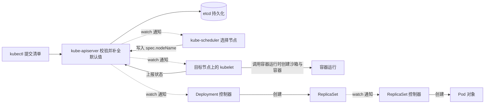

# Day 1 学习笔记 · Pod 与 Deployment

> 日期：2026-09-18 · 代码：`code/week2/day1/`（`pod.webapp.yaml`、`deploy.webapp.yaml`）
> 配套资料：`docs/k8s_in_action/02-Pod与副本机制.md`，以及 `plan/week2/任务明细.md` 中的 Day 1
> 起点资产：第 1 周构建的镜像 `webapp:v4`（占用磁盘 25.3MB、以非 root 用户 uid 10001 运行、基于 alpine 底座）
> 本周的模型变化：从「直接命令 Docker 执行动作」转为「声明期望的状态，由 Kubernetes 的控制器把实际状态调整到期望状态」。

---

## 一、今日速览（结论，收尾时填）

| 编号 | 结论 |
|---|---|
| 1 | 集群状态：单节点 kind 集群，节点名称为 `kind-control-plane`，节点地址为 172.18.0.2；`kubectl get nodes` 与 Pod 的 `NODE` 列显示一致。 |
| 2 | 镜像为什么需要导入节点：`kind load docker-image webapp:v4` 把镜像写入节点内部的容器运行时镜像库。证据是 `kubectl describe` 输出中的 `Image ID` 为 `docker.io/library/import-2026-09-18@sha256:4bf2cfd4…`，其中 `import-2026-09-18` 是导入时生成的引用，说明容器使用的镜像来自节点内部，而不是从远程仓库拉取。 |
| 3 | Pod 与容器的关系：Pod 是一组被放在同一个节点上共同运行的容器集合，它是调度的最小单位；同一个 Pod 内的容器共享 Network、UTS、IPC 三种命名空间，因此共用 IP 地址、主机名与端口空间，文件系统默认互相隔离。 |
| 4 | 删除 Pod 之后重建：新 Pod 的名称与 IP 地址都会改变（本次观察到的 IP 依次为 10.244.0.6、10.244.0.7、10.244.0.9、10.244.0.10、10.244.0.11），这说明 Pod 是一次性对象，删除并重建等价于创建一个全新的对象。 |
| 5 | 裸 Pod 与 Deployment 的差异：删除裸 Pod 之后不会自动恢复；删除由 Deployment 管理的 Pod 之后，ReplicaSet 控制器会创建一个新 Pod 补齐数量，本次观察到 `webapp-7dbcc8ff4b-cz4vc` 被删除后出现了 `webapp-7dbcc8ff4b-qpndp`，其 AGE 为 8 秒。 |
| 6 | 遗留疑问：扩容与缩容时，控制器依据什么顺序选择要删除的 Pod？（属于实现细节，本次不展开） |

---

## 二、任务清单

| 编号 | 任务 | 完成 | 原始输出留在哪 |
|---|---|---|---|
| 1 | 检查集群状态（`docker ps -a --filter name=kind` 与 `kubectl get nodes`） | ✅ | 间接证据：Pod 的 `NODE` 列为 `kind-control-plane` |
| 2 | 执行 `kind load docker-image webapp:v4` 把镜像导入节点 | ✅ | 间接证据：`Image ID` 为 `import-2026-09-18@sha256:…` |
| 3 | 用 `kubectl run --dry-run=client -o yaml` 生成 YAML 模板，并逐字段阅读 | ✅ | `outputs/00-dry-run-pod.yaml`、`outputs/00b-dry-run-deploy.yaml` |
| 4 | 自己编写 `code/week2/day1/pod.webapp.yaml` 并创建裸 Pod | ✅ | 同上 |
| 5 | 执行 `kubectl get po -o wide`、`kubectl describe po`、`kubectl logs` | ✅ | `outputs/01-po-wide.txt` |
| 6 | 执行 `kubectl port-forward`，并在另一个终端执行 `curl` 验证 | ✅ | `outputs/03-port-forward.txt` |
| 7 | 执行 `kubectl exec` 进入容器，查看 `/proc/1/cmdline`、`hostname`、`env` | ✅ | 结果与遇到的问题记录在本节末尾的「容器内查看进程与环境的两个操作问题」表 |
| 8 | 删除裸 Pod，确认它不会自动恢复 | ✅ | 间接证据：Day 2 的基线记录中不存在名为 `webapp` 的裸 Pod，集群中只有 Deployment 管理的两个 Pod |
| 9 | 编写并创建 `code/week2/day1/deploy.webapp.yaml`（副本数量为 3） | ✅ | 同上 |
| 10 | 执行 `kubectl get deploy,rs,po` 同时观察三层对象 | ✅ | `outputs/02-three-layers.txt` |
| 11 | 删除一个由 Deployment 管理的 Pod，确认控制器自动补齐 | ✅ | 同上 |
| 12 | 执行 `kubectl scale` 完成一次扩容与一次缩容 | ✅ | 同上 |
| 13 | 完成 Linux 每日一题 Day 8（umask） | ✅ 讲解式完成 | 见第八节 |
| 14 | 回答当天的面试问答卡（四道题，见 `plan/week2/任务明细.md`） | ✅ 批改完成 | 见第七节 |

---

## 三、概念（机制，用自己的话写）

> 阅读顺序建议：先读 3.1 至 3.3，弄清 Pod、Deployment、ReplicaSet 这三个对象各自是什么；再读 3.4 的对象关系；然后读 3.5 的完整工作链路，把三个对象放进一次部署的全过程中；最后读 3.6 与 3.7 的模型对照与推论。

### 3.1 Pod 对象本身

| 问题 | 答案 |
|---|---|
| 它是什么类型的东西？ | 它既是 Kubernetes 中最小的可调度单位，也是一种内置 API 资源（`apiVersion: v1`、`kind: Pod`），内容是一份「若干容器共享若干命名空间、并且必须运行在同一个节点上」的声明。 |
| 它属于哪个层级？ | 它属于命名空间级对象，因此 `kubectl get po` 默认只列出当前命名空间中的 Pod。 |
| 谁创建它？ | 可以由我直接创建，这种 Pod 称为裸 Pod；也可以由控制器创建，例如 ReplicaSet、DaemonSet、Job。由控制器创建时，Pod 的 `metadata.ownerReferences` 字段会指向创建它的控制器对象，这是判断「这个 Pod 属于谁」的权威依据。 |
| 它的生命周期是怎样的？ | Pod 是一次性对象：删除它就等于新建一个全新的 Pod，名称与 IP 地址都会改变。可以被重启的只有容器这一层（表现为 `RESTARTS` 计数增加），Pod 对象本身不会重启。这里需要补一个限定条件：`status.podIP` 在生命周期内保持不变的前提是**沙箱不被重建**；节点容器重启或节点上的容器运行时重启会重建沙箱并重新分配地址，判断依据是事件中的 `SandboxChanged`，而 Pod 的 `uid` 与 `metadata.creationTimestamp` 仍然不变（该限定条件由 Day 2 的实测确认）。 |
| 它是不是容器？ | 不是。一个 Pod 可以包含多个容器，这些容器共享 Network、UTS、IPC 三种命名空间（p.109-110），但它们的文件系统默认互相隔离。 |

#### 3.1.1 Pod 内部容器的共享范围（Day 1 实测结论）

| 问题 | 答案 |
|---|---|
| Pod 是调度单位，这句话的推论是什么？ | 调度器以 Pod 为对象选择节点，因此同一个 Pod 内的全部容器必然位于同一个节点上，无法被拆分到两个节点。 |
| 同 Pod 容器共享哪些 namespace？ | 共享 Network、UTS、IPC 三种命名空间，因此共用 IP 地址、主机名与端口空间。 |
| 同 Pod 容器**不**共享什么？ | 默认不共享 PID 命名空间与文件系统，因此进程之间互不可见、文件系统互相隔离；需要共享目录时必须显式挂载卷。 |
| 同 Pod 两容器能绑同一端口吗？为什么？ | 不能，因为端口空间是共用的，第二个容器绑定该端口时会返回地址已被占用的错误。 |
| 不同 Pod 的端口会冲突吗？为什么？ | 不会，因为每个 Pod 拥有独立的网络命名空间，端口空间彼此独立。 |

#### 3.1.2 Pod 对象的字段清单

| 字段 | 是否必须 | 含义 |
|---|---|---|
| `apiVersion: v1` 与 `kind: Pod` | 必须 | 声明这是一个 Pod 对象。 |
| `metadata.name` | 必须，与 `metadata.generateName` 二者取一 | Pod 的名称。由控制器创建时，名称由控制器生成，结构为 `<控制器名称>-<随机后缀>`。 |
| `metadata.namespace` | 可选 | 省略时使用当前上下文的命名空间。 |
| `metadata.labels` | 可选 | 供标签选择器匹配使用。ReplicaSet 判断「这个 Pod 是否属于我」时会同时依据标签与 `ownerReferences` 两个信息。 |
| `metadata.ownerReferences` | 由 API Server 写入 | 一个对象创建另一个对象时自动写入，指向拥有者。例如 Pod 的拥有者是 ReplicaSet，ReplicaSet 的拥有者是 Deployment。 |
| `spec.containers[]` | 必须 | 容器列表，常用子字段是 `name`（必须，并且在 Pod 内唯一）、`image`（必须）、`ports[].containerPort`（只是声明，不产生任何网络规则）、`env`、`volumeMounts`、`command` 与 `args`、`resources`（其中 `requests` 与 `limits` 在第 3 周介绍）、`livenessProbe` 与 `readinessProbe`（第 2 周 Day 4 介绍）。 |
| `spec.restartPolicy` | 可选，默认值为 `Always` | 容器退出之后的处理方式，取值可以是 `Always`、`OnFailure`、`Never`。执行这个动作的是容器所在节点上的 kubelet。 |
| `spec.nodeName` | 通常为空，由调度器写入 | Pod 被调度到哪一个节点。手写清单时通常不写该字段；一旦写死，调度器就不再参与选择。 |
| `spec.volumes[]` | 可选 | Pod 级的卷声明，可以被 Pod 内的多个容器同时挂载，这是同一个 Pod 内多个容器共享文件的方式（第 3 周介绍）。 |
| `spec.dnsPolicy` | 可选，默认值为 `ClusterFirst` | 域名解析策略，它决定容器内的 `/etc/resolv.conf` 指向 CoreDNS，还是沿用节点上的解析配置。 |
| `spec.terminationGracePeriodSeconds` | 可选，默认值为 30 | 删除 Pod 时，kubelet 先向容器主进程发送 TERM 信号，等待这段时间之后如果进程仍然存在，再发送 KILL 信号。 |
| `spec.serviceAccountName` | 可选，默认值为 `default` | Pod 用哪一个 ServiceAccount 的身份访问 API Server；因此每个 Pod 默认会挂载一个令牌卷（第 5 周介绍）。 |
| `status` | 服务端字段 | 由 kubelet 上报、由 API Server 写入。常用子字段是 `phase`、`podIP`、`hostIP`、`startTime`、`conditions[]`（其中 `Ready` 表示是否通过就绪判定）与 `containerStatuses[].restartCount`（也就是 `RESTARTS` 这一列的来源）。 |

### 3.2 Deployment 对象本身

| 问题 | 答案 |
|---|---|
| 它是什么类型的东西？ | 它是一种内置 API 资源（`apiVersion: apps/v1`、`kind: Deployment`），内容是一份「某个版本的 Pod 应该运行多少个副本」的声明，并且负责在版本发生变化时以滚动方式替换副本（第 9 章，p.413-438）。 |
| 它属于哪个层级？ | 命名空间级对象。 |
| 它直接创建 Pod 吗？ | 不直接创建。它创建 ReplicaSet，再由 ReplicaSet 创建 Pod，因此从提交到运行一共存在四层对象：Deployment → ReplicaSet → Pod → 容器。 |
| 它为什么能够回滚？ | 因为升级时它不会删除旧的 ReplicaSet，而只是把旧 ReplicaSet 的副本数量调小；回滚时把旧 ReplicaSet 的副本数量重新调大即可（p.422）。 |

#### 3.2.1 Deployment 对象的字段清单

| 字段 | 是否必须 | 含义 |
|---|---|---|
| `apiVersion: apps/v1` 与 `kind: Deployment` | 必须 | 声明这是一个 Deployment 对象。 |
| `metadata.name` | 必须 | Deployment 的名称，它同时是它创建的 ReplicaSet 名称的前缀。 |
| `spec.replicas` | 可选，默认值为 1 | 期望的 Pod 副本数量；实际的增减由 ReplicaSet 控制器执行。 |
| `spec.selector` | 必须，并且创建之后不可修改 | 用来判断哪些 Pod 属于本次部署。Deployment 控制器会在它之上追加 `pod-template-hash` 标签，再把这组选择器交给 ReplicaSet。 |
| `spec.template` | 必须 | Pod 模板，其中 `metadata.labels` 必须与 `spec.selector` 匹配，否则 API Server 会拒绝创建。 |
| `spec.strategy` | 可选，默认值为 `RollingUpdate` | 升级方式。`RollingUpdate` 的两个子字段是 `maxSurge` 与 `maxUnavailable`，默认值都是 25%（p.426）；取值为 `Recreate` 时会先删除全部旧 Pod 再创建新的。 |
| `spec.revisionHistoryLimit` | 可选，默认值为 10 | 保留多少个旧的 ReplicaSet 用于回滚。 |
| `spec.minReadySeconds` | 可选，默认值为 0 | 一个新 Pod 需要保持就绪多少秒之后，才被算作本次升级取得的进展。 |
| `status` | 服务端字段 | 由控制器写入，常用子字段是 `replicas`、`readyReplicas`、`updatedReplicas`、`availableReplicas` 与 `observedGeneration`。 |

### 3.3 ReplicaSet 对象本身

| 问题 | 答案 |
|---|---|
| 它是什么类型的东西？ | 它是一种内置 API 资源（`apiVersion: apps/v1`、`kind: ReplicaSet`），职责是持续对账，让「匹配选择器的 Pod 数量」始终等于 `spec.replicas`（p.183）。 |
| 它的对账过程是怎样的？ | 它先计算「期望副本数」与「实际副本数」的差值：差值为正时用 `spec.template` 创建新的 Pod，差值为负时删除多余的 Pod（p.163，教材以 ReplicationController 为例描述了同一套操作）。 |
| 它与 Deployment 的分工是什么？ | Deployment 负责版本与滚动过程，ReplicaSet 负责数量，因此同一份声明被拆成「改成什么版本」与「保持多少个」两件事。 |
| 它创建的 Pod 有什么特征？ | Pod 的名称是 `<ReplicaSet 名称>-<随机后缀>`，而 ReplicaSet 名称又是 `<Deployment 名称>-<pod-template-hash>`，因此 Pod 名称的中间一段就是模板哈希。 |

#### 3.3.1 ReplicaSet 对象的字段清单

| 字段 | 是否必须 | 含义 |
|---|---|---|
| `apiVersion: apps/v1` 与 `kind: ReplicaSet` | 必须 | 声明这是一个 ReplicaSet 对象。 |
| `spec.replicas` | 可选，默认值为 1 | 期望的 Pod 副本数量。 |
| `spec.selector` | 必须 | 标签选择器。它可以写成 `matchLabels` 形式，也可以写成表达力更强的 `matchExpressions` 形式（p.185）；由 Deployment 创建时，其中会多出 `pod-template-hash` 这一项。 |
| `spec.template` | 必须 | Pod 模板，包括标签与容器定义。模板发生变化时会触发 Pod 的替换。 |
| `status` | 服务端字段 | 常用子字段是 `replicas`、`fullyLabeledReplicas`、`readyReplicas`、`availableReplicas` 与 `observedGeneration`。 |

### 3.4 三个对象之间的关系

| 对象 | 由谁创建 | 靠哪些字段与下一层关联 | 负责维持什么 | `ownerReferences` 指向 |
|---|---|---|---|---|
| Deployment | 我执行 `kubectl apply` 创建 | `spec.template` 与 `spec.selector`；它为自己创建的 ReplicaSet 生成带 `pod-template-hash` 的名称与标签 | 期望的副本数量与版本历史（保留旧的 ReplicaSet） | 无，因为它由我直接创建 |
| ReplicaSet | Deployment 控制器 | `spec.selector`（其中包含 `pod-template-hash`）与 `spec.template` | 匹配选择器的 Pod 数量等于 `spec.replicas` | Deployment |
| Pod | ReplicaSet 控制器 | 模板中的 `metadata.labels`，同时写入 `ownerReferences` | 容器持续运行；容器退出时由 kubelet 按 `restartPolicy` 重启 | ReplicaSet |
| 容器 | kubelet 调用节点上的容器运行时 | Pod 中 `containers[]` 的 `image` 与 `command` | 进程的运行与重启 | 不适用，因为容器不是 API 对象 |

本次实测的证据是哈希 `7dbcc8ff4b` 同时出现在三个位置：ReplicaSet 名称的后缀、ReplicaSet 选择器的一部分、Pod 名称的中间一段。

### 3.5 从提交清单到容器运行、再到删除后补齐的完整工作链路

> 下面把整个过程拆成六个阶段。每个阶段都列出执行者、输入、动作、产生的对象或状态变化与观察方式。其中标注为「补充」的内容是我补充的执行顺序，教材第 11 章 11.1.7（p.504-505）只概述了 kubelet 的职责，没有逐条展开沙箱与网络的具体创建顺序。

#### 阶段一：镜像进入节点内部的镜像库

| 序号 | 执行者 | 输入 | 动作 | 产生的对象或状态变化 | 观察方式 |
|---|---|---|---|---|---|
| 1 | 我执行 `kind load docker-image webapp:v4` | 宿主机 Docker 守护进程镜像库中的镜像 | 把镜像层打包并导入节点容器内部的容器运行时镜像库 | 节点镜像库中出现该镜像，引用名形如 `import-2026-09-18@sha256:…` | 补充命令：`docker exec kind-control-plane crictl images` |

#### 阶段二：裸 Pod 从提交到运行

| 序号 | 执行者 | 输入 | 动作 | 产生的对象或状态变化 | 观察方式 |
|---|---|---|---|---|---|
| 2 | kubectl 客户端 | `pod.webapp.yaml` | 读取文件，执行客户端校验，然后向 API Server 发送创建请求（p.121） | 生成请求体，此时集群中还没有任何对象 | `kubectl create -f pod.webapp.yaml --dry-run=client -o yaml` |
| 3 | kube-apiserver，负责认证、鉴权、准入控制与默认值补全 | 请求体 | 确认身份，执行鉴权，再由准入控制器校验字段，然后补全默认值：`restartPolicy` 设为 `Always`、`dnsPolicy` 设为 `ClusterFirst`、`terminationGracePeriodSeconds` 设为 30、`serviceAccountName` 设为 `default`，并且在标签不是 `latest` 时把 `imagePullPolicy` 设为 `IfNotPresent` | 得到一个字段完整的 Pod 对象，此时 `spec.nodeName` 仍然为空 | `kubectl get po webapp -o yaml`，观察我未写出的字段 |
| 4 | kube-apiserver，负责持久化与通知 | 字段完整的对象 | 把对象写入 etcd，并通过 watch 机制把变更推送给正在监听 Pod 的客户端（p.493） | etcd 中新增一条记录 | 没有可以直接使用的观察命令 |
| 5 | kube-scheduler | 「尚未绑定节点」的 Pod 列表与各节点的资源与约束信息 | 先执行过滤，排除不满足约束的节点；再执行打分，选出得分最高的节点；最后向 API Server 提交绑定结果（p.495） | Pod 的 `spec.nodeName` 被写入 | `kubectl get po -o wide` 的 `NODE` 列；`kubectl describe po webapp` 的 Events 中出现 `Scheduled` |
| 6 | 目标节点上的 kubelet | 被绑定到本节点的 Pod | 补充说明的执行顺序：先为 Pod 创建沙箱容器并建立网络命名空间，再调用 CNI 插件为沙箱分配 IP，然后从镜像库拉取或复用镜像，最后创建并启动业务容器 | 容器开始运行，`status.podIP` 被写入（本次实测为 `10.244.0.6`） | `kubectl describe po webapp` 的 Events 中出现 `Pulled`、`Created`、`Started` 三条记录 |
| 7 | 目标节点上的 kubelet，持续监控 | 容器的运行状态 | 按照教材的概括，kubelet 持续监控容器的运行，向 API Server 报告状态、事件与资源消耗；容器退出时按 `restartPolicy` 重启容器，探针报错时也由它重启容器（p.504-505） | `READY` 变为 `1/1`，`RESTARTS` 计数可能增加 | `kubectl get po` 的 `READY` 与 `RESTARTS` 两列；`kubectl logs --previous` |

#### 阶段三：Deployment 路径（由两级控制器接手）

| 序号 | 执行者 | 输入 | 动作 | 产生的对象或状态变化 | 观察方式 |
|---|---|---|---|---|---|
| 8 | kubectl 客户端与 kube-apiserver | `deploy.webapp.yaml` | 与第 2 至第 4 步相同的校验、默认值补全（`replicas`、`strategy`、`revisionHistoryLimit`）与持久化过程 | Deployment 对象存在并被写入 etcd | `kubectl get deploy webapp -o yaml` |
| 9 | Deployment 控制器，运行在 kube-controller-manager 中（p.498） | 新建的 Deployment 对象 | 依据 `spec.template` 计算出 `pod-template-hash`，创建（或者在模板哈希相同时收养）一个名称与标签都带该哈希的 ReplicaSet，并把副本数量写给它 | 出现 ReplicaSet，例如 `webapp-7dbcc8ff4b` | `kubectl get rs`；`kubectl get rs webapp-7dbcc8ff4b -o yaml`，观察选择器中多出的 `pod-template-hash` |
| 10 | ReplicaSet 控制器 | ReplicaSet 对象与匹配选择器的现有 Pod 列表 | 计算「期望副本数」与「实际副本数」的差值，差值为正时用 `spec.template` 创建新的 Pod 对象，并写入指向该 ReplicaSet 的 `ownerReferences` | 出现带哈希前缀的 Pod，例如 `webapp-7dbcc8ff4b-cz4vc` | `kubectl get po --show-labels` |
| 11 | kube-scheduler 与 kubelet | 新创建的 Pod 对象 | 与阶段二的第 5 至第 7 步完全相同：调度到某个节点、创建沙箱与容器、上报状态 | 新 Pod 进入 `Running` 且 `READY` 为 `1/1` | `kubectl get po -o wide` |
| 12 | Deployment 控制器，持续对账 | Deployment 对象与它管理的全部 ReplicaSet 的状态 | 比较期望副本数与各 ReplicaSet 的实际副本数，必要时调整，并把结果写回自身的 `status` | `readyReplicas` 与 `updatedReplicas` 等字段被更新 | `kubectl get deploy` 的 `READY` 与 `UP-TO-DATE` 两列 |

#### 阶段四：删除一个 Pod 之后的补齐（本次观察到的自愈行为）

| 序号 | 执行者 | 输入 | 动作 | 产生的对象或状态变化 | 观察方式 |
|---|---|---|---|---|---|
| 13 | 我执行 `kubectl delete po <名称>` | Pod 名称 | kube-apiserver 为该对象写入 `deletionTimestamp`，随后把它从 etcd 中删除 | Pod 进入 `Terminating`，最终消失 | `kubectl get po -w` |
| 14 | 该 Pod 所在节点上的 kubelet | 删除事件 | 先向容器主进程发送 TERM 信号，等待 `terminationGracePeriodSeconds` 指定的时间之后如果进程仍然存活则发送 KILL 信号，然后回收沙箱与 IP 地址（p.505） | 容器进程终止，Pod 的 IP 被回收 | `kubectl describe po` 的 Events |
| 15 | ReplicaSet 控制器 | 匹配选择器的 Pod 数量少于期望值 | 一次对账中发现差值为正，于是创建一个新的 Pod 对象 | 出现名称与 IP 都与被删除的那个不同的新 Pod | 对比删除前后的 `kubectl get po -o wide` 输出 |
| 16 | kube-scheduler 与 kubelet | 新创建的 Pod | 重新执行调度、沙箱创建、IP 分配与容器启动 | 新 Pod 进入 `Running` 且 `READY` 为 `1/1` | 与上一行相同 |
| 17 | 机制总结 | 上述全过程 | Deployment 与 ReplicaSet 两个对象的内容在这段时间里没有发生变化 | 被替换的只有 Pod 这一层的对象，因此自愈行为发生在 Pod 这一层，并且由 ReplicaSet 控制器完成 | 对比两次 `kubectl get po` 与一次 `kubectl get rs` |

#### 阶段五：调整副本数量（扩容与缩容）

| 序号 | 执行者 | 输入 | 动作 | 产生的对象或状态变化 | 观察方式 |
|---|---|---|---|---|---|
| 18 | 我执行 `kubectl scale deploy webapp --replicas=4` | 期望副本数 4 | kube-apiserver 更新 Deployment 对象的 `spec.replicas` | Deployment 的字段发生变化 | `kubectl get deploy webapp -o yaml` |
| 19 | Deployment 控制器 | Deployment 的更新事件 | 把新的副本数量写给它管理的 ReplicaSet | ReplicaSet 的 `spec.replicas` 变为 4 | `kubectl get rs` |
| 20 | ReplicaSet 控制器 | 期望数量与实际数量之间的差值 | 差值为正时创建 Pod，差值为负时删除 Pod | Pod 数量等于期望值 | `kubectl get po` |
| 21 | 本次的遗留疑问 | 缩容过程 | 控制器在删除 Pod 时遵循某种排序规则（本次观察到被删除的是两个较新的 Pod），该排序规则属于实现细节 | 不适用 | 已记录在第六节 |

#### 阶段六：删除 Deployment 时的级联清理

| 序号 | 执行者 | 输入 | 动作 | 产生的对象或状态变化 | 观察方式 |
|---|---|---|---|---|---|
| 22 | 我执行 `kubectl delete deploy webapp` | 删除命令 | kube-apiserver 删除 Deployment 对象，并依据 `ownerReferences` 触发级联删除 | Deployment 对象消失 | `kubectl get deploy` |
| 23 | 垃圾回收控制器 | ReplicaSet 对象上的 `ownerReferences` 指向已经消失的 Deployment | 删除该 Deployment 名下的全部 ReplicaSet | ReplicaSet 对象消失 | `kubectl get rs` |
| 24 | 垃圾回收控制器与 kubelet | Pod 对象上的 `ownerReferences` 指向已经消失的 ReplicaSet | 删除这些 Pod，并由各个节点上的 kubelet 终止容器 | Pod 对象消失，容器停止运行 | `kubectl get po` |
| 25 | 与裸 Pod 的对比结论 | 上述全过程 | 由控制器管理的对象链被整条删除；而我直接创建的裸 Pod 只有自己一个对象，删除它不会牵连任何其他对象 | 不适用 | 对比两次删除命令的输出 |

### 3.6 与 Docker 的对应关系（本周的模型切换）

| 维度 | Docker（第 1 周） | Kubernetes（第 2 周） |
|---|---|---|
| 运行单位 | 容器 | Pod，也就是一组一起运行、并且始终位于同一节点上的容器 |
| 镜像来源 | 宿主机 Docker 的镜像库可以直接使用 | 只能使用节点内部容器运行时镜像库中的镜像，因此必须先执行 `kind load docker-image` |
| 网络访问 | `-p 8080:8080`，由宿主机上的 DNAT 规则完成 | 每个 Pod 拥有独立的 IP 地址；调试时使用 `kubectl port-forward`，正式的对外暴露方式在 Day 2 学习 Service 时介绍 |
| 进程退出 | 需要自己执行 `docker start` | kubelet 根据 `restartPolicy`（Pod 的默认值为 `Always`）自动重启容器 |
| 容器被删除 | 不会自动恢复 | 由 ReplicaSet 控制器创建一个新的 Pod 来补齐副本数量 |

### 3.7 Deployment 与 ReplicaSet 的关系（补充说明）

| 问题 | 答案 |
|---|---|
| 从提交 Deployment 到容器运行，一共经过哪几层对象？ | 四层：Deployment → ReplicaSet → Pod → 容器。 |
| 副本数量由哪一层对象负责维持？ | 由 ReplicaSet 负责维持，Deployment 只声明期望的副本数量。 |
| Deployment 为什么能够回滚？ | 因为升级时它会保留旧的 ReplicaSet，回滚时把旧 ReplicaSet 的副本数量重新调大。 |
| Pod 的名称为什么带有随机后缀？ | 因为 Pod 由控制器创建，名称由控制器生成。完整结构为 `<Deployment 名称>-<pod-template-hash>-<随机后缀>`，本次实测的哈希为 `7dbcc8ff4b`。 |

#### 补充说明：为什么裸 Pod 不会被 Deployment 接管

本次实验中，裸 Pod 的名称是 `webapp`，Deployment 的名称也是 `webapp`，两者的标签都包含 `app=webapp`，但是 Deployment 的副本统计中没有包含这个裸 Pod：`kubectl get deploy,rs,po` 的输出显示副本数为 `3/3`，对应的三个 Pod 全部带有 `pod-template-hash` 前缀。

原因是 Deployment 在创建 ReplicaSet 时，会把 `pod-template-hash` 这个标签追加到 ReplicaSet 的选择器中。因此 ReplicaSet 实际使用的选择器是 `app=webapp,pod-template-hash=7dbcc8ff4b`，而裸 Pod 缺少这个标签，所以不会被选中，也不会被计入副本数量。

Pod 名称的中间部分就是这个哈希值，它同时出现在三个位置：ReplicaSet 名称的后缀、ReplicaSet 选择器的一部分、Pod 名称的中间部分。这三处一致，正是控制器用来判断「这个 Pod 是否属于我」的依据。

如果跳过 Deployment 直接创建 ReplicaSet，那么它的选择器就只有 `app=webapp`，此时标签匹配的孤立 Pod 会被控制器接管（《Kubernetes in Action》中称之为收养，p.163-170）。这也是 Deployment 要在选择器中加入哈希标签的原因：避免把标签恰好相同的无关 Pod 误认为自己的副本。

---

## 四、命令

| 场景 | 命令 | 说明（修改了集群中的哪个对象或状态） |
|---|---|---|
| 查看集群与节点 | `kubectl get nodes` | 读取节点对象的状态，确认节点处于 `Ready`。 |
| 把镜像导入节点内部的镜像库 | `kind load docker-image webapp:v4` | 把宿主机 Docker 中的镜像写入节点内部的容器运行时镜像库。 |
| 生成 YAML 模板（只输出到文件，不创建资源） | `kubectl run webapp --image=webapp:v4 --port=8080 --dry-run=client -o yaml > outputs/00-dry-run-pod.yaml` | 由客户端生成清单模板，不会向 API Server 提交任何对象。 |
| 根据 YAML 创建资源 | `kubectl create -f pod.webapp.yaml` | 向 API Server 提交创建请求；如果对象已经存在，命令会报错。 |
| 以声明式方式创建或更新资源 | `kubectl apply -f deploy.webapp.yaml` | 向 API Server 提交期望状态；对象已经存在时执行更新而不是报错。 |
| 查看 Pod 的 IP 地址与所在节点 | `kubectl get po -o wide` | 读取 Pod 对象的 `status.podIP` 与 `spec.nodeName` 字段。 |
| 同时查看 Deployment、ReplicaSet、Pod 三层对象 | `kubectl get deploy,rs,po` | 一次读取三种资源，用于观察三层对象的对应关系。 |
| 查看事件记录（排查的第一步） | `kubectl describe po webapp` | 读取事件记录，本次观测到调度、镜像、创建、启动四个事件。 |
| 查看日志与上一个容器的日志 | `kubectl logs webapp` 与 `kubectl logs --previous` | 读取容器主进程写到标准输出的内容，后者用于查看已经被替换掉的容器。 |
| 进入容器内部 | `kubectl exec -it webapp -- sh` | 在容器内部执行命令。 |
| 转发端口 | `kubectl port-forward po/webapp 8888:8080` | 通过 API Server 与 kubelet 建立隧道，把本地端口转发到 Pod 的端口。 |
| 调整副本数量 | `kubectl scale deploy webapp --replicas=4` | 修改 Deployment 的期望副本数量，由 ReplicaSet 执行实际的增减。 |
| 删除 Pod | `kubectl delete po <名称>` | 删除 Pod 对象；如果该 Pod 由控制器管理，控制器会在下一轮对账时创建新的 Pod。 |

---

## 五、易错点

| 编号 | 易错点 | 现象 | 正确做法 |
|---|---|---|---|
| 1 | 清单文件中保留了占位符 `<>` | 创建时被 API Server 拒绝，报错信息包含 `metadata.labels: Invalid value: "<>"` | 标签取值只能包含字母、数字、`-`、`_`、`.`，并且必须以字母数字开头和结尾。写完清单后可以先用 `kubectl create --dry-run=server -f <文件名>` 校验。 |
| 2 | 把 `status: {}` 写进清单文件 | 提交时会带上服务端字段 | `status` 字段由服务端写入，`--dry-run=client` 的输出保留了这个占位符，手写清单时应当删除。 |
| 3 | 把事件中的 `Pulled` 理解为真的拉取了镜像 | 误认为每次启动容器都会从远程仓库下载镜像 | 本次事件的原文是 `Container image "webapp:v4" already present on machine`，说明 kubelet 直接使用了节点上已有的镜像。原因是在镜像标签不是 `latest` 的情况下，`imagePullPolicy` 的默认值为 `IfNotPresent`。 |
| 4 | 认为标签相同的裸 Pod 会被 Deployment 接管 | 预期副本数量会变成 4 个 | Deployment 生成的 ReplicaSet，其选择器中还包含 `pod-template-hash`，因此不会选中缺少该标签的裸 Pod。 |
| 5 | 忽略 `describe` 输出中的其他字段 | 不清楚 `QoS Class`、`Tolerations`、`Mounts` 的含义 | `QoS Class: BestEffort` 说明没有设置资源请求与限制（第 3 周介绍）；`Tolerations` 是默认添加的容忍（第 3 周介绍）；`Mounts` 中的 `kube-api-access-…` 是自动挂载的 ServiceAccount 令牌卷（第 5 周介绍）。 |
| 6 | 用 `status.startTime` 或 IP 的取值判断 Pod 是否被重建 | 看到 IP 变化就认为 Pod 被重建了 | 判断 Pod 是否被重建要看 `metadata.uid` 与 `metadata.creationTimestamp`；`status.podIP` 只表示当前沙箱的地址，节点容器重启或容器运行时重启会重建沙箱并重新分配地址，此时事件中出现 `SandboxChanged`，`RESTARTS` 计数随之增加（该结论由 Day 2 的实测确认，证据在 `code/week2/day2/outputs/07-fix-and-verify.txt`）。 |

---

## 六、我的疑问

- 缩容时控制器依据什么顺序选择要删除的 Pod？（本次观察到被删除的是两个较新的 Pod，但具体排序规则尚未查阅）
- `kubectl describe` 输出中的 `QoS Class`、`Tolerations`、`Mounts` 三个字段分别由什么机制产生？（已在易错点表中记录归属周次）
- `cat /proc/1/cmdline` 在容器内没有正常显示内容，原因见第七节末尾。

---

## 七、面试问答卡批改记录（Day 1）

| 题目 | 我的回答要点 | 批改结论 |
|---|---|---|
| 1. 同 Pod 容器共享哪些命名空间？ | 共享 Network、UTS；不共享文件系统、IPC、PID；不能监听同一端口 | 漏了 **IPC**：同一个 Pod 内的容器**共享** Network、UTS、IPC 三种命名空间；**不共享**的是 PID（默认）与文件系统。其余部分正确。 |
| 2. `RESTARTS` 统计的是什么？ | 不确定，认为是启动次数；Pod 不是持久对象；IP 每次启动都会变 | 三个需要修正的点：① 统计的是**容器被重启的次数**，第一次启动不计入，因此 `RESTARTS 0` 表示从未重启；② Pod 的 IP 在**生命周期内不变**，只有 Pod 被删除并重建之后才会获得新 IP；③ 与 Docker 容器对比的方向是正确的（Docker 容器的可写层在 stop 与 start 之间保留，而 Pod 删除即新建）。 |
| 3. 为什么宿主机 `docker images` 里有的镜像，kind 节点看不到？ | kind 是运行在 Docker 容器里的集群，因此被隔离，节点读不到外部 Docker 的镜像 | 方向正确。更精确的表述是：两层各自拥有**独立的镜像库**。宿主机上是 Docker 守护进程的镜像库，节点容器内部是 containerd 的镜像库，两者是不同的存储目录，因此必须用 `kind load docker-image` 把镜像复制过去。 |
| 4. Docker 的 `-p` 与 `kubectl port-forward` 在机制上有什么区别？ | `-p` 是宿主机端口到容器端口的映射，会按字面暴露；Kubernetes 中的端口声明不是强制的；`port-forward` 与 Service 有关 | 方向部分正确，需要补充机制：`-p` 由**内核**的 netfilter 规则完成 DNAT；`containerPort` 与 Dockerfile 的 `EXPOSE` 一样只是声明；`port-forward` 是**用户态隧道**（kubectl → API Server → kubelet → 容器），**不经过 Service**，是绕过 Service 的临时调试通道。 |
> 补充实测证据（2026-09-20）：执行 `kubectl port-forward po/webapp-7dbcc8ff4b-qs5xh 8888:8080`，然后在另一个终端执行 `curl --noproxy '*' -i http://127.0.0.1:8888/`，得到 `HTTP/1.1 200 OK` 与 `<h1>Hello DevOps</h1>`。整个过程中没有使用 Service 对象，因此这条通道与 Service 是两条独立的访问路径；原始输出见 `outputs/03-port-forward.txt`。
### 容器内查看进程与环境的两个操作问题

| 现象 | 原因 | 正确做法 |
|---|---|---|
| `cat hostname` 与 `cat env` 提示找不到文件 | `hostname` 与 `env` 是**可执行命令**，不是文件，因此不能用 `cat` 读取 | 直接执行 `hostname` 与 `env`；如果要读取内核提供的信息，主机名文件是 `/proc/sys/kernel/hostname`，环境变量是 `/proc/1/environ` |
| `cat /proc/1/cmdline` 没有正常显示 | `/proc/<PID>/cmdline` 使用 NUL 字节分隔各个参数，直接输出到终端时多个参数会挤在一起，看起来像空行或乱码 | 用 `tr '\0' ' ' < /proc/1/cmdline` 把分隔符转换为空格，或用 `cat -v /proc/1/cmdline` 查看 |

---

## 八、Linux 每日一题 Day 8 · 文件权限与 umask（讲解式完成）

> 说明：本题涉及的概念此前没有接触过，因此本轮不采用「先自己答」的方式，而是直接给出完整答案与机制，并附上可以自己验证的命令。

| 问题 | 答案 |
|---|---|
| ① `umask` 为 `022` 时，新建文件与新建目录的默认权限分别是多少？为什么文件的权限不是 `666`？ | 新建文件的权限是 `644`（`rw-r--r--`），新建目录的权限是 `755`（`rwxr-xr-x`）。文件不是 `666` 的原因有两层：第一层是 `umask 022` 屏蔽了 group 与 others 的**写位**，因此 `666` 变为 `644`；第二层是**文件的基准权限本来就是 `666`**，其中不包含执行位，因为新建文件默认不应当可执行（否则下载或生成的文件会未经确认就能运行），而目录的基准权限是 `777`，因为目录必须带执行位才能被进入。 |
| ② 希望新建目录为 `750`、新建文件为 `640`，`umask` 应当设置为多少？ | `umask` 应当设置为 `027`。验证：目录 `777 & ~027 = 750`；文件 `666 & ~027 = 640`。 |

### 权限模型（本次补充的基础）

| 概念 | 内容 |
|---|---|
| 权限位的数值 | 读 `r` 为 4，写 `w` 为 2，执行 `x` 为 1；一组三位的最大值是 7。 |
| 三类身份 | 属主（u）、属组（g）、其他人（o），因此一组完整权限由九个位组成，例如 `rw-r--r--` 对应 `644`。 |
| `ls -l` 的第一个字符 | 文件类型：`-` 普通文件、`d` 目录、`l` 符号链接、`c` 字符设备、`b` 块设备、`s` 套接字、`p` 命名管道。 |
| `x` 对文件的含义 | 允许把该文件作为程序执行。 |
| `r` 对目录的含义 | 允许列出目录内的名字，也就是可以执行 `ls`。 |
| `w` 对目录的含义 | 允许在目录内创建、删除、重命名条目。**删除一个文件取决于该文件所在目录的写权限，而不是文件自身的权限。** |
| `x` 对目录的含义 | 允许进入该目录，也允许访问目录内已知名字的条目，称为搜索权限。 |

### umask 的机制

| 要点 | 内容 |
|---|---|
| 定义 | `umask` 是一个**权限掩码**，作用是**屏蔽**新建文件或目录将要获得的权限位，而不是赋予权限。 |
| 计算公式 | `最终权限 = 基准权限 & ~umask`，也就是「按位与非」。 |
| 基准权限 | 文件为 `666`，目录为 `777`。更准确地说，程序创建文件时会向内核请求一个模式（`touch` 请求 `0666`，`mkdir` 请求 `0777`），内核执行 `mode & ~umask` 得到最终权限。 |
| 为什么不能用减法 | 常见掩码（`022`、`002`、`077`）用减法恰好得到相同结果，因此容易形成错误习惯。`umask 027` 时减法会算出 `637`，而正确结果是 `640`，原因是减法在 others 组发生了借位，破坏了每个三位组互相独立的语义。 |
| 生效范围 | `umask` 是**进程属性**。在终端里执行 `umask 027` 只影响当前 shell 及其启动的子进程，关闭终端后恢复。 |
| `umask -S` 的差别 | 该命令输出的是**允许**的权限，例如 `u=rwx,g=rx,o=rx`，与八进制掩码的语义相反，两者容易混淆。 |
| 永久修改 | 写进 `~/.zshrc`、`~/.bashrc` 或系统级配置（`/etc/profile`、`/etc/login.defs`）。 |
| 只影响新建 | `umask` 不影响已经存在的文件；修改已有文件的权限要使用 `chmod`。 |

### 建议自己实际验证的命令

| 目的 | 命令 | 说明 |
|---|---|---|
| 查看当前掩码 | `umask` 与 `umask -S` | 同时观察八进制形式与符号形式，理解两者语义相反。 |
| 观察默认权限 | `touch /tmp/f1; mkdir /tmp/d1; ls -l /tmp/f1; ls -ld /tmp/d1` | 在当前掩码下创建文件与目录，比较两者权限的差异。 |
| 观察掩码改变后的效果 | `(umask 027; touch /tmp/f2; mkdir /tmp/d2; stat -c '%a %n' /tmp/f2 /tmp/d2)` | 括号表示在子 shell 中执行，退出之后当前 shell 的掩码不受影响。预期输出为 `640` 与 `750`。 |
| 对比减法与按位与非 | `(umask 027; touch /tmp/f3; stat -c '%a' /tmp/f3)` | 结果是 `640`；而按八进制做 `666 - 027` 得到 `637`，两者不同，说明必须使用按位与非。 |

---

## 九、十分钟速记卡

> 用途：复习时只读这一节。内容与前面的小节重复是刻意的，重复的目的是不翻回正文就能回忆。

### 9.1 四个对象各一句话

| 对象 | 一句话定义 | 最容易说错的地方 |
|---|---|---|
| Pod | Kubernetes 中最小的可调度单位，也是一份「若干容器共享若干命名空间、必须运行在同一个节点上」的声明（`v1`/`Pod`），命名空间级对象 | 不能把 Pod 说成容器，一个 Pod 可以包含多个容器 |
| Deployment | 一份「某个版本的 Pod 应该运行多少个副本」的声明，同时负责版本与滚动过程（`apps/v1`） | 它不直接创建 Pod，中间还有 ReplicaSet |
| ReplicaSet | 持续对账，让匹配选择器的 Pod 数量等于 `spec.replicas` | 它不负责版本，只负责数量 |
| 容器 | 由 kubelet 调用节点上的容器运行时创建，不是 API 对象 | 容器重启只增加 `RESTARTS`，Pod 的名称与 IP 不变 |

### 9.2 必须记住的字段

| 对象 | 字段 | 记住什么 |
|---|---|---|
| Pod | `metadata.labels` 与 `metadata.ownerReferences` | `ownerReferences` 由 API Server 写入，指向拥有者，例如 Pod 的拥有者是 ReplicaSet |
| Pod | `spec.containers[]` | `name` 与 `image` 是必填；`ports[].containerPort` 只是声明，不产生任何网络规则 |
| Pod | `spec.restartPolicy` | 默认值为 `Always`，执行这个动作的是节点上的 kubelet |
| Pod | `spec.nodeName` | 通常为空，由调度器写入 |
| Pod | `status` | 服务端字段，包含 `phase`、`podIP`、`startTime`、`conditions` 与 `containerStatuses[].restartCount` |
| Deployment | `spec.selector` 与 `spec.template` | 两者必须匹配；`spec.selector` 创建之后不可修改 |
| Deployment | `spec.replicas` 与 `spec.strategy` | 副本数默认 1；`RollingUpdate` 的 `maxSurge` 与 `maxUnavailable` 默认都是 25%（p.426） |
| Deployment | `spec.revisionHistoryLimit` | 默认值为 10，保留多少个旧 ReplicaSet 用于回滚 |
| ReplicaSet | `spec.selector` | 由 Deployment 创建时，其中会多出 `pod-template-hash` 这一项 |

### 9.3 全链路摘要

| 阶段 | 执行者 | 关键动作 |
|---|---|---|
| 1 | 我执行 `kind load docker-image` | 把镜像写入节点内部的容器运行时镜像库 |
| 2 | kubectl 与 kube-apiserver | 客户端校验、服务端鉴权与准入控制、补全默认值（`restartPolicy`、`dnsPolicy`、`terminationGracePeriodSeconds` 为 30、`serviceAccountName` 为 `default`、标签不是 `latest` 时 `imagePullPolicy` 为 `IfNotPresent`）、写入 etcd、通过 watch 通知其他组件 |
| 3 | kube-scheduler | 先过滤再打分，最后把绑定结果写入 `spec.nodeName`（p.495） |
| 4 | 目标节点上的 kubelet | 创建沙箱与网络命名空间、调用 CNI 分配 IP、拉取或复用镜像、创建并启动容器、持续上报状态（p.504-505） |
| 5 | Deployment 控制器 | 依据 `spec.template` 计算 `pod-template-hash`，创建带该哈希的 ReplicaSet |
| 6 | ReplicaSet 控制器 | 按「期望副本数减实际副本数」的差值创建或删除 Pod |
| 7 | 删除 Pod 时 | kubelet 先发送 TERM 再发送 KILL，ReplicaSet 控制器随后创建一个名称与 IP 都不同的新 Pod |
| 8 | 删除 Deployment 时 | 依据 `ownerReferences` 逐层级联删除 ReplicaSet 与 Pod |

### 9.4 今天实测出来的硬结论

| 编号 | 结论 | 实测数据 |
|---|---|---|
| 1 | 同一个 Pod 内的容器共享 Network、UTS、IPC 三种命名空间，不共享 PID 与文件系统 | p.109-110 |
| 2 | 删除并重建 Pod 之后，名称与 IP 都改变 | 本次依次观察到 `10.244.0.6`、`.7`、`.9`、`.10`、`.11` |
| 3 | 裸 Pod 删除之后不会恢复，由 Deployment 管理的 Pod 会被补齐 | 删除 `webapp-7dbcc8ff4b-cz4vc` 之后出现 `webapp-7dbcc8ff4b-qpndp`，其 AGE 为 8 秒 |
| 4 | 模板哈希同时出现在三个位置 | ReplicaSet 名称的后缀、ReplicaSet 选择器的一部分、Pod 名称的中间一段，本次为 `7dbcc8ff4b` |
| 5 | 节点容器重启会重建沙箱 | 事件中出现 `SandboxChanged`，容器退出码为 `255`，Pod 的 `uid` 与创建时刻不变，IP 被重新分配 |
| 6 | `containerPort` 不产生任何网络规则 | 不声明它时 `port-forward` 仍然可以工作 |

### 9.5 面试问答卡标准答法

| 问题 | 标准答法 |
|---|---|
| 同一个 Pod 内的容器共享哪些命名空间？文件系统共享吗？能监听同一个端口吗？ | 共享 Network、UTS、IPC 三种命名空间，因此共用 IP 地址、主机名与端口空间；文件系统默认互相隔离；两个容器不能监听同一个端口 |
| `RESTARTS` 统计的是什么？ | 容器被重启的次数（对应 `status.containerStatuses[].restartCount`），第一次启动不计入；Pod 对象本身不会重启 |
| 为什么宿主机 `docker images` 里的镜像 Kind 节点看不到？ | 两层的镜像库是独立的：宿主机上是 Docker 守护进程的镜像库，节点内部是 containerd 的镜像库，因此必须执行 `kind load docker-image` 把镜像复制过去 |
| Docker 的 `-p` 与 `kubectl port-forward` 有什么区别？ | `-p` 由宿主内核的 netfilter 规则完成 DNAT，绑定 `0.0.0.0` 且随容器存续；`port-forward` 是用户态隧道（kubectl → API Server → kubelet），默认只监听 `127.0.0.1`，进程退出即失效，并且不经过 Service |

### 9.6 出现异常时的排查顺序

| 顺序 | 命令 | 看什么 |
|---|---|---|
| 1 | `kubectl get po -o wide` | Pod 是否处于 `Running`、`READY` 是否显示为 `1/1`、IP 地址与所在节点 |
| 2 | `kubectl describe po <名称>` | 事件段落中的调度、拉取镜像、创建与启动四条记录 |
| 3 | `kubectl logs <名称>` 与 `kubectl logs --previous` | 当前容器的输出与上一个被替换容器的输出 |
| 4 | `kubectl get deploy,rs,po` | 三层对象的副本数量是否一致 |

### 9.7 最容易答错的六点

| 编号 | 错误说法 | 正确说法 |
|---|---|---|
| 1 | 「Pod 被重启了」 | 被重启的是容器；Pod 是一次性对象，删除即新建 |
| 2 | 「Pod 的 IP 在整个生命周期内不变」 | 前提是沙箱不被重建；节点容器重启会重建沙箱并重新分配地址 |
| 3 | 「`RESTARTS` 表示启动次数」 | 表示容器被重启的次数，第一次启动不计入 |
| 4 | 「标签相同的裸 Pod 会被 Deployment 接管」 | Deployment 创建的 ReplicaSet 的选择器中还包含 `pod-template-hash`，因此不会选中缺少该标签的裸 Pod |
| 5 | 「事件中的 `Pulled` 表示真的拉取了镜像」 | 本次事件的原文是 `already present on machine`，说明 kubelet 直接使用了节点上已有的镜像 |
| 6 | 「`containerPort` 会被用来做端口映射」 | 它与 Dockerfile 的 `EXPOSE` 语义相同，都只是声明 |

### 9.8 合上笔记自测六个问题

| 编号 | 问题 | 判断标准 |
|---|---|---|
| 1 | 四层对象模型是什么 | Deployment → ReplicaSet → Pod → 容器 |
| 2 | 副本数量由哪一层维持 | ReplicaSet 按「期望减实际」的差值维持 |
| 3 | Deployment 为什么能够回滚 | 升级时保留旧的 ReplicaSet，回滚时把它的副本数量调大（p.422） |
| 4 | 从提交清单到容器运行经过哪些组件 | kube-apiserver → kube-scheduler → kubelet → 容器运行时 |
| 5 | 删除 Deployment 会连带删除什么 | 依据 `ownerReferences` 级联删除 ReplicaSet 与 Pod |
| 6 | 判断沙箱是否被重建的依据 | 事件中的 `SandboxChanged`、`Last State` 的退出码、节点容器的启动时刻 |
