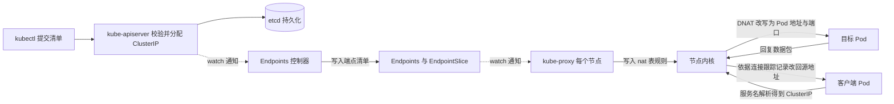

# Day 2 学习笔记 · Service 与标签选择器

> 日期：2026-09-19 · 代码：`code/week2/day2/`（`svc-clusterip.yaml`、`svc-nodeport.yaml`、`outputs/`）
> 配套资料：`docs/k8s_in_action/03-Service与存储.md`、教材第 5 章（p.207-260）与第 11 章 5「kube-proxy」（p.523-526）
> 起点资产：Day 1 创建的 Deployment `webapp`（副本数量为 3，Pod 标签包含 `app=webapp` 与 `env=dev`），以及镜像 `webapp:v4`
> 今日的模型变化：从「直接访问 Pod 的 IP 地址」转为「访问 Service 提供的稳定虚拟地址，由节点上的 kube-proxy 负责写入转发规则」

---

## 一、今日速览（结论，收尾时填）

| 编号 | 结论 | 原始输出依据 |
|---|---|---|
| 1 | Service `webapp` 的类型是 ClusterIP，ClusterIP 的取值是 `10.96.135.12`，端口映射是 `8080/TCP`，选择器是 `app=webapp`。 | `outputs/02-svc-clusterip.txt` |
| 2 | 端点条目与处于就绪状态的 Pod 完全对应：基线的两个 Pod IP 是 `10.244.0.3` 与 `10.244.0.4`，端点列表正是 `10.244.0.3:8080` 与 `10.244.0.4:8080`；EndpointSlice `webapp-jjm4b` 登记的地址与它们相同，说明两个对象的内容等价。 | `outputs/00-baseline-pods.txt`、`outputs/02-svc-clusterip.txt`、`outputs/02-endpointslice.txt` |
| 3 | 在集群内部用临时 busybox Pod 访问服务名成功，两次请求都返回 `<h1>Hello DevOps</h1>`。 | `outputs/03-busybox.txt` |
| 4 | 删除一个 Pod 之后，端点列表中的 `10.244.0.3:8080` 被替换为 `10.244.0.9:8080`，而 Service 的 ClusterIP 仍然是 `10.96.135.12`，说明客户端使用的地址不变，变化只发生在端点对象上。 | `outputs/03-endpoints-before.txt`、`outputs/03-endpoints-after.txt` |
| 5 | 把选择器改成不匹配任何 Pod 的取值之后，Service 对象仍然可以正常读取，Endpoints 变为 `<none>`，客户端得到 `wget: can't connect to remote host (10.96.135.12): Connection refused`。这一结果与课前的预测一致，说明 kube-proxy 为没有后端的 Service 写入了拒绝规则；如果是静默丢弃，客户端的表现应当是等待到超时。 | `outputs/04-endpoints-error.txt` |
| 6 | NodePort 类型的 Service `webapp-nodeport` 的 ClusterIP 是 `10.96.23.58`，API Server 自动分配的节点端口是 `31873`，因此端口映射显示为 `8080:31873/TCP`。 | `outputs/04-nodeport.txt` |
| 7 | 从 WSL 宿主机直接访问节点端口不可行：加上 `--noproxy '*'` 参数之后得到的是 `curl: (28) Connection timed out after 10002 milliseconds`，说明 `172.18.0.2:31873` 在该发行版中没有可达的转发路径；第一次实验得到的 `502` 是网络层旁路代理返回的响应，因此那一条结论作废。在节点容器内部执行 `curl http://localhost:31873/` 得到 `HTTP/1.1 200 OK`，在集群内部用临时 Pod 访问 `172.18.0.2:31873` 也得到 `<h1>Hello DevOps</h1>`，说明节点端口的转发规则本身是有效的。 | `outputs/07-fix-and-verify.txt` |
| 8 | 默认命名空间中的 `kubernetes` 这个 Service 没有 `spec.selector` 字段，它的端点指向节点地址 `172.18.0.2:6443`，端口映射是 `443` 转到 `targetPort: 6443`，说明集群内部的客户端是通过这个 Service 访问 kube-apiserver 的。 | `outputs/05-kubernetes-svc.txt` |
| 9 | 删除 `webapp-nodeport` 之后，`kubectl get endpoints webapp-nodeport` 返回 `Error from server (NotFound)`，说明同名的端点对象随 Service 一起被删除，笔记 3.4 节阶段六第 24 行的预测成立；同时确认 `webapp` 的选择器已经改回 `app=webapp`，端点列表是 `10.244.0.2:8080,10.244.0.3:8080`。 | `outputs/07-fix-and-verify.txt` |
| 10 | 沙箱重建与 Pod 的 IP 之间的关系得到证实：事件中出现 `SandboxChanged`，原文是 `Pod sandbox changed, it will be killed and re-created.`；上一个容器的退出码是 `255`；节点容器的启动时刻是 `2026-09-20T01:39:14Z`；重启计数随之增加，而 Pod 的 `uid` 与创建时刻没有变化。`status.startTime` 与创建时刻取值相同，说明它不会随沙箱重建更新，因此不能用它判断沙箱是否被重建。 | `outputs/07-fix-and-verify.txt` |
| 11 | 环境变量是容器创建时刻的快照：`r8jvf` 的 Pod 对象创建于 Service 之前，但是它的容器在 Service 之后被重建过，因此它的环境变量中包含 `WEBAPP_*` 与 `WEBAPP_NODEPORT_*` 两组变量；`webapp-nodeport` 被删除三分钟之后这组变量仍然存在，说明环境变量创建之后不会更新。 | `outputs/07-fix-and-verify.txt` |

---

## 二、任务清单

| 编号 | 任务 | 完成 | 原始输出留在哪 |
|---|---|---|---|
| 1 | 补完 Day 1 的三项遗留任务（端口转发、进入容器、删除裸 Pod 并重建） | ⚠️ 没有留下输出文件；基线记录中的 Pod 全部属于 Deployment，没有名为 `webapp` 的裸 Pod，说明删除动作已经执行 | 无 |
| 2 | 记录四项基线（Pod、Service、Endpoints、节点） | ✅ | `outputs/00-baseline-pods.txt`、`outputs/00-baseline-svc.txt`、`outputs/00-baseline-endpoints.txt`、`outputs/00-baseline-nodes.txt` |
| 3 | 生成清单模板并逐字段阅读 | ✅ | `outputs/01-dry-run-svc.yaml` |
| 4 | 编写并创建 `svc-clusterip.yaml` | ✅ | `code/week2/day2/svc-clusterip.yaml` |
| 5 | 观察 Service 与 Endpoints 两个对象，并观察 EndpointSlice 对象 | ✅ | `outputs/02-svc-clusterip.txt`、`outputs/02-endpointslice.txt` |
| 6 | 在集群内部用临时 Pod 访问服务名称 | ✅ | `outputs/03-busybox.txt` |
| 7 | 删除一个 Pod，对比端点列表的变化 | ✅ | `outputs/03-endpoints-before.txt`、`outputs/03-endpoints-after.txt` |
| 8 | 把选择器改成不匹配任何 Pod，观察结果并改回 | ✅ 已经确认改回原值，选择器为 `{"app":"webapp"}` | `outputs/04-endpoints-error.txt`、`outputs/07-fix-and-verify.txt` |
| 9 | 编写并创建 `svc-nodeport.yaml`，从宿主机访问节点端口 | ✅ 创建与端口分配已完成；宿主机直连确认不可行，已改用节点容器内部与集群内部两种方式完成验证 | `outputs/04-nodeport.txt`、`outputs/07-fix-and-verify.txt` |
| 10 | 观察没有选择器的 `kubernetes` Service 与它的 Endpoints | ✅ | `outputs/05-kubernetes-svc.txt` |
| 11 | 在 Pod 内部观察环境变量形式的服务发现 | ✅ | `outputs/06-service-env.txt` |
| 12 | 删除 NodePort 类型的 Service，验证同名的 Endpoints 对象随之消失 | ✅ 端点对象随 Service 一起被删除 | `outputs/07-fix-and-verify.txt` |
| 13 | 完成 Linux 每日一题 Day 9（权限特殊位） | ✅ 讲解式完成，见第七节 | `notes/week2/day2.md` 第七节 |
| 14 | 回答当天的面试问答卡（四道题，见 `plan/week2/任务明细.md`） | ✅ 讲解式完成，见第八节 | `notes/week2/day2.md` 第八节 |

---

## 三、概念（机制）

> 阅读顺序建议：先读 3.1 与 3.2，弄清 Service 与 Endpoints 这两个对象各自是什么；再读 3.3 的对象对照；然后读 3.4 的完整工作链路，把两个对象放进一次请求的全过程中；最后读 3.5 至 3.10 的机制细节与对照表。

### 3.1 Service 对象本身是什么

| 问题 | 答案 |
|---|---|
| 它是什么类型的东西？ | 它是 Kubernetes 中的一种内置 API 资源（`apiVersion: v1`、`kind: Service`），描述的内容是「一组 Pod 的稳定访问入口」这份声明，而不是一个正在运行的进程。 |
| 它属于哪个层级？ | 它属于命名空间级对象，因此同一个名称可以在不同的命名空间中重复使用，DNS 名称也因此必须带上命名空间这一段。 |
| 它的生命周期与谁绑定？ | 与 Pod 无关。在 Pod 与 ReplicaSet 反复重建的过程中，Service 对象一直存在且内容不变；只有显式执行删除命令时它才消失。 |
| 它是否执行健康检查？ | 不执行。Service 对象内部没有任何探针配置，某个后端地址是否可用完全由 Endpoints 控制器依据 Pod 的就绪状态判断。 |
| 它是否理解 HTTP？ | 不理解。它工作在第 4 层，只依据 IP 地址与端口转发数据包，不解析主机名与路径；需要按主机名或路径路由时必须引入 Ingress。 |

#### 3.1.1 Service 对象的字段清单

| 字段 | 是否必须 | 含义 |
|---|---|---|
| `apiVersion: v1` 与 `kind: Service` | 必须 | 声明这是一个 Service 对象。 |
| `metadata.name` | 必须 | Service 的名称，它同时决定 DNS 名称的第一段，即 `<名称>.<命名空间>.svc.cluster.local`；取值必须符合 DNS 标签规则。 |
| `metadata.namespace` | 可选 | 省略时使用当前上下文的命名空间；与之配套的端对象必须位于同一个命名空间中。 |
| `metadata.labels` 与 `metadata.annotations` | 可选 | 用于标记 Service 对象自身。它与 `spec.selector` 的作用完全不同：前者是给这个对象贴标签，后者是筛选后端 Pod。 |
| `spec.type` | 可选，默认值为 `ClusterIP` | 取值范围是 `ClusterIP`、`NodePort`、`LoadBalancer`、`ExternalName`；三种主要类型的作用见 3.9。 |
| `spec.selector` | 可选 | 一个键值映射形式的标签选择器。如果省略该字段，Kubernetes 就不会自动创建 Endpoints 对象，必须由人工创建（p.222-224）。 |
| `spec.ports[]` | 必须 | 端口列表，其中的子字段分别是 `name`（在同一个 Service 声明多个端口时必填）、`port`（必填，客户端访问本 Service 时使用的端口）、`targetPort`（可选，省略时默认与 `port` 相同）、`protocol`（可选，默认值为 `TCP`）、`nodePort`（仅在 NodePort 与 LoadBalancer 类型下可用，省略时由 API Server 在 30000 至 32767 之间自动分配）。 |
| `spec.clusterIP` | 由 API Server 分配 | 虚拟 IP 地址。把它显式写成 `None` 时创建出来的是 Headless Service，此时 DNS 会直接返回各个 Pod 的地址（p.254）。 |
| `spec.sessionAffinity` | 可选，默认值为 `None` | 取值为 `ClientIP` 时，同一个客户端 IP 发起的连接总是被转发到同一个 Pod（p.233）。 |
| `spec.externalTrafficPolicy` | 可选 | 仅在 NodePort 与 LoadBalancer 类型下有意义，取值为 `Local` 时只把流量转发到本节点上的 Pod。 |
| `spec.publishNotReadyAddresses` | 可选 | 取值为 `true` 时，尚未通过就绪判定的 Pod 也会被写入端点列表，Headless Service 与 StatefulSet 的场景会用到它（p.257，书中提到这个字段取代了早期的 `tolerate-unready-endpoints` 注解）。 |
| `status` | 服务端字段 | 由 Kubernetes 写入并持续更新，例如 LoadBalancer 类型下的 `status.loadBalancer.ingress`；手写清单时必须删除该段落。 |

### 3.2 Endpoints 对象本身是什么

| 问题 | 答案 |
|---|---|
| 它是什么类型的东西？ | 它同样是一种内置 API 资源（`apiVersion: v1`、`kind: Endpoints`），保存的内容是「某个 Service 的后端地址清单」，也就是当前可以接收流量的真实地址与端口。 |
| 它与 Service 是什么关系？ | 教材的原文是：Endpoint 是一个单独的资源，并不是服务的一个属性（p.223）。因此它是一份独立的对象，可以被单独创建，也可以被单独更新。 |
| 两个对象靠什么关联？ | 靠「同一个命名空间中名称完全相同」这一约定：Endpoint 对象需要与 service 具有相同的名称（p.223）。正因为如此，`kubectl get endpoints <service-name>` 这条命令才能直接取到结果。 |
| 谁负责写入它？ | 当 Service 带有选择器时，由 `kube-controller-manager` 中的 Endpoints 控制器自动写入；当 Service 不带选择器时，控制器不会创建它，必须由人工创建（p.222-224）。 |
| 客户端会直接读取它吗？ | 不会。客户端只使用服务名与 ClusterIP；读取端点对象的是 kube-proxy（用于写入转发规则）与 CoreDNS（用于构建 DNS 记录）。 |

#### 3.2.1 Endpoints 对象的字段清单

| 字段 | 含义 |
|---|---|
| `metadata.name` | 必须与它所属的 Service 名称完全相同。 |
| `metadata.namespace` | 必须与它所属的 Service 位于同一个命名空间。 |
| `subsets[]` | 一个端点分组。同一个分组内的全部地址共用这一组端口声明，因此同一组地址必须监听相同的端口。 |
| `subsets[].addresses[]` | 当前处于就绪状态、可以接收流量的地址。其中 `ip` 是必填项，`hostname`、`nodeName`、`targetRef` 是可选字段，`targetRef` 通常指向这个地址对应的 Pod 对象。 |
| `subsets[].notReadyAddresses[]` | 尚未通过就绪判定的地址。默认情况下这些地址不会出现在 `addresses` 中，因此也不会收到流量；只有把 `spec.publishNotReadyAddresses` 设为 `true` 时，这些地址才会被视为可用（p.257）。 |
| `subsets[].ports[]` | 这一组地址上开放的端口，其中的 `name` 用于与 Service 中多端口声明的 `name` 逐项对应，`port` 是实际的端口号，`protocol` 是协议。 |

#### 3.2.2 谁维护 Endpoints：三种情形

| 情形 | 谁维护 | 结果 |
|---|---|---|
| Service 带有选择器 | Endpoints 控制器自动维护 | Pod 被创建、被删除、就绪状态发生变化、标签发生变化时，端点集合都随之更新（p.524 原文同时列出了就绪状态与标签这两种触发条件）。 |
| Service 不带选择器 | 控制器不创建，由人工创建同名的 Endpoints 对象 | 可以把自己维护的一组地址（例如集群外部的数据库地址）登记进来，Service 的虚拟地址就对这组外部地址做转发（p.222-224）。默认命名空间中的 `kubernetes` 这个 Service 就属于这种用法。 |
| 原本不带选择器，之后又加上了选择器 | Endpoints 控制器接管 | 反过来把选择器从服务中移除之后，Kubernetes 就会停止更新 Endpoints（p.224）。这个特性正是「对外地址保持不变，而服务的实现方式发生改变」的实现手段。 |

#### 3.2.3 EndpointSlice 对象是什么

| 问题 | 答案 |
|---|---|
| 它为什么存在？ | 当一个 Service 的后端 Pod 数量很大时，单个 Endpoints 对象会变得很庞大，任何一次变化都要整份对象重新传输。为了限制单个对象的大小，新版本把端点按分片写入 EndpointSlice 对象（`discovery.k8s.io/v1`），单个分片最多包含 100 个端点。 |
| 它与 Endpoints 是什么关系？ | 两者的数据来源相同、内容互相等价：Endpoints 是一份完整清单，EndpointSlice 是这份清单的分片。两者由同一个控制器依据同一批 Pod 计算得出，kube-proxy 同时监听它们。 |
| 怎么观察？ | 执行 `kubectl get endpointslices -o wide`，把输出中的地址数量与 `kubectl get endpoints <服务名>` 的输出逐条对比。 |

### 3.3 Service 与 Endpoints 两个对象的对照

| 维度 | Service 对象 | Endpoints 对象 |
|---|---|---|
| 回答的问题 | 客户端应该访问哪一个地址与端口 | 这个地址背后现在有哪些真实地址可以接收流量 |
| 保存的内容 | 虚拟地址、端口声明与标签选择器 | 真实的 Pod 地址与端口清单 |
| 谁写入 | 由我提交清单创建，或者由 `kubectl expose` 命令创建 | 带选择器时由 Endpoints 控制器写入，不带选择器时由人工写入 |
| 数据来源 | 我的声明 | Pod 对象本身以及 Pod 的就绪状态 |
| 变化频率 | 几乎不变 | 随 Pod 的创建、删除与就绪状态变化而频繁变化 |
| 客户端是否直接使用 | 是，客户端访问 ClusterIP 或者服务名 | 否，只有 kube-proxy 与 CoreDNS 这类组件会读取它 |
| 删除之后的影响 | 同名的 Endpoints 对象会随之被删除 | Service 立刻失去全部后端，访问请求全部失败 |

### 3.4 从创建 Service 到请求到达 Pod 的完整工作链路

> 下面把整个过程拆成六个阶段。每一个阶段都列出了执行者、输入、动作、产生的对象或状态变化以及观察方式；其中标注为「补充」的观察命令，是我给出的实测方法，教材第 5 章与第 11 章 5 中没有写出这些命令。

#### 阶段一：声明与持久化（执行创建命令之后）

| 序号 | 执行者 | 输入 | 动作 | 产生的对象或状态变化 | 观察方式 |
|---|---|---|---|---|---|
| 1 | kubectl 客户端 | 我在命令中给出的清单文件 | 读取文件，执行客户端校验，然后向 API Server 发送创建请求 | 生成请求体，此时集群中还没有出现任何对象 | `kubectl create -f <文件名> --dry-run=client -o yaml`，该命令只把结果输出到文件，不会创建资源 |
| 2 | kube-apiserver（认证、鉴权、准入控制） | 请求体 | 确认身份，执行 RBAC 鉴权，再由准入控制器校验字段格式，例如端口取值是否合法、标签取值是否符合规则 | 校验结果：通过则继续，不通过则返回错误并指出具体字段 | 被拒绝时，错误信息中会给出字段路径与非法取值 |
| 3 | kube-apiserver（默认值补全与地址分配） | 通过校验的对象 | 补全默认值，包括把 `spec.type` 设为 `ClusterIP`、把 `spec.ports[].protocol` 设为 `TCP`、把 `targetPort` 默认设为与 `port` 相同、把 `sessionAffinity` 设为 `None`；同时从集群的服务地址段中分配一个 ClusterIP | 得到一个字段完整的对象 | 执行 `kubectl get svc <名称> -o yaml`，观察我没有写出的字段是否被自动补全 |
| 4 | kube-apiserver（持久化） | 字段完整的对象 | 把对象写入 etcd | etcd 中新增一条记录，这是集群状态的唯一权威来源 | 没有直接的观察命令，只能通过后续的读取命令间接确认 |
| 5 | kube-apiserver（通知） | 对象变更事件 | 通过 watch 机制把变更推送给所有正在监听该类对象的客户端 | Endpoints 控制器、kube-proxy、CoreDNS 各自收到通知 | 各组件自身的日志 |

#### 阶段二：端点对账（由控制器完成）

| 序号 | 执行者 | 输入 | 动作 | 产生的对象或状态变化 | 观察方式 |
|---|---|---|---|---|---|
| 6 | Endpoints 控制器（运行在 kube-controller-manager 中） | 刚创建的 Service 对象，以及节点上全部 Pod 对象的列表 | 先按 `spec.selector` 筛选 Pod，再按就绪状态做第二次筛选 | 写入与 Service 同名的 Endpoints 对象，并写入对应的 EndpointSlice 对象 | `kubectl get endpoints <名称>` 与 `kubectl get endpointslices -o wide` |
| 7 | Endpoints 控制器（持续对账） | Pod 的创建、删除、就绪状态变化与标签变化事件 | 重新计算端点集合，并更新端点对象 | `subsets[].addresses` 与 `subsets[].notReadyAddresses` 的内容发生变化 | 删除一个 Pod 之后再执行 `kubectl get endpoints <名称>`，对比地址是否被替换 |
| 8 | CoreDNS（监听 Service 与 Endpoints） | Service 对象 | 为服务名建立 DNS 记录；Headless Service 还会把 Pod 的地址作为 A 记录直接返回 | DNS 记录被创建或更新 | 在临时 Pod 内部执行 `cat /etc/resolv.conf` 观察搜索域，再执行 `getent hosts <服务名>` 观察解析结果 |

#### 阶段三：转发规则下发（由每个节点上的 kube-proxy 完成）

| 序号 | 执行者 | 输入 | 动作 | 产生的对象或状态变化 | 观察方式 |
|---|---|---|---|---|---|
| 9 | kube-proxy（每个节点一个实例，kind 集群中以 DaemonSet 部署） | 关于 Service 与 Endpoints 的变更通知 | 依据「Service 的虚拟地址与端口」和「Endpoints 中的后端地址」两类信息，计算出本节点需要的转发规则 | 向本节点内核的 nat 表中写入或更新规则 | `kubectl get po -n kube-system -o wide`，观察每个节点上各有一个 kube-proxy Pod |
| 10 | kube-proxy 与节点内核之间的分工 | 与上一行相同的输入 | kube-proxy 只负责维护规则，数据包的实际处理全部由内核完成 | 规则在节点上持续生效 | 补充命令：进入节点容器执行 `iptables -t nat -L KUBE-SERVICES -n`，可以列出与全部 Service 相关的规则链；教材 p.523-526 只描述了原理，没有给出具体的规则链名称 |
| 11 | 规则的三层结构（补充说明） | 与上一行相同的输入 | 一条完整的转发路径通常由三层规则组成：第一层按「目的地址等于 ClusterIP 与端口」匹配并跳转到该 Service 专属的规则链；第二层在该 Service 的多个后端之间选择一个；第三层把地址改写为某一个后端 Pod 的地址与端口 | 数据包的目的地址在离开节点之前被改写 | 补充命令：进入节点容器执行 `iptables -t nat -L -n \| grep -A3 KUBE-SVC`，观察以 `KUBE-SVC` 开头的规则链 |

#### 阶段四：请求转发与回程（由内核完成）

| 序号 | 执行者 | 输入 | 动作 | 产生的对象或状态变化 | 观察方式 |
|---|---|---|---|---|---|
| 12 | 客户端 Pod 内的解析器 | 我在命令中写出的服务名 | 依据 `/etc/resolv.conf` 中的 `nameserver` 与 `search` 配置向 CoreDNS 发起查询 | 得到该服务的 ClusterIP | 在临时 Pod 内部执行 `cat /etc/resolv.conf` 与 `getent hosts <服务名>` |
| 13 | 客户端进程 | 服务名与端口 | 发起 TCP 三次握手，数据包进入客户端所在节点的网络栈 | 节点内核为该连接建立一条连接跟踪记录 | 补充命令：在节点容器中执行 `conntrack -L`，观察连接记录 |
| 14 | 客户端所在节点的内核 | 目的地址为 ClusterIP 与端口的数据包 | 在 nat 表中匹配到 kube-proxy 写入的规则，执行 DNAT，把目的地址改写为某个后端 Pod 的地址与 `targetPort` | 数据包的目的地址发生变化，连接跟踪记录同时保存改写前后的一对地址 | 与上一行相同 |
| 15 | 节点内核与 CNI 插件（kind 的默认插件是 kindnet） | 改写后的数据包 | 查询路由表，把数据包经 veth 设备送入目标 Pod 的网络命名空间 | 数据包到达容器内的应用进程 | 执行 `kubectl logs <Pod 名称>`，观察应用是否收到请求 |
| 16 | 目标 Pod 内的应用进程 | 收到的请求 | 处理请求并产生回复数据包 | 回复数据包 | 与上一行相同 |
| 17 | 目标 Pod 所在节点的内核 | 回复数据包 | 依据连接跟踪记录做反向改写，把源地址改回 ClusterIP 与端口 | 客户端看到的对端地址始终是 ClusterIP，因此无法从连接信息中得知真实后端 | 在客户端执行 `ss -tn`，观察连接的对端地址 |
| 18 | 负载均衡的粒度（机制结论） | 上述过程中的连接 | 只有在建立新连接时才在端点集合里重新选择一个后端，已经建立的连接固定使用连接跟踪记录中的那一个后端 | 同一条连接内的全部请求都落在同一个 Pod 上 | 用同一条连接连续发送多次请求，对照各个 Pod 的日志；教材 p.233 关于会话亲和与 keep-alive 的说明正是这条机制的结果 |

#### 阶段五：后端发生变化之后的收敛

| 序号 | 执行者 | 输入 | 动作 | 产生的对象或状态变化 | 观察方式 |
|---|---|---|---|---|---|
| 19 | 我，或者 ReplicaSet 控制器 | 删除命令，或者期望副本数与实际副本数之间的差异 | 删除一个 Pod，或者创建一个新的 Pod 来补齐数量 | Pod 对象被标记为终止，或者出现一个新的 Pod | `kubectl get po -w` |
| 20 | Endpoints 控制器 | Pod 被删除或被创建的事件，以及新 Pod 的就绪状态变化 | 从 `addresses` 中移除已经失效的地址，把新就绪 Pod 的地址加入 `addresses` | Endpoints 与 EndpointSlice 对象的内容更新 | 对比删除前后两次 `kubectl get endpoints <名称>` 的输出 |
| 21 | kube-proxy | Endpoints 对象的变更通知 | 更新本节点上的规则，移除已经失效的后端地址，加入新的后端地址 | 新建的连接不再发往已经被删除的 Pod | 与上一行同时观察 |
| 22 | 客户端 | 新一轮请求 | 新建连接时依据更新后的规则选择后端 | 请求被转发到新创建的 Pod | 反复执行 `wget`，对比各个 Pod 的日志 |

#### 阶段六：删除 Service 时的反向收敛

| 序号 | 执行者 | 输入 | 动作 | 产生的对象或状态变化 | 观察方式 |
|---|---|---|---|---|---|
| 23 | 我执行 `kubectl delete svc <名称>` | 删除命令 | kube-apiserver 删除该 Service 对象 | Service 对象消失 | `kubectl get svc` |
| 24 | Endpoints 控制器 | Service 对象被删除的事件 | 删除与它同名的 Endpoints 对象 | 端点对象消失 | 紧接着执行 `kubectl get endpoints <名称>`；这一条属于预测，请在实验末尾自行验证 |
| 25 | kube-proxy | 删除事件 | 删除本节点上与该 Service 相关的全部规则 | ClusterIP 不再可用，新的连接无法建立 | 再次访问原来的服务名，观察解析结果与连接结果 |
| 26 | 地址分配器 | 已经释放的 ClusterIP | 该地址回到可分配池中，可以被此后新建的 Service 重新分配 | 不能保证下一次分配得到同一个地址 | 删除之后重新创建同名的 Service，对比两次得到的 ClusterIP 是否相同 |

### 3.5 为什么必须有 Service 这一层对象

| 问题 | 答案 |
|---|---|
| 为什么不能把 Pod 的 IP 地址写进客户端配置？ | 因为 Pod 是一次性对象，删除并重建之后名称与 IP 地址都会改变；同时 Deployment 的副本数量被调整时，后端 Pod 的集合本身会增减，因此客户端配置无法跟上这种变化。 |
| Service 提供的是什么？ | 提供一个不随 Pod 变化的稳定虚拟地址，也就是 ClusterIP 与端口的组合，并且在这组地址之后隐藏后端的具体 Pod 集合。 |

### 3.6 Service 对象本身不是转发组件

| 事实 | 机制依据 |
|---|---|
| Service 对象内部没有进程，也不监听端口 | 它的 `spec` 中只有标签选择器与端口声明，因此不存在一个「监听在 ClusterIP 上的进程」 |
| ClusterIP 是虚拟地址 | 创建 Service 时由 API Server 从集群的服务地址段中分配（kind 集群的默认值是 `10.96.0.0/12`）；这个地址没有被分配给任何网络接口，数据包离开节点时也不会把它列为源地址或目的地址（p.523 原文明确说明 IP 地址是虚拟的，并且不会被列为数据包的源或目的地址） |
| `ping` ClusterIP 不通属于正常现象 | Service 的本质是一个「IP 与端口对」的集合，而 ICMP 协议没有端口概念，因此没有可以匹配的转发规则（p.523 原文说明服务 IP 本身并不代表任何东西，这也是无法 ping 通的原因） |

### 3.7 Service 与 Endpoints 的关系（补充说明）

| 问题 | 答案 |
|---|---|
| 谁负责筛选后端 Pod？ | `kube-controller-manager` 中的 Endpoints 控制器负责筛选，它的筛选条件是「标签符合 Service 的 `spec.selector`」并且「处于就绪状态」。 |
| 筛选的结果写到哪里？ | 写入一个与 Service 同名的 Endpoints 对象，条目形式是「Pod 的 IP 与端口」；新版本中还会被切分成多个 EndpointSlice 对象，单个分片最多包含 100 个端点。 |
| 哪些变化会导致端点集合变化？ | Pod 就绪状态的变化会使它进入或离开端点集合；Pod 标签的变化也会使它落入或超出 Service 的选择范围（p.524 原文同时列出了这两种情况）。 |
| 选择器写错时会报错吗？ | 不会。Service 对象能够正常创建，也不会产生事件，只有 Endpoints 对象变为空；故障在访问阶段才表现为连接不成功。 |
| 没有选择器的 Service 怎么工作？ | 由人工创建同名的 Endpoints 对象，把集群外部的地址登记进来，或者指向集群内的某个固定地址（p.222-224）。默认命名空间中的 `kubernetes` 这个 Service 就是这种用法。 |
| Pod 的 IP 变化之后客户端为什么不受影响？ | 因为客户端访问的是 Service 的固定地址，Pod 的 IP 变化只会导致 Endpoints 对象的内容更新，客户端使用的地址保持不变。 |

### 3.8 谁真正执行转发：kube-proxy

| 环节 | 内容 |
|---|---|
| 组件位置 | kube-proxy 运行在每一个工作节点上，kind 集群中由 DaemonSet 部署 |
| 它监听什么 | 同时监听 Service 对象与 Endpoints 对象的变化（p.524 原文明确提出除了监控对 Service 的更改之外，kube-proxy 也监控对 Endpoint 对象的更改） |
| 它做什么 | 在所在节点上写入转发规则，把目的地址为「ClusterIP 与端口」的数据包的目的地址改写为「某个后端 Pod 的 IP 与端口」，也就是执行 DNAT |
| 当前默认模式 | `iptables` 模式：规则由 kube-proxy 维护，真正处理数据包的是节点内核，因此 kube-proxy 不在数据平面上转发流量。更早的 `userspace` 模式由 kube-proxy 进程自己接收每一条连接再转发，性能较差，已经被 iptables 模式取代（p.523） |
| 负载均衡的粒度 | 每一条新连接随机选择一个后端，因此同一条 TCP 连接上的多个请求总是落到同一个 Pod，只有新建连接才会重新选择；这也是 p.233 会话亲和（`sessionAffinity`）一节成立的机制前提 |

### 3.9 三种类型对照表

| 类型 | 生效范围 | 实现方式 | 在 kind 集群中是否可用 | 本次实验的验证方式 |
|---|---|---|---|---|
| ClusterIP（默认值） | 只能在集群内部访问 | API Server 分配一个虚拟 IP，kube-proxy 为这个 IP 与端口写入转发规则 | 可用 | 用临时 busybox Pod 在集群内部执行 `wget -qO- http://<服务名>:8080` |
| NodePort | 可以从集群外部访问 | 在 ClusterIP 的基础上再叠加一层：在每个节点上开放一个处于 30000 至 32767 范围内的固定端口，到达该端口的数据包先被转发到 ClusterIP，再被转发到 Pod | 可用，但访问方式受 kind 的网络拓扑限制 | 省略 `nodePort` 字段让它自动分配，从宿主机访问「节点地址 与 节点端口」组成的地址 |
| LoadBalancer | 面向云平台的外部访问 | 在 NodePort 的基础上再向云平台申请一个外部负载均衡器，并把它的地址写入 `EXTERNAL-IP` 字段 | 不可用，`EXTERNAL-IP` 会一直停留在 `<pending>` | 本次只做概念了解，不执行创建 |
| Ingress | 第 7 层（HTTP）的对外入口 | 由 Ingress 控制器实现，按主机名与路径把请求路由到不同的 Service，并且可以终止 TLS | 需要额外安装控制器 | 不在本周范围内 |

### 3.10 服务发现的两种方式

| 方式 | 形式 | 时序要求 | 局限 |
|---|---|---|---|
| 环境变量 | kubelet 在创建容器时把 `<服务名转大写且短横线转下划线>_SERVICE_HOST` 与 `_PORT` 写入容器环境 | 要求 Service 必须先于 Pod 创建，否则该 Pod 的环境变量中不会出现这两个取值，只能删除 Pod 重建（p.216） | 取值在 Pod 启动的那一刻确定，运行期间不会更新 |
| DNS | CoreDNS 提供 `<服务名>.<命名空间>.svc.cluster.local`，同一个命名空间内可以只写服务名 | 没有时序要求，Pod 无论先后都可以解析 | 依赖 CoreDNS 正常运行 |

---

## 四、命令

| 场景 | 命令 | 说明（修改了集群中的哪个对象或状态） |
|---|---|---|
| 查看 Service 的虚拟地址与端口 | `kubectl get svc -o wide` | 读取全部 Service 对象的 `spec.clusterIP`、`spec.ports` 与 `spec.selector` 字段 |
| 查看端点列表 | `kubectl get endpoints <服务名>` | 读取由 Endpoints 控制器维护的端点对象，条目形式为「Pod 的 IP 与端口」 |
| 查看新版端点对象 | `kubectl get endpointslices -o wide` | 读取按分片组织的端点对象，用于理解 Endpoints 与 EndpointSlice 的对应关系 |
| 查看 Service 的选择器与端口 | `kubectl describe svc <服务名>` | 读取 `Selector`、`Port`、`Endpoints` 三行，用于判断选择器是否与 Pod 标签匹配 |
| 生成清单模板（只输出到文件，不创建资源） | `kubectl expose deploy webapp --port=8080 --dry-run=client -o yaml` | 由客户端根据 Deployment 的选择器生成一份 Service 清单模板，不会向 API Server 提交任何对象 |
| 创建 Service | `kubectl create -f svc-clusterip.yaml` | 向 API Server 提交创建请求；对象已经存在时该命令会报错 |
| 修改已存在的 Service | `kubectl edit svc <服务名>` | 在编辑器中修改对象，保存之后由 API Server 更新；本次用于修改选择器 |
| 删除 Service | `kubectl delete svc <服务名>` | 删除 Service 对象，同时与之关联的 Endpoints 对象也会被删除 |
| 在集群内部访问服务 | `kubectl run tmp --image=busybox:1.36 --rm -it --restart=Never -- wget -qO- http://<服务名>:8080` | 启动一个临时 Pod，在集群网络内部发起请求；`--rm` 表示命令结束之后删除该 Pod |
| 在没有 shell 的情况下访问服务 | `kubectl run tmp --image=busybox:1.36 --rm --restart=Never -- wget -qO- http://<服务名>:8080` | 去掉 `-it` 参数，适用于不需要交互终端的场景 |
| 读取容器内的环境变量 | `kubectl exec -it <Pod 名称> -- env` | 在容器内部列出进程环境，用于观察环境变量形式的服务发现 |
| 在容器内部测试连通性 | `kubectl exec -it <Pod 名称> -- wget -qO- http://<服务名>:8080` | 从一个已经在运行的 Pod 内部发起请求，不需要额外创建临时 Pod |
| 查看节点的地址 | `kubectl get nodes -o wide` | 读取节点的 INTERNAL-IP 列，从宿主机访问节点端口时需要使用该地址 |
| 查看节点容器的端口映射 | `docker inspect kind-control-plane --format '{{json .NetworkSettings.Ports}}'` | 查看节点容器向宿主机暴露了哪些端口，用于解释 `localhost` 无法访问节点端口的原因 |

---

## 五、易错点

| 编号 | 易错点 | 现象 | 正确做法 |
|---|---|---|---|
| 1 | 骨架文件中的尖括号没有被替换 | 创建清单文件时被 API Server 拒绝，报错信息包含标签取值非法 | 标签取值只允许包含字母、数字、短横线与点号，并且必须以字母或数字开头和结尾；写完清单后先执行 `kubectl create --dry-run=server -f <文件名>` 校验（对应错题本中的 K1） |
| 2 | 把 `status` 段落或 `spec.clusterIP` 字段抄进自己的清单文件 | 提交时带上服务端字段，或者与 API Server 分配的地址冲突 | `status` 由服务端写入；`clusterIP` 由 API Server 分配，手写清单时应当省略（对应错题本中的 K3） |
| 3 | 认为选择器写错会导致 Service 创建失败 | 预期创建时就会报错，实际创建成功但访问不通 | Service 创建成功与否只取决于清单本身是否合法；选择器与标签不匹配的结果是 Endpoints 对象变为空，故障在访问阶段才出现 |
| 4 | 把 `port` 与 `targetPort` 混为一谈 | 认为两者必须取相同数值 | `port` 是客户端访问 Service 时使用的端口，`targetPort` 是数据包被转发到 Pod 之后使用的端口，两者允许不同；把 `targetPort` 写成容器端口的名称还能在修改端口号时不需要改动 Service |
| 5 | 在宿主机上用 `localhost` 访问节点端口 | 提示连接被拒绝，误以为是 Service 配置错误 | kind 的节点本身是一个 Docker 容器，只有在创建集群时通过 `extraPortMappings` 声明过的端口才会被映射到宿主机；本次实测同时确认改用节点地址也不可行，完整原因与正确的验证方式见下面的第 9 条 |
| 6 | 认为 `kubectl port-forward` 也会经过 Service | 把两种访问方式混在一起解释 | `port-forward` 由 kubectl 与 API Server、kubelet 建立用户态隧道，不经过 Service，也不读取 iptables 规则；它是绕过 Service 的临时调试通道（对应错题本中的 K7） |
| 7 | 只看 Pod 数量就判断端点数量正确 | 端点条目数量少于 Pod 数量时找不到原因 | 端点条目只包含处于就绪状态的 Pod，因此需要先执行 `kubectl get po` 确认 READY 列是否都显示为 `1/1` |
| 8 | 把「curl 得到 502」直接判定为集群或 Service 的故障 | `curl -I 172.18.0.2:31873` 返回 `HTTP/1.1 502 Bad Gateway`，响应头中带有 `Proxy-Connection: keep-alive` 与 `Keep-Alive: timeout=4` | 这两个响应头说明响应来自旁路代理，而不是集群；本机的代理变量是 `http_proxy=http://127.0.0.1:9674`，`no_proxy` 中虽然包含 `172.18.*`，但是代理以网络层旁路方式工作时，`no_proxy` 无法阻止数据包被接管。判断这类问题的正确做法是对照三种访问方式：宿主机直连、节点容器内部访问、集群内部访问；本次三者的结果分别是超时、`HTTP/1.1 200 OK` 与成功返回 `<h1>Hello DevOps</h1>`，因此可以确定问题出在宿主机的网络路径上，而不在 Service 与 kube-proxy。 |
| 9 | 认为从宿主机可以通过节点地址访问节点端口 | 认为 `172.18.0.2:31873` 或 `localhost:31873` 总有一个可用 | 节点容器只发布了 API Server 的端口（`{"6443/tcp":[{"HostIp":"127.0.0.1","HostPort":"42691"}]}`），节点端口没有发布记录，因此 `localhost:31873` 不存在转发规则；而 `172.18.0.2` 位于 Docker Desktop 虚拟机所在的网络中，WSL 发行版虽然有一条经由 `172.18.128.1` 的路由，数据包却得不到响应。在 kind 集群中验证 NodePort 的可靠方式是进入节点容器执行 `curl http://localhost:<节点端口>/`，或者从集群内部的临时 Pod 访问 `<节点地址>:<节点端口>`。 |
| 10 | 把 `kubectl get endpoints` 的输出当作长期可用的接口 | 输出中带有 `Warning: v1 Endpoints is deprecated in v1.33+; use discovery.k8s.io/v1 EndpointSlice` | 集群版本是 v1.37.0，v1 的 Endpoints 已经被标记为废弃；`kubectl get endpointslices -o wide` 才是官方推荐的方式，本次实测两者的地址内容一致，因此可以用 EndpointSlice 代替它作为观察对象。 |
| 11 | `kubectl describe svc` 输出中的 `Port: <unset>` | 误以为端口没有生效 | `<unset>` 表示这个端口没有在清单中写 `name` 字段；只有在同一个 Service 中声明多个端口时才必须为每个端口起名，因此单端口场景下显示为 `<unset>` 属于正常现象。 |
| 12 | 用 `status.startTime` 判断沙箱是否被重建 | 认为容器重建之后 `startTime` 会更新 | `status.startTime` 只在 Pod 开始被 kubelet 接管时写入一次，本次实测它与 `metadata.creationTimestamp` 取值完全相同，而容器的重启计数已经变成 2。判断沙箱被重建的依据是 `kubectl describe po` 事件中的 `SandboxChanged`、`Last State` 中的退出码，以及节点容器的 `docker inspect` 启动时刻。 |
| 13 | 认为环境变量会随 Service 的变化而更新 | 认为删除 Service 之后容器内的 `WEBAPP_*` 变量会消失 | 环境变量由 kubelet 在创建容器时注入，是那一刻的快照，创建之后不会再更新；本次实测中 `webapp-nodeport` 被删除三分钟之后，容器内仍然存在 `WEBAPP_NODEPORT_*` 这一组变量。反过来，`r8jvf` 这个 Pod 的对象创建于 Service 之前，但是它的容器在 Service 之后被重建过，因此它的环境变量里出现了 `WEBAPP_*`，说明真正的要求是 Service 必须先于容器的创建存在。 |

---

## 六、我的疑问

| 编号 | 疑问 | 当前状态 |
|---|---|---|
| 1 | 「Pod 的 IP 在生命周期内不变」这一结论的适用条件是什么？ | 已解决：只要沙箱不被重建，`status.podIP` 就不变；节点容器重启或容器运行时重启会重建沙箱并重新分配地址，表现为 `SandboxChanged` 事件与重启计数增加，而 Pod 的 `uid` 与创建时刻保持不变（证据见 `outputs/07-fix-and-verify.txt`）。 |
| 2 | 环境变量方式的时序要求究竟约束在哪一层？ | 已解决：约束在容器的创建时刻，而不是 Pod 对象的创建时刻；证据是 `r8jvf` 这个 Pod 早于 Service 创建，却在容器被重建之后获得了 `WEBAPP_*` 变量。 |
| 3 | 从 WSL 宿主机访问 `172.18.0.2` 为什么失败？ | 部分解决：已经排除路由缺失（`ip route get` 能查到经由 `172.18.128.1` 的条目）与 curl 的代理变量（`no_proxy` 已经包含 `172.18.*`）；剩下的可能原因是 Docker Desktop 虚拟机与 WSL 发行版之间的转发规则，属于本地环境问题，暂时记录不再深入排查。 |
| 4 | 在脚本中创建一次性 Pod 时，`kubectl run --rm` 需要附加状态，怎么写才稳定？ | 已记录：`--rm` 必须配合 `-i`，也就是写成 `--restart=Never -i --rm`，否则报错 `--rm should only be used for attached containers`；加上 `-t` 之后容器执行完命令立即退出，会出现 `warning: couldn't attach to pod` 的提示，属于正常回退行为。 |

---

## 七、Linux 每日一题 Day 9 · 权限特殊位

> 题目：解释 `s`（suid 与 sgid）与 `t`（sticky）三个位的作用，各举一个系统中的真实例子，并说明为什么 `/tmp` 必须有 sticky 位。

| 问题 | 答案 | 批改结论 |
|---|---|---|
| suid 位的作用与真实例子 | `suid` 是 set-user-ID 位，位于属主权限的执行位上；当某个可执行文件带有这一位时，进程启动之后的**有效用户 ID** 变为该文件属主的 uid，而不再是执行者的 uid。真实例子是 `/usr/bin/passwd`：它的属主是 `root`，权限显示为 `-rwsr-xr-x`，普通用户执行它时进程以 root 的凭据运行，因此可以向 `/etc/shadow` 写入新的口令散列值。 | 讲解式完成。要点是区分「有效用户 ID 被提升」与「执行者获得 root 身份」这两句话：前者是内核层面的凭据变换，后者只是结果上的描述。另外 `s` 与 `S` 的差别在于执行位是否存在：`rws` 表示执行位同时存在，`rwS` 表示执行位不存在。 |
| sgid 位的作用与真实例子 | `sgid` 是 set-group-ID 位，位于属组权限的执行位上，它有两种语义：对可执行文件，进程启动之后的**有效组 ID** 变为该文件属组的 gid；对目录，在这个目录中新建的文件与子目录会继承该目录的属组，而不是创建者的主组。两个真实例子分别是 `/usr/bin/wall`（属组为 `tty`，因此普通用户可以写入所有已登录用户的终端）与团队共享目录（把目录设为 `2775`，组内成员新建的文件自动属于该组）。 | 讲解式完成。要点是把「对文件」与「对目录」两种语义都写出来，只答其中一种会被判为不完整。 |
| sticky 位的作用与真实例子 | `sticky` 位现在的正式名称是受限删除位，它只对目录有意义：目录中的文件或子目录只有「文件的属主」「目录的属主」与 `root` 三类身份可以删除或重命名，其他用户即使对该目录拥有写权限也不能删除别人的文件。真实例子是 `/tmp`，权限显示为 `drwxrwxrwt`。 | 讲解式完成。要点是它并不是「禁止删除」，而是把删除权限从「目录写权限」收窄到「属主身份」。 |
| `/tmp` 为什么必须有 sticky 位 | 因为 `/tmp` 需要允许所有用户在同一个目录中创建文件，因此权限必须是 `1777`，也就是所有人可读、可写、可进入，并且目录带粘滞位。如果没有粘滞位，任何用户都可以删除或者用自己的文件替换其他用户的文件，从而造成拒绝服务，也可以利用符号链接把其他用户进程的写入重定向到敏感路径；带上粘滞位之后，删除权限被限制在文件属主、目录属主与 `root` 三类身份上。 | 讲解式完成。答案需要同时包含「为什么需要全局可写」与「去掉粘滞位之后会出现哪两类具体后果」，只答「防止误删」会被判为不完整。 |

### 三个特殊位的表示方式与设置方法

| 能力 | 八进制数值 | 设置方式 | `ls -l` 中的显示 |
|---|---|---|---|
| suid（set-user-ID） | 4000 | `chmod u+s <文件>` 或 `chmod 4755 <文件>` | 属主执行位显示为 `s`（执行位同时存在）或 `S`（执行位不存在） |
| sgid（set-group-ID） | 2000 | `chmod g+s <文件或目录>` 或 `chmod 2775 <目录>` | 属组执行位显示为 `s` 或 `S` |
| sticky（受限删除位） | 1000 | `chmod +t <目录>` 或 `chmod 1777 <目录>` | 其他人执行位显示为 `t` 或 `T` |

| 目的 | 命令 | 说明 |
|---|---|---|
| 观察三个特殊位在真实文件上的显示 | `ls -l /usr/bin/passwd; ls -ld /tmp` | `passwd` 显示为 `-rwsr-xr-x`，`/tmp` 显示为 `drwxrwxrwt` |
| 同时观察八进制与符号形式 | `stat -c '%a %A %n' /usr/bin/passwd /tmp` | 预期输出为 `4755 -rwsr-xr-x /usr/bin/passwd` 与 `1777 drwxrwxrwt /tmp` |
| 自己制造一个目录级的粘滞位 | `mkdir -p /tmp/sticky-test; chmod +t /tmp/sticky-test; stat -c '%a %A %n' /tmp/sticky-test` | 预期输出为 `1777 drwxrwxrwt`，用于观察 `t` 字符的出现位置 |

---

## 八、面试问答卡批改记录（Day 2）

| 题目 | 我的回答要点 | 批改结论 |
|---|---|---|
| 1. Service 是通过什么机制找到 Pod 的？ | Service 通过 `spec.selector` 这个标签选择器筛选 Pod，再由 Endpoints 控制器把「标签匹配并且处于就绪状态」的 Pod 的地址与端口写入同名的 Endpoints 对象（新版本中同时写入 EndpointSlice 对象），kube-proxy 读取这两个对象在节点上写入转发规则。 | 讲解式完成。实测证据：选择器为 `app=webapp` 时端点列表是两个 Pod 的地址，把选择器改成不匹配任何取值之后端点变为 `<none>`。 |
| 2. Pod 的 IP 地址变化之后为什么不会影响客户端访问？ | 因为客户端访问的是 Service 的固定虚拟地址与端口，而不是 Pod 的地址。Pod 被删除重建或者沙箱被重建时，变化的只是 Endpoints 对象中的地址清单，kube-proxy 更新规则之后新连接被转发到新的后端，ClusterIP 与客户端的配置都不需要修改。 | 讲解式完成。实测证据：删除一个 Pod 之后端点从 `10.244.0.3:8080` 变成 `10.244.0.9:8080`，而 `10.96.135.12` 保持不变。 |
| 3. ClusterIP 与 NodePort 有什么区别？ | ClusterIP 只在集群内部可用，API Server 从服务地址段中分配一个虚拟地址，由 kube-proxy 写入转发规则；NodePort 在 ClusterIP 的基础上再叠加一层，在每个节点上开放一个处于 30000 至 32767 范围内的固定端口，到达该端口的数据包先被转发到 ClusterIP 与 `port` 的组合，再被转发到 Pod 的 `targetPort`，因此可以从集群外部访问。 | 讲解式完成。实测证据：`webapp` 的类型是 ClusterIP，取值是 `10.96.135.12:8080`；`webapp-nodeport` 的端口映射是 `8080:31873/TCP`。 |
| 4. Service 到 Pod 的转发由哪个组件完成？ | 由每个节点上的 kube-proxy 完成规则写入，真正的数据包改写由节点内核依据这些规则执行。Service 对象本身没有进程，也不监听端口，因此不能说「Service 转发流量」。 | 讲解式完成。实测证据：删除 Service 之后同名端点对象消失，节点上的规则被移除；在节点容器内部访问 `localhost:31873` 得到 `HTTP/1.1 200 OK`，说明规则确实存在于节点上。 |

---

## 九、十分钟速记卡

> 用途：复习时只读这一节。内容与前面的小节重复是刻意的，重复的目的是不翻回正文就能回忆。

### 9.1 三个对象各一句话

| 对象 | 一句话定义 | 最容易说错的地方 |
|---|---|---|
| Service | 一组 Pod 的稳定访问入口，是一个只有声明、没有进程的 API 对象（`v1`/`Service`），属于命名空间级对象 | 不能说「Service 转发流量」，它不监听端口也没有进程 |
| Endpoints | 某个 Service 当前的后端地址清单，`metadata.name` 必须与 Service 同名，保存「Pod 的 IP 与端口」 | 它是一份独立的资源，不是 Service 的属性（p.223） |
| EndpointSlice | 端点清单的分片（`discovery.k8s.io/v1`），单个分片最多 100 个端点，名称由控制器生成而不是与 Service 同名 | 它与 Endpoints 数据来源相同、内容等价，不是替代关系 |

### 9.2 必须记住的字段

| 对象 | 字段 | 记住什么 |
|---|---|---|
| Service | `spec.type` | 省略时默认 `ClusterIP`，另外可取 `NodePort`、`LoadBalancer`、`ExternalName` |
| Service | `spec.selector` | 键值映射形式，取值必须与 Pod 模板标签一致；省略该字段时控制器不会创建 Endpoints，必须人工创建 |
| Service | `spec.ports[].port` | 客户端访问 Service 时使用的端口 |
| Service | `spec.ports[].targetPort` | 数据包被转发到 Pod 之后使用的端口，省略时默认等于 `port`，也可以写成容器端口的名称 |
| Service | `spec.ports[].nodePort` | 仅 NodePort 与 LoadBalancer 可用，取值范围 30000 至 32767，省略时由 API Server 自动分配 |
| Service | `spec.clusterIP` | 由 API Server 从服务地址段分配，手写清单时不要写；写成 `None` 得到 Headless Service |
| Endpoints | `subsets[].addresses[]` | 处于就绪状态的地址；`notReadyAddresses[]` 保存尚未就绪的地址 |
| Endpoints | `subsets[].ports[]` | 这一组地址开放的端口，`name` 用于与 Service 的多端口声明对应 |

### 9.3 全链路摘要

| 步骤 | 执行者 | 做了什么 |
|---|---|---|
| 1 | 客户端 Pod 的解析器 | 向 CoreDNS 查询 `<服务名>.<命名空间>.svc.cluster.local`，得到 ClusterIP |
| 2 | 客户端所在节点的内核 | 数据包的目的地是 ClusterIP 与端口，命中 kube-proxy 写入的 nat 表规则 |
| 3 | 客户端所在节点的内核 | 执行 DNAT，把目的地改写为某个就绪 Pod 的 `IP:targetPort`，同时写入连接跟踪记录 |
| 4 | 节点内核与 CNI 插件 | 数据包经 veth 进入目标 Pod 的网络命名空间 |
| 5 | 目标 Pod 所在节点的内核 | 回复数据包依据连接跟踪记录把源地址改回 ClusterIP，因此客户端始终只看到 ClusterIP |

配套要记住四件事：Service 对象不是转发组件；写入规则的是每个节点上的 kube-proxy；真正改写数据包的是节点内核；负载均衡的粒度是每一条新连接，同一条连接内的请求固定落在同一个 Pod（p.233）。

### 9.4 今天实测出来的硬结论

| 编号 | 结论 | 实测数据 |
|---|---|---|
| 1 | Endpoints 的内容只包含「标签匹配且处于就绪状态」的 Pod | 基线两个 Pod 的 IP 是 `10.244.0.3` 与 `10.244.0.4`，端点列表正是这两个地址加端口 8080 |
| 2 | Pod 重建只替换端点条目，客户端使用的地址不变 | 端点由 `10.244.0.3:8080` 换成 `10.244.0.9:8080`，ClusterIP 始终是 `10.96.135.12` |
| 3 | Service 没有后端时，kube-proxy 写入的是拒绝规则而不是静默丢弃 | 选择器改成不匹配任何取值之后，客户端立刻得到 `Connection refused`，而不是等到超时 |
| 4 | 选择器写错不会导致创建失败，也不会产生事件 | Service 正常存在且可读，只有 Endpoints 变为 `<none>` |
| 5 | 删除 Service 时同名的 Endpoints 对象一起被删除 | `kubectl get endpoints webapp-nodeport` 返回 `Error from server (NotFound)` |
| 6 | 一个真实的「无选择器加人工端点」例子 | 默认命名空间的 `kubernetes`（`10.96.0.1:443`）没有 `spec.selector`，其端点指向节点地址 `172.18.0.2:6443` |
| 7 | 环境变量形式只描述入口，不承担负载均衡 | `WEBAPP_SERVICE_HOST=10.96.135.12` 与 `WEBAPP_PORT=tcp://10.96.135.12:8080` |

### 9.5 面试问答卡标准答法

| 问题 | 标准答法 |
|---|---|
| Service 通过什么机制找到 Pod？ | 通过 `spec.selector` 筛选 Pod，由 Endpoints 控制器把「标签匹配且就绪」的地址写入同名 Endpoints 与 EndpointSlice，kube-proxy 再据此写入转发规则 |
| Pod 的 IP 变化为什么不影响客户端？ | 客户端访问的是固定的 ClusterIP，Pod 地址变化只更新端点对象，新连接被转发到新的后端 |
| ClusterIP 与 NodePort 的区别？ | ClusterIP 只在集群内可用；NodePort 在每个节点上再开放一个固定端口，数据包先到 ClusterIP 再到 Pod，因此外部可以访问 |
| 谁完成 Service 到 Pod 的转发？ | kube-proxy 写入规则、节点内核执行 DNAT；Service 对象本身没有进程也不监听端口 |

### 9.6 出现「访问不通」时的排查顺序

| 顺序 | 命令 | 看什么 |
|---|---|---|
| 1 | `kubectl get endpoints <服务名>` | 端点是否为空；为空说明选择器不匹配或者 Pod 未就绪 |
| 2 | `kubectl describe svc <服务名>` | `Selector`、`Port`、`TargetPort`、`Endpoints` 四行 |
| 3 | `kubectl get po --show-labels` | 标签是否与选择器一致，`READY` 是否显示为 `1/1` |
| 4 | `kubectl exec -it <Pod 名称> -- wget -qO- http://<服务名>:8080` | 集群内部能否访问，用于区分是 Service 问题还是外部网络问题 |
| 5 | 在节点容器内部执行 `curl http://localhost:<节点端口>/` | NodePort 的转发规则是否存在 |

### 9.7 最容易答错的七点

| 编号 | 错误说法 | 正确说法 |
|---|---|---|
| 1 | 「Service 转发流量」 | Service 只是声明，转发规则由 kube-proxy 写入，数据包由节点内核改写 |
| 2 | 「ping 不通 ClusterIP 说明服务有问题」 | ClusterIP 是虚拟地址，Service 的本质是 IP 与端口对的集合，而 ICMP 没有端口概念，因此 ping 不通属于正常现象 |
| 3 | 「选择器写错会报错」 | Service 创建成功且没有事件，只有 Endpoints 变为空 |
| 4 | 「Pod 被重启了」 | 被重启的只有容器（`RESTARTS` 增加）；Pod 是一次性对象，删除即新建 |
| 5 | 「Pod 的 IP 在生命周期内绝对不变」 | 前提是沙箱不被重建；节点容器或容器运行时重启会重建沙箱并重新分配地址，判断依据是 `SandboxChanged` 事件 |
| 6 | 「环境变量会随 Service 更新」 | 变量在创建容器时注入，是快照；约束条件是 Service 先于容器的创建存在，不是先于 Pod 对象存在 |
| 7 | 「`kubectl get endpoints` 可以一直用」 | 集群版本 v1.37 起 v1 Endpoints 已经废弃，官方推荐 `kubectl get endpointslices -o wide` |

### 9.8 合上笔记自测六个问题

| 编号 | 问题 | 判断标准 |
|---|---|---|
| 1 | 说出 Service 与 Endpoints 各自回答的问题 | 一个回答「客户端访问哪里」，一个回答「这个地址背后现在有谁」 |
| 2 | 说出四层对象模型 | Service → Endpoints 或 EndpointSlice → kube-proxy 规则 → Pod |
| 3 | `port` 与 `targetPort` 分别给谁用 | 前者给客户端，后者给 Pod |
| 4 | 端点列表为空时客户端的表现是什么 | 连接被拒绝，不是等到超时 |
| 5 | 环境变量的两组命名规则 | 服务名转大写、短横线转下划线，再加 `_SERVICE_HOST` 与 `_PORT` |
| 6 | 三种类型各在第几层工作，哪一种 Kind 集群做不了 | 都在第 4 层，LoadBalancer 在 Kind 集群中做不了 |
